# TLS-Flow Design

## §1 Introduction
### §1.1 Related Documents
- **SRS**: [TLS_Flow_Enforcement SRS (SharePoint)](https://bitbucket.org/rdwr/defensepro_docs/src/dev/10_15_0_0/SRS/tls-flow-enforcement-srs.md)

### §1.2 Motivation

TLS traffic may be consumed by multiple independent TLS-related features, both existing and future ones.
Features such as `TLS-Enforcement`, `TLS-Visibility`, and `TLS-Fingerprint` are examples of such consumers, but the TLS processing foundation itself must remain independent of any specific feature implementation.

`TLS-Flow` serves as the shared infrastructure layer for TLS processing.
Its purpose is to centralize TLS parsing in a single shared processing path, maintain the minimal per-session context required for TLS parsing progression, and expose parsed information to feature observers registered for the relevant TLS events.
`SessionObserver` is the runtime conductor of this path: it performs session TLS initialization, invokes feature participation evaluation, builds per-event observer lists inside `TLSSessionExtension`, invokes `TLSProcessor`, generates step events, dispatches observers in deterministic order, handles verdicts, and commits eligible `TLSData` updates.
This avoids duplicating TLS parsing logic across features and ensures that all TLS consumers operate on the same parsed view of the session.

The current TLS processing path requires stronger session awareness.
TLS input is not always self-contained within a single packet: a TLS record may be fragmented across multiple TCP packets, and a single packet may contain multiple TLS records.
In addition, after the flow reaches an encrypted stage or a terminal TLS state, TLS payload content should no longer be parsed beyond the TLS record layer because the handshake data may be encrypted or otherwise unavailable to the system.
For this reason, `TLS-Flow` must maintain a minimal TLS parsing lifecycle state that indicates how far TLS input should be parsed for the session.

TLS-Flow may detect and expose parser-level problems and basic TLS protocol-sequencing inconsistencies as `TLSAnomaly` values.
However, TLS-Flow does not decide whether such anomalies are enforcement violations, whether a packet should be dropped, mitigated, reported, or whether a violation is terminal.  
Those decisions belong to TLS feature observers, primarily TLS-Enforcement.

Feature observers receive parsed TLS information and read-only session context through the TLS event pipeline.
If a feature determines that packet processing should stop, it returns a verdict to `TLS-Flow` rather than mutating the TLS session state directly.
When such a verdict represents a terminal violation, `TLS-Flow` commits the corresponding violation state to the session and prevents further TLS parsing work for subsequent packets in that session.

`TLS-Flow` follows a best-effort parsing model.
When valid TLS data can be extracted from the input, that data is preserved and exposed to interested observers.
Parsing anomalies, such as malformed TLS structures, inconsistent lengths, or invalid ClientHello encoding, are exposed separately through the TLS event pipeline.
Valid parsed data and TLS anomalies may coexist for the same processing step, allowing registered feature observers to decide how such anomalies should affect packet handling without coupling the common TLS parsing layer to feature-specific policy. Later anomalies do not reorder events already dispatched for earlier records.

Finally, `TLS-Flow` supports session lifecycle, reset, reuse, and cleanup semantics.
When a session is reset, reused, or terminated, the TLS-specific session state must be cleared or reinitialized so that a new flow instance cannot inherit stale TLS data from a previous one.
This ensures that TLS parsing state, observer dispatch, and feature-visible TLS context remain isolated per session lifecycle.

### §1.3 Named Requirements (High-Level)

**NR-FLOW-1: Session-Based TLS Processing**  
The system shall maintain TLS flow processing on a per-session basis.

**NR-FLOW-2: TLS-Specific Flow Context Initialization**
The system shall create and initialize a TLS-specific flow context for a session only when TLS processing is required for that session.

TLS processing shall be considered required when at least one configured TLS feature returns a non-empty TLS event mask for the session.

**NR-FLOW-3: Session- and Event-Scoped TLS Feature Registration**
The system shall evaluate the configured TLS features during TLS session initialization and collect the TLS event mask requested by each feature for the session.

For each feature with a non-empty event mask, the system shall store the corresponding TLS feature observer in the matching per-event observer lists in the session `TLSSessionExtension`.

**NR-FLOW-4: Centralized TLS Parsing Path**  
The system shall centralize TLS parsing in a single shared processing path and expose parsed TLS results to registered TLS feature observers.

**NR-FLOW-5: Best-Effort TLS Parsing**  
The system shall parse TLS input on a best-effort basis and preserve valid parsed data whenever possible.

**NR-FLOW-6: TLS Anomaly Separation**
The system shall expose TLS anomalies separately from valid parsed data through the TLS event pipeline.

TLS anomalies may represent parser-level problems, packet-local TLS protocol inconsistencies, and basic TLS protocol-sequencing inconsistencies detected while processing a TLS processing step.

**NR-FLOW-7: Parser, Anomaly, and Policy Separation**
The system may detect parser-level problems and basic TLS protocol-sequencing inconsistencies and expose them as `TLSAnomaly` values.

The system shall not treat detected `TLSAnomaly` values as enforcement decisions by itself.

TLS feature observers shall decide anomaly severity, reporting, mitigation, packet handling, and terminal violation behavior through the `TLSFeatureVerdict` path.

**NR-FLOW-8: Multi-Record Packet Support**  
The system shall support parsing and processing of multiple TLS records contained within a single packet while preserving record order.

**NR-FLOW-9: Partial TLS Input Handling**  
The system shall preserve the required TLS parsing context between packets in order to continue TLS parsing when the input spans multiple TCP packets.

**NR-FLOW-10: ClientHello Extraction and Exposure**  
The system shall identify successfully parsed ClientHello records, extract the relevant ClientHello data, and expose the parsed result to registered observers.

**NR-FLOW-11: TLS Parsing Lifecycle State**  
The system shall maintain minimal per-session TLS parsing lifecycle state required to determine how far TLS input should be parsed for the session.

**NR-FLOW-12: Feature-Visible TLS Session Context**  
The system shall expose the TLS session context required by TLS feature observers, including current TLS state and relevant flow-derived counters or hints from `TLSSessionExtension`, as read-only data.

**NR-FLOW-13: Encrypted and Terminal Parsing Boundaries**  
The system shall not parse TLS payload content beyond the TLS record layer after the flow reaches an encrypted stage or a terminal TLS state.

**NR-FLOW-14: TLS State Ownership**  
The system shall ensure that TLS session state is updated only by `TLS-Flow`.

**NR-FLOW-15: Feature Verdict Handling**
The system shall allow TLS feature observers to return `TLSFeatureVerdict` values to `TLS-Flow`.

A `TLSFeatureVerdict` shall include a dispatch action, such as `CONTINUE` or `STOP`, and may include an optional feature finding or violation reason.

**NR-FLOW-16: Non-Terminal Feature Findings**
The system shall allow TLS feature observers to return a `CONTINUE` verdict together with an optional feature finding or violation reason.

A finding returned with `CONTINUE` shall be non-terminal from the point of view of `TLS-Flow`.  
Such a finding shall not cause `TLS-Flow` to enter a terminal violation state, stop event dispatch, or prevent normal TLS state progression.

**NR-FLOW-17: Normal State Commit After Non-Terminal Verdict Handling**
The system shall commit eligible normal TLS state transitions when observer verdict handling does not result in violation-state commit.

A `STOP` verdict without a finding or violation reason shall not by itself prevent normal TLS state progression.

**NR-FLOW-18: Packet-Scoped Stop Dispatch Handling**
If a TLS feature observer returns a `STOP` verdict, the system shall stop dispatching the current packet to lower-priority TLS feature observers.

A `STOP` verdict shall stop TLS observer dispatch and further TLS processing for the current packet.  
A `STOP` verdict by itself shall not imply terminal TLS state, packet drop, mitigation action, security reporting, or prevention of normal TLS state progression.

**NR-FLOW-19: Terminal Violation Commit**
`TLS-Flow` shall commit a terminal violation state only when observer verdict handling results in a violation-state commit according to the `TLSFeatureVerdict` contract.

When a `STOP` verdict includes a violation reason according to the verdict contract, `TLS-Flow` shall commit the corresponding terminal violation state and shall not commit normal TLS state transitions derived from the current step.

**NR-FLOW-20: Terminal Violation TLS Processing Stop**  
Once a session enters a terminal violation state, `TLS-Flow` shall not perform further TLS parsing or parsed-data event generation for subsequent packets associated with that session.

**NR-FLOW-21: Terminal Violation Payload Packet Handling**  
For subsequent packets associated with a session in a terminal violation state, payload-bearing packets shall not be parsed by `TLS-Flow`.  
Instead, `TLS-Flow` shall expose the terminal TLS state and packet context to registered verdict-capable TLS feature observers and apply the packet verdict returned by those observers.

**NR-FLOW-22: Terminal Violation Non-Payload Packet Handling**  
For subsequent packets associated with a session in a terminal violation state, packets that do not carry payload shall not trigger TLS parsing or parsed-data event generation.  
Such packets shall not be rejected by `TLS-Flow` solely due to the terminal TLS violation state.

**NR-FLOW-23: Deterministic Observer Dispatch and Short-Circuiting**
The system shall dispatch TLS events to registered observers in deterministic order.

If a TLS feature observer returns a `STOP` verdict, the system shall stop dispatching the current packet to lower-priority TLS feature observers and stop further TLS processing for the current packet.

**NR-FLOW-24: Packet Event Ordering**
For a single TLS processing step, the system shall dispatch TLS anomaly events before valid parsed-data events from that same step.

Later TLS anomalies shall not reorder events already dispatched for earlier records.

**NR-FLOW-25: No Independent Enforcement Decisions in TLS-Flow**  
`TLS-Flow` shall not independently decide whether a packet should be dropped, blocked, mitigated, or reported as a security event.

**NR-FLOW-26: TLS Session Lifecycle Event Exposure**  
The system shall expose TLS session lifecycle events, such as reset, reuse, and session end, to registered TLS feature observers when applicable.

**NR-FLOW-27: Session Reset, Reuse, and Cleanup**  
The system shall support safe cleanup, reinitialization, release, or invalidation of TLS-specific session state when a session is reset, reused, or reaches the end of its lifecycle.

## §2 Use-Cases
### §2.1 TLS Flow Context Initialization and Feature Observer Registration

- **Identifier:** UC-FLOW-2.1
- **Description:** Initialize TLS-specific flow context for a session only when at least one configured TLS feature requests participation in TLS processing for that session.
- **Participating Components:** `SessionTable`, `SessionObserver`, `TLSSessionExtensionTable`, `TLSSessionExtension`, `TLS Feature Observers`
- **Pre-conditions:**
  - A packet belonging to a session is received.
  - The session infrastructure has created or located the corresponding session entry.
- **Main Flow:**
  1. The session infrastructure identifies or creates the session associated with the packet.
  2. The `SessionObserver` invokes the TLS session initialization path.
  3. The TLS session initialization path evaluates the configured TLS features for the session.
  4. Each configured TLS feature returns the TLS event mask it requests for the session.
  5. `SessionObserver` determines whether at least one feature returned a non-empty event mask.
  6. If at least one non-empty event mask is returned, a `TLSSessionExtension` is allocated from the `TLSSessionExtensionTable`.
  7. The `TLSSessionExtension` is associated with the session through the TLS extension storage mechanism.
  8. `TLSData` is initialized.
  9. For each feature with a non-empty event mask, `SessionObserver` stores the feature observer in the corresponding per-event observer lists in `TLSSessionExtension` according to deterministic observer priority order.
  10. The `SessionObserver` ensures that the session events required by `TLS-Flow`, such as inbound packet processing and aging, are registered for the session.
- **Alternative Flow - No TLS Feature Participation:**
  1. All configured TLS features return an empty TLS event mask for the session.
  2. No `TLSSessionExtension` is allocated.
  3. No `TLSData` is initialized.
  4. No per-event observer lists are created.
  5. TLS packet processing is not attached to the session.
  6. The initialization path returns without attaching TLS-specific processing context to the session.
- **Post-conditions:**
  - If at least one feature returned a non-empty event mask, a TLS-specific flow context exists for the session.
  - If at least one feature returned a non-empty event mask, TLS feature observers are stored per session and per event in `TLSSessionExtension`.
  - If all returned event masks are empty, no TLS-specific processing context is attached to the session.
  - The `TLSSessionExtensionTable` remains sparse and contains entries only for sessions requiring TLS processing.

---

### §2.2 Normal Packet Processing and State Commit

* **Identifier:** UC-FLOW-2.2
* **Description:** `SessionObserver` conducts packet processing in the TLS flow path as ordered TLS processing steps, dispatches step events to registered observers, and commits eligible normal TLS state transitions per step when observer verdict handling does not result in violation-state commit.
* **Participating Components:** `SessionObserver`, `TLSSessionExtension`, `TLSProcessor`, `TLS Feature Observers`
* **Pre-conditions:**
  * A valid session exists.
  * A `TLSSessionExtension` is associated with the session.
  * The session is not in a terminal violation state.
* **Main Flow:**
  1. The `SessionObserver` locates the `TLSSessionExtension` associated with the session.
  2. `SessionObserver` reads current `TLSData` and per-event observer lists from `TLSSessionExtension`.
  3. `SessionObserver` determines that the packet carries payload relevant for TLS processing.
  4. SessionObserver associates the current packet with TLSProcessor using beginPacket()
  5. SessionObserver starts a processing loop and repeatedly invokes processRecord() on TLSProcessor.
  6. TLSProcessor processes at most one TLS record and returns TLSStepResult.
  7. `SessionObserver` reads viewer accessors on `TLSProcessor` and generates TLS events for the current step.
  8. For the current step, anomaly events are dispatched before parsed-data events from that same step.
  9. `SessionObserver` dispatches step events to registered observers in deterministic order and handles returned `TLSFeatureVerdict` values.
  10. If observer verdict handling does not result in violation-state commit, `SessionObserver` commits eligible normal state updates derived from the current step into `TLSData`.
  11. `SessionObserver` continues to the next step until one of the following occurs: end of payload, parser disposition `need more data`, parser disposition `stop packet parsing`, observer `STOP` verdict, or violation-state commit.
* **Alternative Flow - Packet Without Payload:**
  1. `SessionObserver` determines that the packet does not carry payload.
  2. `SessionObserver` does not invoke the `TLSProcessor`.
  3. `SessionObserver` does not generate parsed-data TLS events.
  4. Lifecycle handling may still occur if the packet represents a relevant session lifecycle event.
* **Alternative Flow - Observer `STOP` verdict:**
  1. An invoked TLS feature observer returns a `STOP` verdict.
  2. Processing continues according to `UC-FLOW-2.3`.
* **Post-conditions:**
  * Parsed TLS information is delivered per processing step only to relevant registered observers, if any.
  * Step events with no registered observers are treated as accepted.
  * Eligible normal TLS state transitions are committed per step when observer verdict handling does not result in violation-state commit.
  * Non-terminal findings returned with a `CONTINUE` verdict do not prevent normal TLS state progression.
  * TLS session state remains owned and updated only by the TLS flow path orchestrated by `SessionObserver`.

---

### §2.3 Feature `STOP` verdict and Optional Violation-State Commit

- **Identifier:** UC-FLOW-2.3
- **Description:** Handle a packet for which a TLS feature observer returns a `STOP` verdict, with or without a violation reason.
- **Participating Components:** `SessionObserver`, `TLSSessionExtension`, `TLSProcessor`, `TLS Feature Observers`
- **Pre-conditions:**
  - A packet is processed through the TLS flow path.
  - One or more TLS feature observers are registered for a generated TLS event.
  - A registered observer determines that TLS observer dispatch should stop for the current packet.
* **Main Flow:**
  1. `SessionObserver` invokes `TLSProcessor` for the current step and reads the step results via viewer accessors.
  2. `SessionObserver` dispatches the relevant step event to registered observers in deterministic order.
  3. A TLS feature observer returns a `STOP` verdict.
  4. `SessionObserver` stops dispatching the current packet to lower-priority TLS observers and stops further TLS processing for the current packet.
  5. If the `STOP` verdict does not include a finding or violation reason, no violation state is committed as a result of the verdict.
  6. If the `STOP` verdict includes a violation reason according to the verdict contract, `SessionObserver` commits the corresponding violation state to `TLSData`.
  7. If violation-state commit occurs, normal TLS state transitions derived from the current step are not committed.
  8. If violation-state commit does not occur, eligible normal TLS state transitions derived from the current step may still be committed.
- **Post-conditions:**
  - Lower-priority TLS observers are not invoked for the current packet, and further TLS processing is stopped for the current packet.
  - A `STOP` verdict by itself does not imply terminal TLS state, packet drop, mitigation action, or security reporting.
  - A violation state is committed only when the verdict contract indicates violation-state handling.
  - Normal TLS state transitions from the current step are prevented only when violation-state commit occurs.
  - If a terminal violation state is committed, future TLS parsing for the session is disabled.

---

### §2.4 Feature Finding with `CONTINUE` verdict

* **Identifier:** UC-FLOW-2.4
* **Description:** Handle a TLS feature observer finding or violation reason that does not require stopping packet processing.
* **Participating Components:** `TLSSessionExtension`, `TLS Feature Observers`
* **Pre-conditions:**
  * A TLS event is dispatched to a registered TLS feature observer.
  * The observer detects a feature-specific finding or violation condition.
  * The observer returns a `CONTINUE` verdict.
* **Main Flow:**
  1. The TLS feature observer returns a `CONTINUE` verdict with an optional finding or violation reason.
  2. `TLS-Flow` does not commit a terminal violation state as a result of the finding.
  3. `TLS-Flow` continues dispatching the current step event to the remaining relevant observers.
  4. If observer verdict handling does not result in violation-state commit, `TLS-Flow` commits the eligible normal TLS parsing lifecycle state transitions derived from the current step.
* **Post-conditions:**
  * The packet continues through the TLS flow pipeline.
  * The TLS session does not enter a terminal violation state.
  * Future packets for the session continue to be processed according to the normal TLS parsing lifecycle state.
  * Feature-specific reporting, persistence, or interpretation of the finding remains the responsibility of the feature.

---

### §2.5 Terminal Violation - Subsequent Payload Packet

* **Identifier:** UC-FLOW-2.5
* **Description:** Handle a subsequent payload-bearing packet that belongs to a session already marked with a terminal violation state.
* **Participating Components:** `SessionObserver`, `TLSSessionExtension`, `TLS Feature Observers`
* **Pre-conditions:**
  * The session has an associated `TLSSessionExtension`.
  * The TLS session state is a terminal violation state.
  * A subsequent packet associated with the session carries payload.
* **Main Flow:**
  1. The `SessionObserver` locates the `TLSSessionExtension`.
  2. `TLS-Flow` detects that the session is already in a terminal violation state.
  3. `TLS-Flow` does not invoke the `TLSProcessor`.
  4. `TLS-Flow` does not parse TLS records or TLS payload content.
  5. `TLS-Flow` does not generate parsed-data TLS events for the packet.
  6. `TLS-Flow` exposes the terminal TLS state and packet context to registered verdict-capable TLS feature observers.
  7. Verdict-capable observers, if registered for terminal-state payload handling, are invoked in deterministic order.
  8. If an invoked verdict-capable observer returns a `STOP` verdict, dispatch stops for the current packet according to the `TLSFeatureVerdict` contract.
* **Alternative Flow - No Verdict-Capable Observer Registered:**
  1. No verdict-capable TLS feature observer is registered for terminal-state payload handling.
  2. `TLS-Flow` does not independently decide to drop the packet.
  3. `TLS-Flow` returns without performing TLS parsing or TLS parsed-data dispatch.
* **Post-conditions:**
  * No further TLS parsing is performed for the packet.
  * The terminal violation state remains associated with the session.
  * Packet fate is determined by a feature observer verdict, not independently by `TLS-Flow`.
  * If the observer verdict allows packet processing to continue, the packet continues without TLS parsing and the terminal violation state remains unchanged.

---

### §2.6 Terminal Violation - Subsequent Non-Payload Packet

* **Identifier:** UC-FLOW-2.6
* **Description:** Handle a subsequent packet without payload that belongs to a session already marked with a terminal violation state.
* **Participating Components:** `SessionObserver`, `TLSSessionExtension`
* **Pre-conditions:**
  * The session has an associated `TLSSessionExtension`.
  * The TLS session state is a terminal violation state.
  * A subsequent packet associated with the session does not carry payload.
* **Main Flow:**
  1. The `SessionObserver` locates the `TLSSessionExtension`.
  2. `TLS-Flow` detects that the session is already in a terminal violation state.
  3. `TLS-Flow` does not invoke the `TLSProcessor`.
  4. `TLS-Flow` does not generate parsed-data TLS events.
  5. `TLS-Flow` returns without rejecting the packet solely due to the terminal TLS violation state.
  6. If the packet represents a relevant lifecycle event, lifecycle handling proceeds through the lifecycle event path.
* **Post-conditions:**
  * No TLS parsing is performed.
  * No parsed TLS data is generated.
  * The packet is not rejected by `TLS-Flow` solely due to the terminal TLS violation state.
  * Session lifecycle handling remains possible.

---

### §2.7 TLS Record Event Exposure

* **Identifier:** UC-FLOW-2.7
* **Description:** Expose per-step TLS record-level metadata as feature-consumable events through `onTLSRecord` and `TLSRecordViewer`, allowing observers to interpret record sequencing without requiring `TLS-Flow` to classify sequencing conditions as enforcement violations.
* **Participating Components:** `TLSProcessor`, `TLSRecord`, `TLSSessionExtension`, `TLS Feature Observers`
* **Pre-conditions:**
  * The session is not in a terminal violation state.
  * The packet contains at least one parseable TLS record.
* **Main Flow:**
  1. `TLSProcessor` parses the current TLS record and returns `TLSStepResult`, with record metadata accessible via `TLSRecordViewer`.
  2. `SessionObserver` creates an `onTLSRecord` event for the current step and exposes record metadata through `TLSRecordViewer`.
  3. Registered observers receive the step record event according to per-event observer lists stored in `TLSSessionExtension`.
  4. Events with no registered observers are treated as accepted.
  5. `SessionObserver` does not classify record sequencing conditions as security violations.
  6. If observer verdict handling does not result in violation-state commit, eligible normal TLS state transitions derived from the current step may be committed.
* **Alternative Flow - Observer `STOP` verdict:**
  1. A registered observer returns a `STOP` verdict while processing a record-level event.
  2. Processing continues according to `UC-FLOW-2.3`.
* **Post-conditions:**
  * Parsed TLS record-level information is exposed to relevant observers.
  * TLS record order is preserved.
  * Enforcement interpretation of record sequencing remains the responsibility of feature observers.
  * Eligible normal state transitions are committed when observer verdict handling does not result in violation-state commit.

---

### §2.8 ClientHello Parsing and Exposure

* **Identifier:** UC-FLOW-2.8
* **Description:** Parse a TLS ClientHello when its structure can be successfully parsed and expose the resulting data to registered observers.
* **Participating Components:** `TLSProcessor`, `TLSSessionExtension`, `ClientHelloData`, `TLS Feature Observers`
* **Pre-conditions:**
  * The session is not in a terminal violation state.
  * The packet contains a TLS Handshake record with a ClientHello message.
* **Main Flow:**
  1. The `TLSProcessor` processes the current TLS record and identifies a visible TLS Handshake record when applicable.
  2. The `TLSProcessor` identifies the handshake message as ClientHello when safely visible.
  3. The ClientHello structure is parsed successfully.
  4. The `TLSProcessor` stores parsed `ClientHelloData` internally, accessible via `ClientHelloViewer`.
  5. `SessionObserver` creates a step-scoped ClientHello event containing `ClientHelloViewer` data and read-only session context.
  6. If the same step also contains parsing anomalies, dispatch follows `UC-FLOW-2.9`; otherwise, the ClientHello event is dispatched to registered observers in deterministic order.
  7. If observer verdict handling does not result in violation-state commit, `SessionObserver` commits the corresponding eligible normal TLS parsing lifecycle state transition derived from the current step.
* **Alternative Flow - ClientHello Parsing Failure:**
  1. The `TLSProcessor` identifies a TLS Handshake record with a ClientHello message.
  2. The `TLSProcessor` fails to parse the ClientHello structure.
  3. `SessionObserver` creates a parsing anomaly event.
  4. No `ClientHelloData` object is created.
  5. No ClientHello parsed-data event is dispatched.
  6. No `ClientHelloData`-derived state update is committed because no `ClientHelloData` object was created.
  7. If the ClientHello envelope was reliably identified and observer verdict handling does not result in violation-state commit, `SessionObserver` may commit the normal handshake-progress lifecycle transition.
  8. If an invoked anomaly observer returns a `STOP` verdict, processing continues according to `UC-FLOW-2.3`.
* **Alternative Flow - Observer Continue with Finding:**
  1. A registered observer returns a `CONTINUE` verdict with a ClientHello-related finding or violation reason.
  2. Processing continues according to `UC-FLOW-2.4`.
* **Alternative Flow - Observer `STOP` verdict:**
  1. A registered observer returns a `STOP` verdict for the packet.
  2. Processing continues according to `UC-FLOW-2.3`.
* **Post-conditions:**
  * Successfully parsed ClientHello data is exposed only through the TLS event pipeline.
  * No ClientHello parsed-data event is generated when the ClientHello cannot be parsed successfully.
  * `TLS-Flow` does not determine whether ClientHello occurrences across the session are valid or invalid; session-level interpretation remains the responsibility of TLS feature observers.
  * A non-terminal ClientHello-related finding does not by itself move the session to a terminal violation state.
  * Eligible ClientHello-related normal state is committed when observer verdict handling does not result in violation-state commit.

---

### §2.9 Packet Event Ordering - Anomaly Before Parsed Data

* **Identifier:** UC-FLOW-2.9
* **Description:** Enforce step-level event ordering when both parsing anomaly events and valid parsed-data events are produced for the same TLS processing step. Valid parsed-data events may include `onClientHello` or `onTLSRecord` events. TLS anomaly events may include parser-level problems, framing issues, packet-local protocol inconsistencies, or basic protocol-sequencing inconsistencies detected for the current step.
* **Participating Components:** `TLSProcessor`, `TLSSessionExtension`, `TLS Feature Observers`
* **Pre-conditions:**
  * A TLS processing step produces at least one TLS anomaly event.
  * The same processing step also produces at least one valid parsed-data event.
* **Main Flow:**
  1. `SessionObserver` reads the current step's parsed data and anomaly information via viewer accessors on `TLSProcessor`.
  2. `SessionObserver` dispatches TLS anomaly events before valid parsed-data events from that same step.
  3. If anomaly event dispatch is not stopped by a `STOP` verdict, `SessionObserver` continues dispatching valid parsed-data events from that step.
  4. Later anomalies do not reorder events already dispatched for earlier records.
* **Alternative Flow - `STOP` verdict on Anomaly:**
  1. An invoked anomaly observer returns a `STOP` verdict.
  2. `SessionObserver` stops dispatching further events for the packet and stops further TLS processing for the current packet.
  3. Valid parsed-data events from the same step are not dispatched.
  4. If the `STOP` verdict includes a violation reason according to the verdict contract, `SessionObserver` commits the corresponding violation state and does not commit normal state transitions derived from the current step.
  5. If the `STOP` verdict does not include a violation reason, eligible normal state transitions derived from the current step may still be committed.
* **Post-conditions:**
  * Parsing anomaly events are dispatched before valid parsed-data events for the same processing step.
  * Valid parsed-data observers are invoked only if dispatch was not stopped by an earlier `STOP` verdict.
  * Events with no registered observers are treated as accepted.

---

### §2.10 Multiple TLS Records in a Single Packet

* **Identifier:** UC-FLOW-2.10
* **Description:** Parse and process multiple TLS records contained within a single packet while preserving record order and packet-level verdict semantics.
* **Participating Components:** `TLSProcessor`, `TLSRecord`, `TLSSessionExtension`, `TLS Feature Observers`
* **Pre-conditions:**
  * A packet contains multiple TLS records.
  * The session is not in a terminal violation state.
* **Main Flow:**
  1. `SessionObserver` iterates over TLS processing steps in packet order.
  2. For each step, `TLSProcessor` returns `TLSStepResult`, with current record metadata accessible via `TLSRecordViewer`.
  3. `SessionObserver` generates per-step events such as `onTLSRecord` and `onClientHello` when applicable.
  4. Events with no registered observers are treated as accepted.
  5. If a step also produces anomalies, event dispatch for that step follows `UC-FLOW-2.9`.
  6. If observer verdict handling does not result in violation-state commit, `SessionObserver` commits eligible normal state transitions derived from that step before moving to the next record.
* **Alternative Flow - `STOP` verdict:**
  1. A registered observer returns a `STOP` verdict while processing an event derived from the packet.
  2. `SessionObserver` stops further TLS processing for the current packet.
  3. Processing continues according to `UC-FLOW-2.3`.
* **Post-conditions:**
  * TLS records are parsed and represented in packet order via per-step results.
  * Eligible normal state progression is committed step-by-step when observer verdict handling does not result in violation-state commit.
  * A `STOP` verdict prevents further TLS observer dispatch for the current packet.
  * Normal state commit is prevented only for current-step updates when observer verdict handling results in violation-state commit.

---

### §2.11 Partial TLS Input Across TCP Segments

- **Identifier:** UC-FLOW-2.11  
- **Description:** Preserve TLS parsing capability when the input required to complete TLS parsing spans multiple packets due to TCP segmentation.  
- **Participating Components:** SessionObserver, TLSProcessor, TLS Feature Observers  
- **Pre-conditions:**
  - The session is not in a terminal violation state.
  - The packet contains only part of the data required to complete TLS parsing.

- **Main Flow:**
  1. The `SessionObserver` invokes `TLSProcessor` to process the current TLS record.
  2. TLSProcessor determines that additional data is required to complete parsing and returns a `NeedMoreData` disposition.
  3. TLSProcessor retains the partial TLS input internally using its SegmentBuffer.
  4. If the current step also produces events, they are dispatched to registered observers; events with no registered observers are treated as accepted.
  5. SessionObserver does not commit any parser continuation state to TLSData.
  6. Processing of the current packet stops.
  7. When a subsequent packet arrives, its payload is appended to the SegmentBuffer.
  8. TLSProcessor resumes parsing using the accumulated buffered data.

- **Alternative Flow - `STOP` verdict:**
  1. A registered observer returns a `STOP` verdict for the packet.
  2. SessionObserver stops dispatching the current packet to lower-priority TLS observers.
  3. SessionObserver stops further TLS processing for the current packet.
  4. If the `STOP` verdict includes a violation reason according to the verdict contract, SessionObserver commits the corresponding violation state.
  5. Parser continuation state remains preserved in TLSProcessor's SegmentBuffer unless the session is reset, reused, or terminated.

- **Post-conditions:**
  - TLS parsing continues across packet boundaries using buffered input maintained by TLSProcessor.
  - No parser continuation state is stored in TLSData or TLSSessionExtension.
  - Parser continuation state is fully owned and managed by TLSProcessor through SegmentBuffer.

---

### §2.12 No Valid TLS Record in Packet

* **Identifier:** UC-FLOW-2.12
* **Description:** Handle a packet that does not contain any valid TLS record that can be parsed successfully.
* **Participating Components:** `TLSProcessor`, `TLSSessionExtension`, `TLS Feature Observers`
* **Pre-conditions:**
  * The packet is received for TLS flow processing.
  * The session is not in a terminal violation state.
  * No valid TLS record can be extracted from the packet.
* **Main Flow:**
  1. The `TLSProcessor` attempts to parse the current TLS processing step.
  2. If no valid TLS record can be extracted for the step, `TLS-Flow` reads anomaly data via `AnomalyViewer` and creates a TLS anomaly event.
  3. The parsing anomaly event is dispatched to registered observers, if any.
  4. If no observers are registered for the anomaly event, the event is treated as accepted.
  5. If observer verdict handling does not result in violation-state commit, no normal TLS state transition derived from parsed TLS data is committed because no valid TLS record was parsed.
* **Alternative Flow - `STOP` verdict:**
  1. A registered observer returns a `STOP` verdict for the anomaly event.
  2. Processing continues according to `UC-FLOW-2.3`.
* **Post-conditions:**
  * The packet does not contribute valid TLS parsed data.
  * The parsing anomaly is exposed through the TLS anomaly event path when observers are registered for it.
  * `TLS-Flow` does not independently classify the packet as a security violation.

---

### §2.13 Valid TLS Data with Trailing Invalid Bytes

* **Identifier:** UC-FLOW-2.13
* **Description:** Preserve valid TLS parsing results for the current processing step when additional invalid bytes remain after parsed TLS structures, while allowing feature observers to determine packet handling.
* **Participating Components:** `TLSProcessor`, `TLSSessionExtension`, `TLS Feature Observers`
* **Pre-conditions:**
  * The packet contains at least one valid TLS structure that can be parsed.
  * Additional bytes remain that cannot be interpreted as part of the parsed TLS structures.
  * The session is not in a terminal violation state.
* **Main Flow:**
  1. For the current processing step, valid TLS structures are parsed successfully.
  2. Additional trailing invalid bytes are detected for that step.
  3. The valid parsed TLS information is held internally by `TLSProcessor` and exposed through viewer accessors.
  4. A parsing anomaly is also held internally by `TLSProcessor` and exposed through `AnomalyViewer`.
  5. `TLS-Flow` dispatches the parsing anomaly event before valid parsed-data events from that same step.
  6. If anomaly event dispatch is not stopped by a `STOP` verdict, `TLS-Flow` dispatches the valid parsed-data events from that step.
  7. Events with no registered observers are treated as accepted.
  8. If observer verdict handling does not result in violation-state commit, `TLS-Flow` commits the eligible normal state transitions derived from the current step.
* **Alternative Flow - `CONTINUE` verdict with Finding:**
  1. An invoked observer returns a `CONTINUE` verdict with a finding or violation reason.
  2. Processing continues according to `UC-FLOW-2.4`.
* **Alternative Flow - `STOP` verdict on Anomaly:**
  1. A registered anomaly observer returns a `STOP` verdict.
  2. Processing continues according to `UC-FLOW-2.3`.
* **Post-conditions:**
  * Valid TLS data is preserved whenever possible.
  * Parsing anomalies are exposed separately and before valid parsed-data events from the same step.
  * Valid parsed data is delivered only if dispatch is not stopped by a `STOP` verdict.
  * Non-terminal findings do not prevent normal state progression.
  * Eligible normal state transitions are committed when observer verdict handling does not result in violation-state commit.

---

### §2.14 Encrypted Parsing Boundary

* **Identifier:** UC-FLOW-2.14
* **Description:** Limit TLS processing to the record layer after the flow reaches an encrypted parsing stage.
* **Participating Components:** `TLSProcessor`, `TLSSessionExtension`
* **Pre-conditions:**
  * A TLS session exists.
  * The TLS parsing lifecycle state indicates that TLS payload content should no longer be parsed beyond the record layer because the relevant payload content is encrypted or otherwise unavailable to the system.
* **Main Flow:**
  1. `TLS-Flow` reads the current TLS parsing lifecycle state.
  2. `TLS-Flow` determines that deep TLS payload parsing is no longer applicable.
  3. `TLS-Flow` may still process TLS record-layer metadata per step.
  4. `TLS-Flow` does not deep-parse encrypted or unavailable TLS payload content.
  5. No handshake parsed-data events are generated from encrypted payload content.
* **Post-conditions:**
  * TLS payload content beyond the record layer is not parsed after the encrypted parsing boundary.
  * TLS parsing behavior remains consistent with the session TLS parsing lifecycle state.
  * Terminal violation handling is covered separately by `UC-FLOW-2.5` and `UC-FLOW-2.6`.

---

### §2.15 TCP Reset and Session Reuse

* **Identifier:** UC-FLOW-2.15
* **Description:** Handle TCP reset and safe TLS session state reinitialization when a session entry is reused.
* **Participating Components:** `SessionObserver`, `SessionTable`, `TLSSessionExtension`, `TLS Feature Observers`
* **Pre-conditions:**
  * A TLS session exists.
  * A TCP reset is observed for the session, or an existing session entry is reused for a new flow instance.
* **Main Flow - TCP Reset:**
  1. The session infrastructure detects a TCP reset event.
  2. `SessionObserver` exposes the lifecycle event to registered TLS feature observers when applicable.
  3. The TLS session context remains associated with the session according to session infrastructure policy.
* **Alternative Flow - Session Reuse:**
  1. A new flow instance reuses an existing session entry.
  2. `SessionObserver` clears the TLS-specific state stored in the `TLSSessionExtension`.
  3. The TLS parsing lifecycle state is reinitialized.
  4. TLS parsing context, counters, and feature-visible TLS state are reset.
  5. TLS feature participation is re-evaluated for the reused flow.
  6. Per-event observer lists in `TLSSessionExtension` are rebuilt according to the event masks returned by the participating features.
* **Post-conditions:**
  * Session reuse begins with clean TLS-specific state.
  * No TLS state is inherited from the previous flow instance.
  * Registered observers may be notified of lifecycle events when applicable.

---

### §2.16 Session End / Timeout Handling

* **Identifier:** UC-FLOW-2.16
* **Description:** Finalize and release TLS-specific session resources when a session reaches the end of its lifecycle.
* **Participating Components:** `SessionObserver`, `SessionTable`, `TLSSessionExtension`, `TLS Feature Observers`
* **Pre-conditions:**
  * A session termination or timeout condition is detected.
  * A `TLSSessionExtension` may be associated with the session.
* **Main Flow:**
  1. The session infrastructure detects a session termination or timeout condition.
  2. `TLS-Flow` exposes the lifecycle event to registered TLS feature observers when applicable.
  3. `TLS-Flow` finalizes the TLS-specific session context.
  4. TLS-specific parsing context, counters, and feature-visible state are released or invalidated.
  5. The session entry is removed or invalidated according to session infrastructure policy.
* **Post-conditions:**
  * The session lifecycle is completed.
  * TLS-specific resources associated with the session are no longer active.
  * No stale TLS-specific state remains available for future flow instances.

## §3 Key Design Decisions

### §3.1 TLS-Flow is Infrastructure, Not an Enforcement Engine

* **Context & Problem:** Multiple TLS-related features may consume parsed TLS information, but each feature may apply different policy, reporting, mitigation, or enforcement behavior. Mixing feature-specific decisions into the common TLS processing layer would tightly couple the parser to policy logic and would make future TLS features harder to integrate.

* **Design Decision:** `TLS-Flow` is designated as a shared TLS processing infrastructure layer. It centralizes TLS parsing, maintains the minimal TLS parsing lifecycle state required for flow processing, and exposes parsed TLS information through the event pipeline. `SessionObserver` is the runtime conductor of this pipeline and performs observer dispatch using per-event observer lists stored in `TLSSessionExtension`. `TLS-Flow` does not independently decide whether a packet should be dropped, blocked, mitigated, or reported as a security event.
`TLS-Flow` may expose `TLSAnomaly` values, but TLS feature observers decide anomaly severity and enforcement verdicts.

* **Rationale:** Keeping `TLS-Flow` policy-agnostic allows existing and future TLS features to evolve independently. The common flow layer remains predictable, reusable, and focused on parsing, state ownership, and event dispatch.

---

### §3.2 TLS-Flow Owns State Commit, Features Own Verdicts

* **Context & Problem:** TLS features need to influence packet handling, but allowing features to mutate TLS session state directly would make state ownership unclear and could lead to inconsistent session state.

* **Design Decision:** TLS feature observers receive parsed event data and read-only TLS session context. They do not mutate the `TLSSessionExtension` directly. Instead, observers return packet-processing verdicts to the TLS flow runtime path orchestrated by `SessionObserver`. Only that path is allowed to commit TLS session state updates into `TLSData`. A feature verdict may include a dispatch action, such as `CONTINUE` or `STOP`, and an optional finding or violation reason.

A `STOP` action controls TLS observer dispatch and stops further TLS processing for the current packet.  
Terminal session handling is applied only when the verdict includes a violation reason according to the `TLSFeatureVerdict` contract.

* **Rationale:** This keeps TLS session state mutation centralized and deterministic while still allowing features to decide packet handling according to their own logic.

---

### §3.3 Non-Terminal Findings Are Separate from Terminal TLS State

* **Context & Problem:** A feature may detect a finding or violation condition without requiring packet processing to stop. Treating every feature finding as a terminal TLS state would incorrectly stop TLS parsing and prevent later packets from being processed normally.

* **Design Decision:** Feature findings and TLS terminal states are separate concepts. A feature observer may return a `CONTINUE` verdict together with an optional finding or violation reason. Such a finding does not cause `TLS-Flow` to enter a terminal violation state, does not stop dispatch, and does not prevent normal TLS state progression. A terminal violation state is committed only when observer verdict handling results in violation-state commit according to the `TLSFeatureVerdict` contract.

* **Rationale:** This preserves the separation between feature policy and TLS parsing lifecycle state. `TLS-Flow` does not need to understand feature-specific modes or reporting semantics.

---

### §3.4 Best-Effort Parsing with Separate Anomaly Events

* **Context & Problem:** Real-world traffic may contain malformed TLS structures, truncated data, inconsistent lengths, or trailing invalid bytes. A parser that aborts all processing on the first anomaly would prevent features from consuming valid TLS information that may exist in the same packet.

* **Design Decision:** `TLS-Flow` follows a best-effort parsing model. Valid parsed data is preserved in step-scoped processing results whenever possible. TLS anomalies, including parser-level problems, framing issues, packet-local protocol inconsistencies, and basic protocol-sequencing inconsistencies, are exposed separately through the TLS event pipeline. When both anomaly events and valid parsed-data events are produced for the same step, anomaly events are dispatched first for that step. Later anomalies do not reorder events already dispatched for earlier records.

* **Rationale:** This allows verdict-capable observers to evaluate parser anomalies before other observers consume valid parsed data. If anomaly dispatch is not stopped by a `STOP` verdict, valid parsed data can still be delivered to later observers.
Normal TLS state progression may continue when observer verdict handling does not result in violation-state commit.

---

### §3.5 Session- and Event-Scoped Observer Registration

* **Context & Problem:** Evaluating feature configuration and event subscription logic for every packet would add unnecessary overhead to the data path. Invoking TLS features that are not relevant to the current session or event would also waste processing time.

* **Design Decision:** TLS feature observer registration is performed per session when TLS processing is required. During TLS session initialization, each configured TLS feature returns the TLS event mask it requests for the session. A `TLSSessionExtension` is allocated only if at least one feature returns a non-empty event mask. For each non-empty event mask, `SessionObserver` stores the feature observer in the corresponding per-event observer lists in `TLSSessionExtension`. During packet processing, `SessionObserver` invokes only observers stored in the per-event list for the generated event. If no observers are stored for an event, the event is treated as accepted.

* **Rationale:** Session- and event-scoped registration keeps the packet path efficient and deterministic while allowing multiple TLS features to consume the same parsed view of the session.

---

### §3.6 Packet-Scoped Stop and State Commit Semantics

- **Context & Problem:** A single packet may contain multiple TLS records and may produce multiple TLS events. A feature may decide that lower-priority TLS observers should not process the current packet, while still not requiring the TLS session to enter a violation state. Therefore, dispatch control must be separated from TLS state commit semantics.

- **Design Decision:** A `STOP` verdict returned by a TLS feature observer is packet-scoped and controls TLS observer dispatch and TLS processing for the current packet. When a `STOP` verdict is returned, `TLS-Flow` stops dispatching the current packet to lower-priority TLS observers and stops further TLS processing for that packet.

  A `STOP` verdict by itself does not imply terminal TLS state, packet drop, mitigation action, security reporting, or prevention of normal TLS state progression.

  If a `STOP` verdict does not include a finding or violation reason, eligible normal TLS state transitions derived from the current step may still be committed according to the current step result.

  If a `STOP` verdict includes a violation reason according to the `TLSFeatureVerdict` contract, `TLS-Flow` commits the corresponding violation state and does not commit normal TLS state transitions derived from the current step.

  Non-terminal findings returned with a `CONTINUE` verdict do not stop dispatch and do not prevent normal TLS state progression.

- **Rationale:** This separates observer dispatch control from TLS state ownership. Features can stop lower-priority observers from processing the current packet without necessarily forcing a terminal TLS state. At the same time, violation-state commit remains deterministic and centralized in `TLS-Flow`.

---

### §3.7 Separation Between Session State and Step-Scoped Parsed Data

* **Context & Problem:** Persisting step-level parsed structures in session state would increase memory usage and blur ownership between long-lived session data and transient parsing results.

* **Design Decision:** `TLS-Flow` separates long-lived TLS session state from step-scoped or event-scoped parsed data. Session-level state includes the TLS parsing lifecycle state, flow counters, parser continuation context, per-event observer lists for the session, and client-side TLS version hints or handshake progression hints when required. Step/event structures such as `TLSRecord`, parser anomaly details, and event-local `ClientHelloData` are scoped to processing steps unless explicitly promoted to session state by the design.

* **Rationale:** This keeps memory usage proportional to the number of active sessions rather than to the number of parsed records, and it provides clear ownership boundaries for parsed data.

---

### §3.8 Encrypted and Terminal Parsing Boundaries

* **Context & Problem:** After certain points in the TLS flow, handshake payload content may be encrypted or otherwise unavailable. In addition, once a session enters a terminal violation state, continuing TLS parsing would be wasteful and could produce misleading events.

* **Design Decision:** After the flow reaches an encrypted parsing stage, `TLS-Flow` limits processing to the TLS record layer and does not parse encrypted payload content. Once a session enters a terminal violation state, `TLS-Flow` performs no further TLS parsing or parsed-data event generation for subsequent packets. If verdict-capable observers are registered for terminal-state packet handling, payload-bearing packets in terminal state are exposed to them with terminal-state context. Non-payload packets are not rejected by `TLS-Flow` solely because of the terminal TLS state.

* **Rationale:** This prevents invalid or unnecessary parsing while keeping packet handling decisions delegated to feature observers rather than `TLS-Flow`.

---

### §3.9 Reset, Reuse, and Reinitialization Semantics

* **Context & Problem:** Session entries may be reset, reused, aged, or terminated. If TLS-specific state is retained across a reused session entry, a new flow instance may inherit stale parsing context, counters, observer registration, or lifecycle state from a previous flow.

* **Design Decision:** When a session is reused for a new flow instance, `TLS-Flow` clears and reinitializes the TLS-specific state stored in the `TLSSessionExtension`. TLS parsing lifecycle state, parser continuation context, counters, and feature-visible TLS state are reset. TLS feature participation is re-evaluated for the reused flow, and observer registration is re-established according to the event masks returned by the participating features. Lifecycle events such as reset, reuse, and session end are exposed to registered TLS feature observers when applicable.

* **Rationale:** Clearing TLS-specific state on reuse prevents cross-flow contamination while preserving integration with the session infrastructure lifecycle.

## §4 TLS Events

`TLS-Flow` exposes parsed TLS information and lifecycle notifications through a fixed set of TLS events.
Feature observers register per session for the events they are interested in.
Events are generated by `TLS-Flow` from current-step parsed data (accessed via `TLSProcessor` viewer accessors), TLS anomalies, lifecycle notifications, or terminal-state packet handling.

### §4.1 Event Categories

TLS events are grouped into the following categories:

* **Parsed-data events** — events that expose valid parsed TLS information.
* **Anomaly events** — events that expose parser-level, framing, packet-local protocol, or basic TLS protocol-sequencing anomalies.
* **Lifecycle events** — events related to session reset, reuse, aging, or termination.
* **Terminal-state events** — events generated for packets received after the session has entered a terminal TLS state.

### §4.2 Supported TLS Events

#### `onAnomaly`

Generated when `TLS-Flow` identifies one or more parser-level, framing, packet-local protocol, or basic TLS protocol-sequencing anomalies.

The event exposes anomaly information through an anomaly viewer.
For a single TLS processing step, if the same step also contains valid parsed TLS data, `onAnomaly` is dispatched before parsed-data events from that step.
A later anomaly does not reorder events already dispatched for earlier records.

#### `onClientHello`

Generated when a ClientHello structure is successfully parsed.

The event exposes ClientHello-derived data through a ClientHello viewer.
If the ClientHello envelope is detected but the ClientHello structure cannot be parsed, `onClientHello` is not generated; instead, `onAnomaly` is generated.

#### `onTLSRecord`

Generated when a TLS record is parsed for the current TLS processing step at the TLS record layer.

The event exposes record-level metadata through `TLSRecordViewer`, such as record type, record ordinal within the packet, payload visibility, and available record metadata.
`TLS-Flow` does not classify record sequencing as an enforcement violation.

#### `onTerminalPayload`

Generated when a payload-bearing packet is received for a session that is already in a terminal TLS state.

`TLS-Flow` does not parse the packet.
The event exposes terminal-state context and packet metadata to verdict-capable observers.

#### `onTCPReset`

Generated when a TCP reset is observed for a TLS-enabled session.

#### `onSessionEnd`

Generated when the session reaches termination, timeout, or cleanup.

## §5 Observer Priority and Dispatch Rules

TLS feature observers are invoked in deterministic priority order.
The current priority order is:

1. `TLS-Enforcement`
2. `TLS-Visibility`
3. `TLS-Fingerprint`

Future TLS features must be assigned a deterministic position in the priority order.

### §5.1 Dispatch Rules

For each generated TLS event, `SessionObserver` reads the corresponding per-event observer list from `TLSSessionExtension`.

If no observers are registered for an event, the event is treated as accepted and no dispatch is performed.

Observers receive:
* read-only TLS session data,
* event-specific parsed data viewers,
* packet-level context when applicable.

Observers return a `TLSFeatureVerdict`.

#### §5.2 Verdict Handling

A TLS feature observer returns a `TLSFeatureVerdict` to `TLS-Flow`.

A verdict may include:

* Dispatch action:
  * `CONTINUE`
  * `STOP`
* Optional finding or violation reason.

A `CONTINUE` verdict allows dispatch to continue to the next relevant observer.

A `CONTINUE` verdict with a finding is non-terminal from the point of view of `TLS-Flow`.  
It does not cause `TLS-Flow` to enter a terminal violation state, does not stop dispatch, and does not prevent normal TLS state progression.

A `STOP` verdict is packet-scoped and stops dispatching the current packet to lower-priority TLS observers.

`STOP` stops further TLS observer dispatch and further TLS processing for the current packet.  
By itself, it does not imply terminal TLS state, packet drop, mitigation action, security reporting, or violation-state commit.

A `STOP` verdict without a finding or violation reason does not cause a violation state to be committed.  
In this case, eligible normal TLS state transitions derived from the current step may still be committed.

A `STOP` verdict with a violation reason causes `TLS-Flow` to commit the corresponding violation state according to the `TLSFeatureVerdict` contract.  
When violation-state commit occurs, further TLS processing for the current packet stops, and normal TLS state transitions derived from the current step are not committed.

### §5.3 Packet Event Ordering

For a single TLS processing step, TLS anomaly events are dispatched before valid parsed-data events from that same step.

A later anomaly does not reorder events already dispatched for earlier records.

If a TLS anomaly observer returns `STOP` for a step, valid parsed-data events from that same step are not dispatched and TLS processing for the current packet stops.

## §6 Components

This section describes each TLS-Flow component's purpose, responsibilities, and design constraints. It is the primary reference for understanding the architecture and component boundaries. For precise interface definitions, formal operation contracts, field-level data layouts, and class diagrams, see §9.

| Component | Role |
|---|---|
| `SessionObserver` | Runtime conductor — drives session initialization, TLS parsing, event dispatch, verdict handling, and state commit |
| `TLSSessionExtensionTable` | Sparse storage for per-session TLS extensions; exists only for TLS-enabled sessions |
| `TLSSessionExtension` | Per-session TLS attachment — owns `TLSData`, and observer lists |
| `TLSData` | Compact cross-packet TLS session state: handshake progress, counters, version hints, terminal context |
| `TLSProcessor` | Record-oriented TLS parser; processes one TLS record at a time and manages segmented-input continuation state |
| `TLSStepResult` | Per-record enum status returned by `TLSProcessor`: `RecordParsed`, `NeedMoreData`, `EndOfPacket`, or `Stop` |
| `TLSRecord` | Step-scoped record metadata exposed through `TLSRecordViewer` |
| `ClientHelloData` | Step-scoped parsed ClientHello fields exposed through `ClientHelloViewer` |
| `TLSAnomaly` | Step-scoped parser or framing observation exposed through `AnomalyViewer` |
| Viewers | Read-only, event-scoped feature-facing access to parsed TLS data |
| `ITlsListener` | Feature observer contract: participation evaluation and TLS event handlers |
| `TLSFeatureVerdict` | Feature-to-TLS-Flow result: dispatch action plus optional finding or violation reason |
| Observer list construction | Logic embedded in `SessionObserver`; translates per-session feature event masks into per-event `ITlsListener` lists stored in `TLSSessionExtension` |

### §6.1 SessionObserver

The `SessionObserver` is the runtime conductor of the TLS-Flow packet and session path.

It is invoked by the session layer for session events such as new-session notification, inbound packet processing, aging, reset, and session termination.  
Its main role is to attach TLS-specific processing to sessions that require it and orchestrate TLS runtime processing for packets that belong to those sessions.

#### Responsibilities

The `SessionObserver` is responsible for:

* Invoking the TLS session initialization path during new-session processing.
* Evaluating TLS feature participation for the session.
* Triggering allocation of a `TLSSessionExtension` only when at least one feature returns a non-empty event mask.
* Building per-event observer lists in the allocated `TLSSessionExtension` according to feature event masks and deterministic priority.
* Ensuring that the session events required by `TLS-Flow`, such as inbound packet processing and aging, are registered when TLS processing is attached to the session.
* Locating the `TLSSessionExtension` during packet processing.
* Reading `TLSData` and per-event observer lists from `TLSSessionExtension` during packet processing.
* Invoking `TLSProcessor` for TLS parsing steps.
* Reading step results from `TLSProcessor` viewer accessors and generating step events.
* Dispatching observers for each event in deterministic order.
* Handling observer verdicts and short-circuit behavior.
* Committing eligible current-step updates into `TLSData`.
* Forwarding relevant lifecycle events, such as TCP reset and session end, into the TLS flow lifecycle path.
* Returning the appropriate session-observer result to the session infrastructure according to the final TLS flow pipeline result.

The `SessionObserver` does not parse TLS payloads directly and does not make enforcement decisions.

#### Interaction with `TLSSessionExtension`

When TLS processing is required for a session, a `TLSSessionExtension` is allocated and associated with that session through the TLS extension storage mechanism.

During packet processing, the `SessionObserver` retrieves the `TLSSessionExtension` associated with the session and uses its `TLSData` and per-event observer lists to conduct the TLS flow pipeline.

If no `TLSSessionExtension` exists for the session, the `SessionObserver` does not invoke TLS packet processing for that session.

All TLS state updates are committed through the TLS flow runtime path orchestrated by `SessionObserver`.

The session-observer result returned to the generic session infrastructure, such as continue or stop, is separate from TLS feature observer verdicts.  
TLS feature verdicts are consumed within the TLS flow path by `SessionObserver`, which then propagates the final processing result back to the session observer chain.

---
### §6.2 TLSSessionExtensionTable

The `TLSSessionExtensionTable` provides sparse storage for `TLSSessionExtension` instances.

It maps sessions that require TLS processing to their TLS-specific session extension.  
The table is intentionally not a one-to-one mirror of the generic `SessionTable`; its size is expected to scale with the number of TLS-enabled sessions rather than the total number of sessions.

A `TLSSessionExtension` is allocated only when at least one configured feature returns a non-empty TLS event mask for the session.

#### Responsibilities

The `TLSSessionExtensionTable` is responsible for:

* Allocating a `TLSSessionExtension` for sessions that require TLS processing.
* Providing lookup of the `TLSSessionExtension` associated with a session.
* Validating the association between a session and its TLS extension when required.
* Releasing or invalidating the `TLSSessionExtension` when the session lifecycle requires cleanup.
* Supporting sparse TLS extension storage so that TLS-specific state is not allocated for sessions that do not require TLS processing.

The `TLSSessionExtensionTable` is not responsible for feature policy, TLS parsing, TLS event dispatch, verdict handling, or state commit.

#### Allocation Model

During the TLS session initialization path, configured TLS features are evaluated before allocating a `TLSSessionExtension`.

Each configured TLS feature returns the TLS event mask it requests for the session.  
The event mask represents the TLS events the feature wants to observe for that specific session.

The TLS session initialization path determines whether at least one configured TLS feature returned a non-empty event mask.

If all returned event masks are empty:

* no `TLSSessionExtension` is allocated;
* no per-event observer lists are created for the session;
* TLS packet processing is not attached to the session.

If at least one returned event mask is non-empty:

* a `TLSSessionExtension` is allocated from the `TLSSessionExtensionTable`;
* the extension and `TLSData` are initialized;
* per-event observer lists are built in `TLSSessionExtension` according to the event masks returned by participating features.

This allocation model preserves memory efficiency by allocating TLS-specific state only for sessions that require TLS processing.

#### Event Mask Registration

The TLS event mask determines both whether a feature participates in the session and which TLS events it observes.

For each feature with a non-empty event mask, `SessionObserver` stores the feature observer in the matching per-event observer lists in `TLSSessionExtension` for each event represented in the mask.

These lists preserve deterministic priority order used during event dispatch.

#### Lookup and Lifecycle

During packet and lifecycle processing, the `SessionObserver` uses the TLS extension storage mechanism to retrieve the `TLSSessionExtension` associated with the session.

If no `TLSSessionExtension` exists for a session, TLS packet processing is not invoked for that session.

When a session is reset, reused, terminated, or cleaned up, the corresponding TLS extension is cleared, reinitialized, released, or invalidated as required by the session lifecycle policy.
---
### §6.3 TLSSessionExtension

The `TLSSessionExtension` is the TLS-specific context allocated for a session when TLS processing is attached to that session.

It serves as the per-session anchor point for `TLS-Flow` and contains the TLS-specific data required by the TLS flow pipeline, including the `TLSData` instance, per-session per-event observer lists, and TLS lifecycle metadata.

The `TLSSessionExtension` does not parse TLS payloads, does not make packet handling decisions, and does not own feature policy logic.

#### Responsibilities

The `TLSSessionExtension` is responsible for:

* Holding the `TLSData` associated with the session.
* Holding per-session, per-event observer lists.
* Providing the TLS flow pipeline with access to the current TLS session context.
* Providing the TLS flow pipeline with the observers stored for each generated TLS event.
* Supporting initialization, cleanup, and reinitialization of TLS-specific session context.
* Exposing TLS session data to feature observers as read-only context.

#### Owned Data

The `TLSSessionExtension` owns:

* `TLSData` — the compact per-session TLS flow state.
* Per-event observer lists — the per-session mapping between TLS events and registered TLS feature observers.
* TLS-specific lifecycle metadata required by the TLS flow pipeline.

The `TLSSessionExtension` does not own step-scoped or event-scoped parsed data such as `TLSRecord`, parser anomaly details, or event-local `ClientHelloData`.  
Those objects are held internally by `TLSProcessor` for the duration of a single step unless explicitly promoted to session-level state by the design.

#### Mutation Ownership

The `TLSSessionExtension` and its contained `TLSData` are not mutated directly by TLS feature observers.

TLS feature observers receive read-only access to the relevant TLS session context and return `TLSFeatureVerdict` objects to `TLS-Flow`.  
All updates to `TLSData` are committed by `TLS-Flow`.

#### Lifecycle

A `TLSSessionExtension` is allocated from the `TLSSessionExtensionTable` when at least one configured feature returns a non-empty event mask for the session.

During initialization, its `TLSData` and per-event observer lists are initialized.  
During packet processing, the `SessionObserver` retrieves the `TLSSessionExtension` and passes it to the TLS flow pipeline.

On session reset, reuse, termination, or cleanup, TLS-specific state stored through the `TLSSessionExtension` is cleared, reinitialized, released, or invalidated according to the session lifecycle policy.

On session reuse, TLS feature observer registration is established according to the configured TLS feature set.

---
### §6.4 TLSData

`TLSData` contains the compact TLS session-level information maintained for a single TLS-enabled session.

It is owned by the `TLSSessionExtension` and stores the TLS state, counters, and hints required by `TLS-Flow` across packets.  
This information is used to determine the current TLS flow status, expose shared TLS context to feature observers, and allow `TLS-Flow` to determine how far future TLS input should be processed.

`TLSData` stores only session-level information that must survive beyond the current packet.  
It does not contain step-scoped or event-scoped parsed objects such as `TLSRecord`, parser anomaly details, or event-local `ClientHelloData`.

Per-event observer lists are session-owned metadata in `TLSSessionExtension` and are not part of `TLSData`.

#### Stored Information

`TLSData` may include:

* **TLS parsing lifecycle state** — the current TLS flow state used by `TLS-Flow` to determine how far TLS input should be processed.
* **Flow counters** — compact counters required for shared TLS flow processing, such as parsed record count, observed ClientHello count, record counts before or after ClientHello, or anomaly count when required.
* **ClientHello-related hints** — minimal session hints such as whether a ClientHello envelope was observed, whether it was successfully parsed, the number of observed ClientHello messages, or ClientHello timing information when required by shared TLS flow behavior.
* **Client-side TLS version and handshake hints** — best-effort hints derived from visible client-side TLS traffic. These are not treated as confirmed negotiated TLS version state.
* **Terminal-state indication** — represented as part of the TLS flow lifecycle state when committed by `TLS-Flow`.

Full `ClientHelloData` is not stored in `TLSData` by default.  
Parsed `ClientHelloData` is step-scoped or event-scoped unless explicitly promoted to session-level state by the design.

#### Non-Responsibilities

`TLSData` is not responsible for:

* Parsing TLS payloads.
* Holding step-scoped parsed records or event-local parsed data.
* Holding feature-owned policy, reporting, or mitigation state.
* Deciding whether a packet should be dropped, blocked, mitigated, or reported.
* Storing parser continuation state or partial TLS input across packets.
Continuation caused by TCP segmentation is handled exclusively by TLSProcessor via SegmentBuffer.


#### Memory and Access Model

`TLSData` is expected to exist for every TLS-enabled session and must therefore remain compact.

Step-scoped or event-scoped parsed objects and large parsed structures are exposed through step/event viewers rather than stored in `TLSData`.  
Feature-specific policy or reporting state is owned by the relevant TLS feature and is not stored in `TLSData`.

TLS feature observers may receive read-only access to relevant `TLSData` fields as part of the TLS event context.  
Feature observers must not update `TLSData`; all updates are committed only by `TLS-Flow` as part of the state commit path.

---

### §6.5 TLSProcessor

The `TLSProcessor` is responsible for parsing TLS input carried in packet payloads.

A packet is first associated with the processor through beginPacket(), after which TLS input is processed one TLS record at a time through processRecord(). 

For each step, the `TLSProcessor` uses the lifecycle state and packet-local context to determine how far the current payload region should be parsed.

The `TLSProcessor` does not own session state, does not commit updates to `TLSData`, and does not make enforcement decisions.

**Continuation State Ownership Clarification**

Although TLSProcessor does not own logical TLS session state (TLSData), it owns and manages parser continuation state required for handling partial TLS input across TCP packets.

This continuation state is maintained internally via SegmentBuffer and represents partial input data caused by TCP segmentation.

TLS-Flow does not store or manage this continuation state in TLSData or TLSSessionExtension.

#### Responsibilities

The `TLSProcessor` is responsible for:

* Parsing one TLS processing step at a time, typically one TLS record.
* Parsing clear-text TLS structures only when such parsing is required by the TLS flow design and allowed by the current TLS parsing lifecycle state.
* Identifying TLS record types and available record metadata for the current step.
* Identifying ClientHello messages when present and safely parseable in cleartext for the current step.
* Extracting `ClientHelloData` when the ClientHello structure can be successfully parsed.
* Producing `TLSAnomaly` values for parser-level, framing, packet-local protocol, and basic TLS protocol-sequencing inconsistencies detected for the current step.
* Supporting best-effort parsing and preserving valid parsed data whenever possible.
* Returning parser disposition for the current step: continue, need more data, or stop packet parsing.
* Maintaining packet-local parsing position while processing the currently associated packet.
* Managing TLS continuation state internally via SegmentBuffer when additional TCP payload is required to complete parsing.

Deep structural parsing is limited to TLS structures that are explicitly required by `TLS-Flow` consumers.  
In the current design, `ClientHello` is the primary structure parsed into a dedicated data object.  
Other TLS records are generally exposed as record-level metadata, such as record type, order, length, and available handshake type when safely visible, without validating their full protocol-specific content.

The `TLSProcessor` is not responsible for:

* Updating `TLSData` directly.
* Registering or invoking TLS feature observers.
* Deciding anomaly severity, enforcement action, packet fate, reporting, mitigation, or terminality.
* Validating the full protocol-specific content of TLS records that are not explicitly parsed by the TLS flow design.
* Persisting step-scoped or event-scoped parsed objects beyond the current step/event.

#### Best-Effort, Partial Input, and Anomalies

The `TLSProcessor` follows a best-effort parsing model.

When valid TLS structures can be extracted for a step, they are preserved in the parsing result even if the same step also contains anomalies.

When additional TCP payload data is required to complete parsing, the `TLSProcessor` updates its internal continuation state through `SegmentBuffer` and returns a NeedMoreData disposition.

No continuation state is committed to `TLSData`.
Continuation state remains internal to `TLSProcessor` and is preserved until parsing resumes, the session is reset, reused, terminated, or the continuation is discarded by processor-specific handling.

Anomalies produced by the `TLSProcessor` represent parser-level problems, framing issues, packet-local TLS protocol inconsistencies, or basic TLS protocol-sequencing inconsistencies, such as malformed TLS structures, inconsistent lengths, truncated input, invalid ClientHello encoding, malformed TLS extensions, trailing invalid bytes, or multiple ClientHello records detected using packet-local context.

They do not by themselves imply anomaly severity, enforcement violations, packet fate, mitigation actions, terminality, or security reporting.

---

### §6.6 TLS Processing Step Status

`TLSProcessor` processes TLS input one record at a time and returns a `TLSStepResult` enum for each step.

`TLSStepResult` is a compact status indicator. It tells `SessionObserver` how to proceed after the current record is processed. It is not a data container.

Parsed data produced by the step — record metadata, parsed `ClientHelloData`, and `TLSAnomaly` values — is held internally by `TLSProcessor` and exposed to `SessionObserver` through read-only viewer accessors on the processor.

`SessionObserver` reads the viewer data, builds event-specific viewers to pass to TLS feature observers, dispatches events, handles verdicts, and commits eligible state updates.

#### TLSStepResult values

| Value | Meaning |
|---|---|
| `RecordParsed` | The current TLS record was successfully processed.
SessionObserver checks viewer accessors to determine which events should be generated and dispatched for the step.|
| `NeedMoreData` | Additional TCP payload is required to complete the current TLS record.
Continuation state has been updated in the TLSProcessor SegmentBuffer.
Processing of the current packet stops until more data arrives. |
| `Stop` | TLSProcessor cannot continue parsing the current packet.
Any anomaly or parsed information associated with the current step remains accessible through viewer accessors.|
| `EndOfPacket` | No additional TLS records remain in the currently associated packet.
Packet processing is complete. |

#### Step state commit

`SessionObserver` commits eligible candidate updates derived from the current step into `TLSData` only after observer verdict handling.

A `STOP` observer verdict without a violation reason stops dispatch but does not by itself prevent eligible candidate updates from being committed.

If a `STOP` verdict includes a violation reason, `TLS-Flow` commits terminal violation state and does not commit normal candidate updates derived from the current step.

Non-terminal findings returned with a `CONTINUE` verdict do not prevent normal candidate updates from being committed.

TLS feature observers receive viewers and read-only TLS session context.  
They do not receive mutable access to `TLSProcessor`-internal step data, `TLSData`, or `TLSSessionExtension`.

---
### §6.7 TLSRecord

`TLSRecord` represents the current TLS record parsed for a TLS processing step.

It is a step-scoped structure produced by `TLSProcessor` and exposed through `TLSRecordViewer` for the current processing step.
The current record metadata is exposed to TLS feature observers through `TLSRecordViewer`.

`TLSRecord` contains record-level metadata, including:

* TLS record type.
* TLS record length.
* Handshake message type, when applicable, safe, and visible.
* Additional record-level metadata required for event generation or observer context.

`TLSRecord` does not represent session-level TLS state, is not stored in `TLSData` by default, does not classify record sequencing as an enforcement violation, and does not determine packet verdicts.

TLS version or handshake-version hints are not primary `TLSRecord` fields; they are derived from parsed handshake data, such as `ClientHelloData`, or stored as session-level hints in `TLSData` when required.

---

### §6.8 ClientHelloData

`ClientHelloData` represents the structured data extracted from a successfully parsed TLS ClientHello message.

It is produced by the `TLSProcessor` during the current processing step only when the current visible record contains a ClientHello structure that can be parsed safely and successfully.  
It is step-scoped or event-scoped by default, held internally by `TLSProcessor` for the current step, and exposed to TLS feature observers through the `ClientHelloViewer`.

`ClientHelloData` is not created when a ClientHello message envelope is detected but the ClientHello structure cannot be parsed successfully.

#### Stored Information

`ClientHelloData` contains the parsed ClientHello information required by TLS features, including:

* TLS fingerprint information.
* SNI information, when present.
* Client-advertised supported TLS versions.
* Highest client-advertised supported TLS version.
* Number of cipher suites.
* Number of extensions.
* Number of compression methods.
* ClientHello arrival timestamp or packet timestamp.
* Packet-context metadata required to correlate the ClientHello with the packet or record from which it was parsed, when required.

Client-advertised TLS versions are represented as a supported-version set or bitmask rather than as a single TLS version.  
The highest supported TLS version may be exposed as a derived convenience value.  
These values must not be interpreted as the negotiated TLS version.

`ClientHelloData` does not hold feature policy state, enforcement decisions, packet verdict information, or negotiated TLS session state.

#### Lifetime and Exposure

`ClientHelloData` is exposed through `ClientHelloViewer`, which provides read-only access to the parsed ClientHello data and may also expose ClientHello parsing status.

`ClientHelloData` is not stored in `TLSData` by default.  
If ClientHello-derived information must survive beyond the current step/event, only the required compact hints or counters should be promoted to session-level state by the design.

#### ClientHello Parsing Failure

If the `TLSProcessor` detects a ClientHello message envelope but fails to parse the ClientHello structure:

* No `ClientHelloData` object is created.
* No `onClientHello` parsed-data event is generated.
* A `TLSAnomaly` is produced and exposed through the anomaly event path.
* ClientHello detection status may still be exposed through parsing status, when required.

If observer verdict handling does not result in violation-state commit, `TLS-Flow` may commit the normal handshake-progress lifecycle transition when the ClientHello message envelope was identified reliably, even though no `ClientHelloData` was created.

ClientHello parsing failure does not by itself imply packet drop, mitigation, or security reporting.  
Feature observers determine how to interpret the anomaly through the TLS verdict path.

---

### §6.9 TLSAnomaly

`TLSAnomaly` represents parser-level, framing, packet-local protocol, or basic TLS protocol-sequencing conditions detected by the `TLSProcessor` while processing the current step.

It is a lightweight step-scoped indication, typically represented as an enum value or error code, and is held internally by `TLSProcessor` when such anomalies are detected.

Examples include malformed TLS records, inconsistent length fields, truncated input, invalid ClientHello encoding, malformed extensions, trailing invalid bytes, or multiple ClientHello records detected within the same packet.

`TLSAnomaly` values are exposed to TLS feature observers through the `AnomalyViewer`.

A `TLSAnomaly` does not encode severity, packet action, terminality, reporting, mitigation, or enforcement.  
Feature observers decide how to interpret anomalies through `TLSFeatureVerdict`.

Session-level sequencing or policy-dependent conditions, such as whether a ClientHello observed in a later packet is allowed for the session, are not classified by `TLSAnomaly`; those decisions belong to TLS feature observers.

---

### §6.10 Viewers / Inspectors

Viewers, also referred to as Inspectors, provide step-scoped or event-scoped read-only access to TLS parsing results, with packet-local context when applicable.

They are built by `SessionObserver` from `TLSProcessor` viewer accessors and passed to TLS feature observers as part of TLS event dispatch.  
Viewers are the feature-facing access mechanism for parsed TLS data; feature observers do not access `TLSProcessor` internal state directly.

Viewers hide parser implementation details and expose only the parsed information required by the relevant TLS event.

Viewers do not:

* Mutate `TLSData`, `TLSSessionExtension`, or step-scoped/event-scoped parsing results.
* Own session state.
* Perform TLS parsing.
* Make enforcement decisions.
* Return packet verdicts.

Viewers are valid only for the duration of event dispatch unless explicitly documented otherwise.

---

#### §6.10.1 AnomalyViewer

`AnomalyViewer` exposes TLS anomalies detected for the current TLS processing step.

It provides read-only access to the `TLSAnomaly` values produced by `TLSProcessor` for the current step.  
When one or more anomalies are present, an `onAnomaly` event is made available for dispatch.  
If no observers are registered for anomaly events, the event is treated as accepted and no dispatch is performed.

`AnomalyViewer` may expose:

* The list of `TLSAnomaly` values detected in the current step.
* The number of anomalies.
* Packet-local context relevant to the anomalies.
* Whether valid parsed TLS data also exists in the same step.

The anomalies exposed through `AnomalyViewer` may represent parser-level problems, framing issues, packet-local TLS protocol inconsistencies, or basic TLS protocol-sequencing inconsistencies.  
Feature observers decide how to interpret them through the TLS verdict path.

---

#### §6.10.2 ClientHelloViewer

`ClientHelloViewer` exposes ClientHello-related parsing results.

When a ClientHello structure is successfully parsed, the viewer provides read-only access to the corresponding `ClientHelloData`.

`ClientHelloViewer` may expose:

* Whether a ClientHello message envelope was detected.
* Whether ClientHello parsing succeeded.
* Parsed `ClientHelloData`, when available.
* ClientHello arrival timestamp or packet timestamp, when available through `ClientHelloData`.
* Packet-local context required to correlate the ClientHello with the packet or parsed record, when required.

If the ClientHello structure cannot be parsed successfully, no `ClientHelloData` object is exposed through the viewer.  
Feature observers consume ClientHello information through `ClientHelloViewer` and must not depend on `TLSProcessor` internal state.

---

#### §6.10.3 TLSRecordViewer

`TLSRecordViewer` exposes TLS record-level parsing results for the current TLS processing step.

It provides read-only access to the current `TLSRecord` metadata produced by the `TLSProcessor` for that step.

`TLSRecordViewer` may expose:

* Current record metadata.
* TLS record type.
* TLS record length.
* Handshake message type, when applicable, safe, and visible.
* Payload visibility status.
* Record ordinal within the packet.
* Relevant packet-local context required by TLS feature observers.

Events from different records are emitted in processing order and are not reordered by anomalies discovered in later records.

`TLSRecordViewer` exposes record-level facts only.  
Session-level interpretation of record ordering remains the responsibility of TLS feature observers.
---
### §6.11 TLS Feature Observer Interface

The TLS Feature Observer Interface defines the contract between `TLS-Flow` and TLS feature implementations.

TLS feature observers register for TLS events that are relevant to them and receive read-only event context when those events are dispatched.  
Observers consume parsed TLS information through event-specific viewers and return a `TLSFeatureVerdict` to `TLS-Flow`.

TLS feature observers do not mutate `TLSSessionExtension`, `TLSData`, `TLSProcessor`-internal step state, or step-scoped/event-scoped parsed objects directly.

#### Role

A TLS feature observer is responsible for:

* Receiving TLS events generated by the TLS flow runtime path orchestrated by `SessionObserver`.
* Consuming event-specific parsed TLS information through read-only viewers.
* Inspecting read-only TLS session context when needed.
* Applying feature-specific logic.
* Returning a `TLSFeatureVerdict` to `TLS-Flow`.

Feature observers own feature-specific interpretation and policy decisions.  
`TLS-Flow` owns event dispatch, verdict handling, and TLS state commit.

#### Event Subscription Model

TLS feature observers are registered per session and per TLS event.

A feature observer is invoked only for events it registered for in the current session. Observer registrations are stored as per-event observer lists in `TLSSessionExtension`.  
If no observers are registered for a generated event, the event is treated as accepted and no dispatch is performed.

Observer invocation follows the deterministic priority order defined by the TLS observer dispatch rules.

#### Mutation Restrictions

TLS feature observers must not mutate TLS flow state directly.

Specifically, observers must not:

* Modify `TLSSessionExtension`.
* Modify `TLSData`.
* Modify `TLSProcessor`-internal step state.
* Modify step-scoped or event-scoped parsed objects exposed through viewers.
* Commit TLS state transitions.
* Register or unregister observers during packet dispatch.
* Directly control TLS parsing lifecycle state.

Observers may maintain their own feature-owned state when required, such as reporting state, mitigation state, counters, or historical feature-specific observations.

All TLS session state updates are committed only by `TLS-Flow`.

#### Supported Event Handlers

The TLS Feature Observer Interface supports the following event handlers:

* `onAnomaly` — invoked when one or more `TLSAnomaly` values are available for the current processing step. The observer receives an `AnomalyViewer`.
* `onClientHello` — invoked when a ClientHello structure was successfully parsed. The observer receives a `ClientHelloViewer`.
* `onTLSRecord` — invoked when TLS record-level information is available for the current processing step. The observer receives a `TLSRecordViewer`.
* `onTerminalPayload` — invoked when a payload-bearing packet is received for a session already in a terminal TLS state. No TLS parsing is performed before this event.
* `onTCPReset` — invoked when a TCP reset is observed for a TLS-enabled session.
* `onSessionEnd` — invoked when a TLS-enabled session reaches termination, timeout, or cleanup.

---
### §6.12 TLSFeatureVerdict

`TLSFeatureVerdict` represents the result returned by a TLS feature observer to `TLS-Flow`.

It allows a feature observer to control TLS observer dispatch for the current packet and, optionally, report a feature finding or violation reason.

`TLSFeatureVerdict` does not update TLS session state directly.  
It is consumed by `TLS-Flow`, which applies the verdict according to the dispatch and state commit rules.

#### Fields

A `TLSFeatureVerdict` contains:

* Dispatch action
  * `CONTINUE`
  * `STOP`
* Optional finding / violation reason

#### Semantics

`CONTINUE` allows `TLS-Flow` to continue dispatching the current packet to the next relevant TLS observer.

`STOP` stops dispatching the current packet to lower-priority TLS observers.

`STOP` stops further TLS observer dispatch and further TLS processing for the current packet.  
By itself, it does not imply a terminal TLS state, packet drop, mitigation action, security report, or violation-state commit.

A finding returned with `CONTINUE` is non-terminal from the point of view of `TLS-Flow`.  
It does not stop dispatch, does not cause `TLS-Flow` to enter a violation state, and does not prevent normal TLS state progression.

A `STOP` verdict without a finding or violation reason stops dispatch but does not cause a violation state to be committed.

In this case, normal TLS state derived from the current step may still be committed.

A `STOP` verdict with a violation reason causes `TLS-Flow` to commit the corresponding violation state according to the `TLSFeatureVerdict` contract.

When violation-state commit occurs, TLS-Flow stops further TLS processing for the current packet, and normal state transitions derived from the current step are not committed.

All TLS session state updates are committed only by `TLS-Flow`.

Feature-owned reporting, counters, mitigation state, or historical observations are not stored in `TLSData` as part of verdict handling unless explicitly defined by the shared TLS flow design.

---
### §6.13 Observer List Construction

There is no separate `TLSObserverRegistry` class.

The logic for translating per-session feature event masks into deterministic per-event observer lists is embedded directly in `SessionObserver` as part of the TLS session initialization path.

During session initialization, `SessionObserver` enumerates the registered `ITlsListener` instances (obtained from `ITlsSubject`, which `SessionObserver` itself implements), asks each for its session event mask, and builds the per-event observer lists that are stored in `TLSSessionExtension`.

At runtime, `SessionObserver` dispatches directly from these per-event observer lists stored in `TLSSessionExtension`, without any additional helper component.

---
### §6.14 Component Ownership Summary

The component ownership model follows these principles:

* `SessionObserver` is the runtime conductor of the TLS-Flow packet and session path.
* `TLSSessionExtensionTable` provides sparse storage for TLS-enabled sessions only.
* `TLSSessionExtension` remains slim and owns the per-session TLS attachment, including `TLSData`, per-event observer lists, and TLS lifecycle metadata.
* `TLSData` stores compact session-level TLS state, counters, and hints.
* `TLSProcessor` parses TLS input one processing step at a time and produces parsing facts and basic `TLSAnomaly` observations.
* `TLSProcessor` holds step-scoped parsing state internally and exposes it through read-only viewer accessors; it returns a `TLSStepResult` status per step.
* `TLSRecord`, `ClientHelloData`, and `TLSAnomaly` represent step-scoped or event-scoped parsing artifacts, with packet-local context when applicable.
* Viewers expose step-scoped or event-scoped parsing results, with packet-local context when applicable, to TLS feature observers as read-only data.
* TLS feature observers own feature-specific interpretation, policy, and feature state.
* `TLSFeatureVerdict` communicates observer dispatch action and optional finding or violation reason to the TLS flow runtime path.
* `SessionObserver` performs observer dispatch, verdict handling, and commits to `TLSData` within the TLS flow runtime path.

No TLS feature observer may mutate `TLSSessionExtension`, `TLSData`, `TLSProcessor`-internal step state, or step-scoped/event-scoped parsed objects directly.

---
## §7 Flows
### §7.1 New Session / First Packet Registration Flow

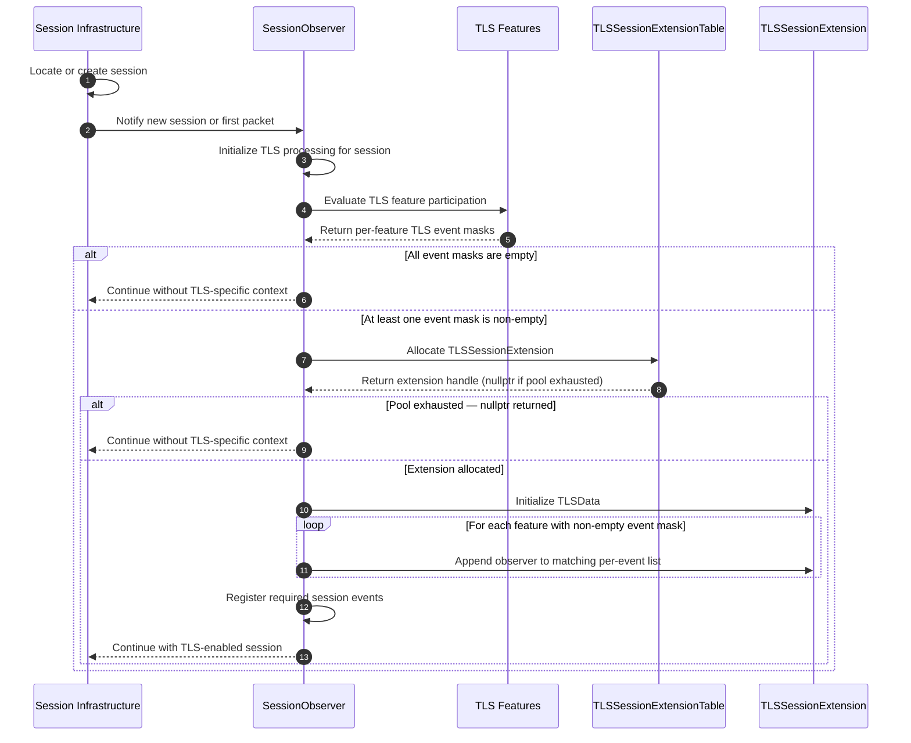
```mermaid
sequenceDiagram
    autonumber

    participant SI as Session Infrastructure
    participant SO as SessionObserver
    participant FF as TLS Features
    participant ET as TLSSessionExtensionTable
    participant EX as TLSSessionExtension

    SI->>SI: Locate or create session
    SI->>SO: Notify new session or first packet
  SO->>SO: Initialize TLS processing for session

  SO->>FF: Evaluate TLS feature participation
  FF-->>SO: Return per-feature TLS event masks

  alt All event masks are empty
        SO-->>SI: Continue without TLS-specific context
  else At least one event mask is non-empty
    SO->>ET: Allocate TLSSessionExtension
    ET-->>SO: Return extension handle (nullptr if pool exhausted)

    alt Pool exhausted — nullptr returned
        SO-->>SI: Continue without TLS-specific context
    else Extension allocated
        SO->>EX: Initialize TLSData

        loop For each feature with non-empty event mask
            SO->>EX: Append observer to matching per-event list
        end

        SO->>SO: Register required session events
        SO-->>SI: Continue with TLS-enabled session
    end
    end
```
### §7.2 Normal Packet Processing Flow

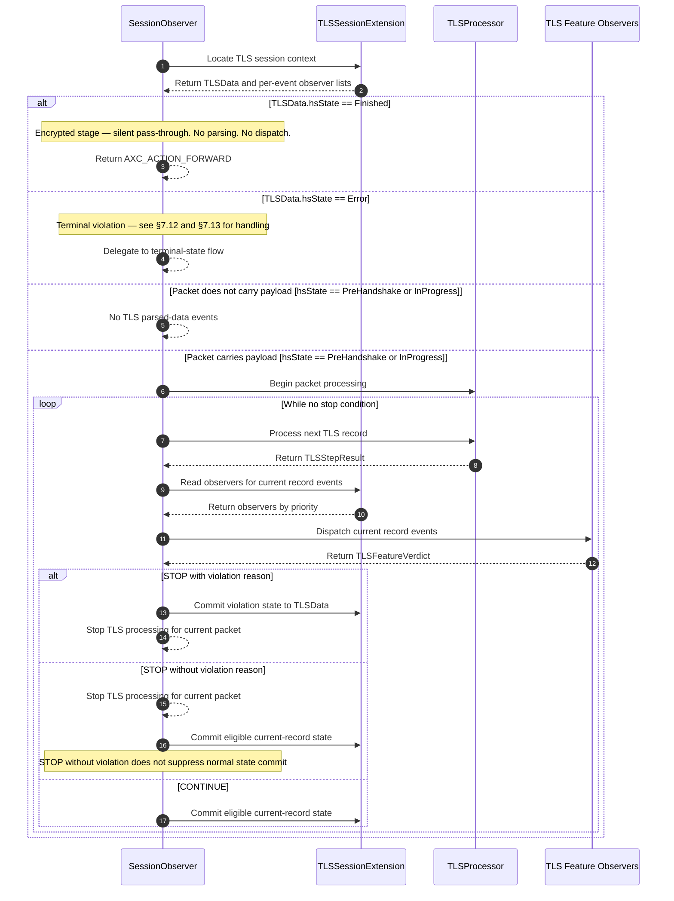
```mermaid
sequenceDiagram
    autonumber

    participant SO as SessionObserver
    participant EX as TLSSessionExtension
    participant TP as TLSProcessor
    participant FO as TLS Feature Observers

    SO->>EX: Locate TLS session context
    EX-->>SO: Return TLSData and per-event observer lists

    alt TLSData.hsState == Finished
        Note over SO: Encrypted stage — silent pass-through. No parsing. No dispatch.
        SO-->>SO: Return AXC_ACTION_FORWARD

    else TLSData.hsState == Error
        Note over SO: Terminal violation — see §7.12 and §7.13 for handling
        SO-->>SO: Delegate to terminal-state flow

    else Packet does not carry payload  [hsState == PreHandshake or InProgress]
        SO-->>SO: No TLS parsed-data events

    else Packet carries payload  [hsState == PreHandshake or InProgress]

        SO->>TP: Begin packet processing

        loop While no stop condition
            SO->>TP: Process next TLS record
            TP-->>SO: Return TLSStepResult

            SO->>EX: Read observers for current record events
            EX-->>SO: Return observers by priority

            SO->>FO: Dispatch current record events
            FO-->>SO: Return TLSFeatureVerdict

            alt STOP with violation reason
                SO->>EX: Commit violation state to TLSData
                SO-->>SO: Stop TLS processing for current packet

            else STOP without violation reason
                SO-->>SO: Stop TLS processing for current packet
                SO->>EX: Commit eligible current-record state
                Note over SO: STOP without violation does not suppress normal state commit

            else CONTINUE
                SO->>EX: Commit eligible current-record state
            end
        end
    end
```

### §7.3 TLS Record Processing Flow

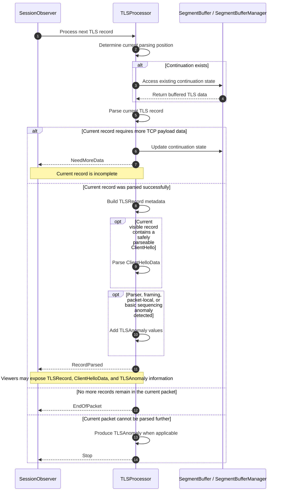
```mermaid
sequenceDiagram
    autonumber

    participant SO as SessionObserver
    participant TP as TLSProcessor
    participant SB as SegmentBuffer / SegmentBufferManager

    SO->>TP: Process next TLS record

    TP->>TP: Determine current parsing position

    alt Continuation exists
        TP->>SB: Access existing continuation state
        SB-->>TP: Return buffered TLS data
    end

    TP->>TP: Parse current TLS record

    alt Current record requires more TCP payload data
        TP->>SB: Update continuation state
        TP-->>SO: NeedMoreData
        Note over SO,TP: Current record is incomplete

    else Current record was parsed successfully

        TP->>TP: Build TLSRecord metadata

        opt Current visible record contains a safely parseable ClientHello
            TP->>TP: Parse ClientHelloData
        end

        opt Parser, framing, packet-local, or basic sequencing anomaly detected
            TP->>TP: Add TLSAnomaly values
        end

        TP-->>SO: RecordParsed

        Note over SO,TP: Viewers may expose TLSRecord, ClientHelloData, and TLSAnomaly information

    else No more records remain in the current packet

        TP-->>SO: EndOfPacket

    else Current packet cannot be parsed further

        TP->>TP: Produce TLSAnomaly when applicable
        TP-->>SO: Stop

    end
```

### §7.4 Event Generation and Step Ordering Flow

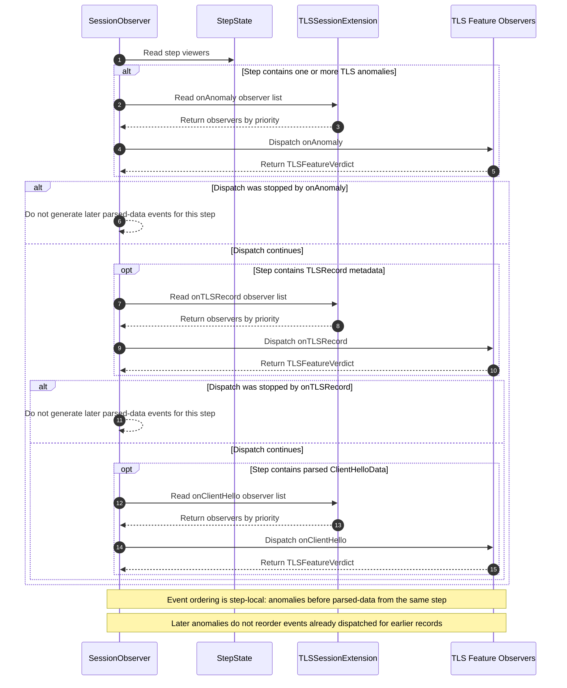
```mermaid
sequenceDiagram
    autonumber

    participant SO as SessionObserver
    participant SR as StepState
  participant EX as TLSSessionExtension
    participant FO as TLS Feature Observers

    SO->>SR: Read step viewers

    alt Step contains one or more TLS anomalies
    SO->>EX: Read onAnomaly observer list
    EX-->>SO: Return observers by priority
        SO->>FO: Dispatch onAnomaly
        FO-->>SO: Return TLSFeatureVerdict
    end

    alt Dispatch was stopped by onAnomaly
        SO-->>SO: Do not generate later parsed-data events for this step
    else Dispatch continues

        opt Step contains TLSRecord metadata
          SO->>EX: Read onTLSRecord observer list
          EX-->>SO: Return observers by priority
            SO->>FO: Dispatch onTLSRecord
            FO-->>SO: Return TLSFeatureVerdict
        end

        alt Dispatch was stopped by onTLSRecord
            SO-->>SO: Do not generate later parsed-data events for this step
        else Dispatch continues

            opt Step contains parsed ClientHelloData
              SO->>EX: Read onClientHello observer list
              EX-->>SO: Return observers by priority
                SO->>FO: Dispatch onClientHello
                FO-->>SO: Return TLSFeatureVerdict
            end

        end
    end

    Note over SO,FO: Event ordering is step-local: anomalies before parsed-data from the same step
    Note over SO,FO: Later anomalies do not reorder events already dispatched for earlier records
```


### §7.5 Observer Dispatch, Verdict Handling, and Processing Stop Flow

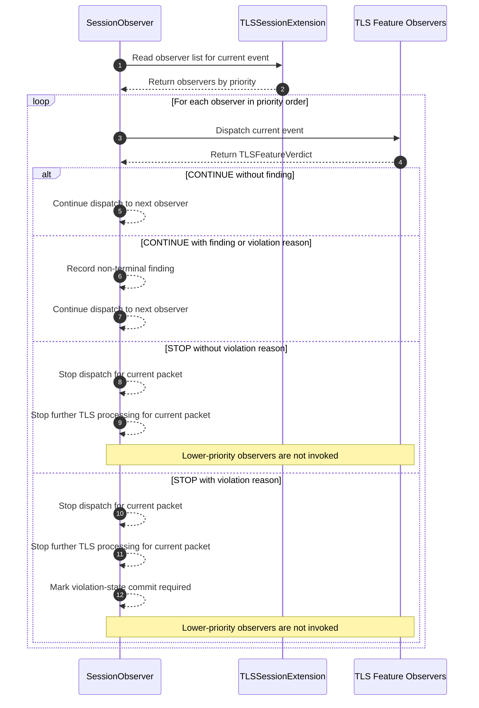
```mermaid
sequenceDiagram
    autonumber

    participant SO as SessionObserver
  participant EX as TLSSessionExtension
    participant FO as TLS Feature Observers

  SO->>EX: Read observer list for current event
  EX-->>SO: Return observers by priority

    loop For each observer in priority order
        SO->>FO: Dispatch current event
        FO-->>SO: Return TLSFeatureVerdict

        alt CONTINUE without finding
            SO-->>SO: Continue dispatch to next observer

        else CONTINUE with finding or violation reason
            SO-->>SO: Record non-terminal finding
            SO-->>SO: Continue dispatch to next observer

        else STOP without violation reason
            SO-->>SO: Stop dispatch for current packet
            SO-->>SO: Stop further TLS processing for current packet
            Note over SO,FO: Lower-priority observers are not invoked

        else STOP with violation reason
            SO-->>SO: Stop dispatch for current packet
            SO-->>SO: Stop further TLS processing for current packet
            SO-->>SO: Mark violation-state commit required
            Note over SO,FO: Lower-priority observers are not invoked
        end
    end
```

### §7.6 Step State Commit Flow

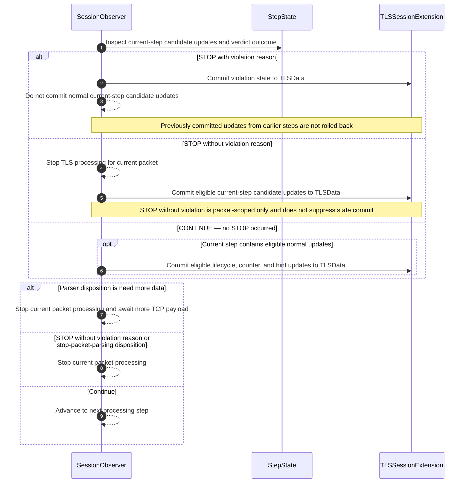
```mermaid
sequenceDiagram
    autonumber

    participant SO as SessionObserver
    participant SR as StepState
    participant EX as TLSSessionExtension

    SO->>SR: Inspect current-step candidate updates and verdict outcome

    alt STOP with violation reason
        SO->>EX: Commit violation state to TLSData
        SO-->>SO: Do not commit normal current-step candidate updates
        Note over SO,EX: Previously committed updates from earlier steps are not rolled back

    else STOP without violation reason
    SO-->>SO: Stop TLS processing for current packet
    SO->>EX: Commit eligible current-step candidate updates to TLSData
    Note over SO,EX: STOP without violation is packet-scoped only and does not suppress state commit

    else CONTINUE — no STOP occurred
        opt Current step contains eligible normal updates
            SO->>EX: Commit eligible lifecycle, counter, and hint updates to TLSData
        end
    end

    alt Parser disposition is need more data
        SO-->>SO: Stop current packet processing and await more TCP payload

    else STOP without violation reason or stop-packet-parsing disposition
        SO-->>SO: Stop current packet processing

    else Continue
        SO-->>SO: Advance to next processing step
    end
```

### §7.7 ClientHello Processing Flow

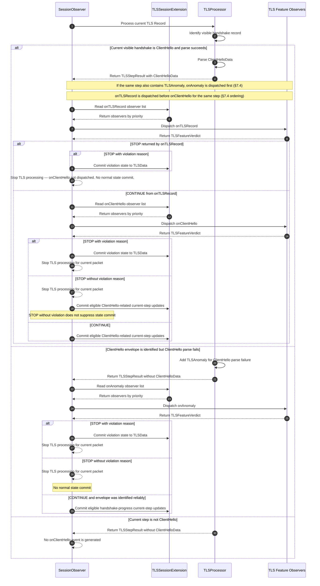
```mermaid
sequenceDiagram
    autonumber

    participant SO as SessionObserver
    participant EX as TLSSessionExtension
    participant TP as TLSProcessor
    participant FO as TLS Feature Observers

    SO->>TP: Process current TLS Record
    TP->>TP: Identify visible handshake record

    alt Current visible handshake is ClientHello and parse succeeds
        TP->>TP: Parse ClientHelloData
        TP-->>SO: Return TLSStepResult with ClientHelloData

        Note over SO,FO: If the same step also contains TLSAnomaly, onAnomaly is dispatched first (§7.4)
        Note over SO,FO: onTLSRecord is dispatched before onClientHello for the same step (§7.4 ordering)

        SO->>EX: Read onTLSRecord observer list
        EX-->>SO: Return observers by priority
        SO->>FO: Dispatch onTLSRecord
        FO-->>SO: Return TLSFeatureVerdict

        alt STOP returned by onTLSRecord
            alt STOP with violation reason
                SO->>EX: Commit violation state to TLSData
            end
            SO-->>SO: Stop TLS processing — onClientHello not dispatched. No normal state commit.
        else CONTINUE from onTLSRecord
            SO->>EX: Read onClientHello observer list
            EX-->>SO: Return observers by priority
            SO->>FO: Dispatch onClientHello
            FO-->>SO: Return TLSFeatureVerdict

            alt STOP with violation reason
                SO->>EX: Commit violation state to TLSData
                SO-->>SO: Stop TLS processing for current packet

            else STOP without violation reason
                SO-->>SO: Stop TLS processing for current packet
                SO->>EX: Commit eligible ClientHello-related current-step updates
                Note over SO: STOP without violation does not suppress state commit

            else CONTINUE
                SO->>EX: Commit eligible ClientHello-related current-step updates
            end
        end

    else ClientHello envelope is identified but ClientHello parse fails
        TP->>TP: Add TLSAnomaly for ClientHello parse failure
        TP-->>SO: Return TLSStepResult without ClientHelloData

        SO->>EX: Read onAnomaly observer list
        EX-->>SO: Return observers by priority
        SO->>FO: Dispatch onAnomaly
        FO-->>SO: Return TLSFeatureVerdict

        alt STOP with violation reason
            SO->>EX: Commit violation state to TLSData
            SO-->>SO: Stop TLS processing for current packet
        else STOP without violation reason
            SO-->>SO: Stop TLS processing for current packet
            Note over SO: No normal state commit
        else CONTINUE and envelope was identified reliably
            SO->>EX: Commit eligible handshake-progress current-step updates
        end

    else Current step is not ClientHello
        TP-->>SO: Return TLSStepResult without ClientHelloData
        SO-->>SO: No onClientHello event is generated
    end
```

### §7.8 Multi-Record Packet Flow

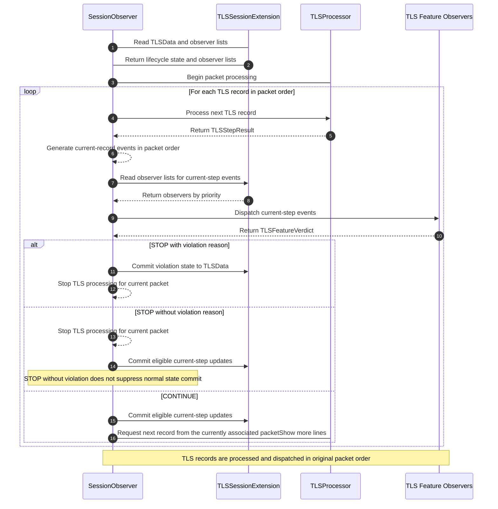
```mermaid
sequenceDiagram
    autonumber

    participant SO as SessionObserver
    participant EX as TLSSessionExtension
    participant TP as TLSProcessor
    participant FO as TLS Feature Observers

    SO -> EX: Read TLSData and observer lists
    EX -> SO: Return lifecycle state and observer lists

    SO -> TP: Begin packet processing

    loop For each TLS record in packet order
        SO->>TP: Process next TLS record
        TP-->>SO: Return TLSStepResult

        SO-->>SO: Generate current-record events in packet order
        SO->>EX: Read observer lists for current-step events
        EX-->>SO: Return observers by priority

        SO->>FO: Dispatch current-step events
        FO-->>SO: Return TLSFeatureVerdict

        alt STOP with violation reason
            SO->>EX: Commit violation state to TLSData
            SO-->>SO: Stop TLS processing for current packet
        else STOP without violation reason
            SO-->>SO: Stop TLS processing for current packet
            SO->>EX: Commit eligible current-step updates
            Note over SO: STOP without violation does not suppress normal state commit
        else CONTINUE
            SO->>EX: Commit eligible current-step updates
            SO -> TP: Request next record from the currently associated packetShow more lines
        end
    end

    Note over SO,FO: TLS records are processed and dispatched in original packet order
```

### §7.9 Partial TLS Input Flow

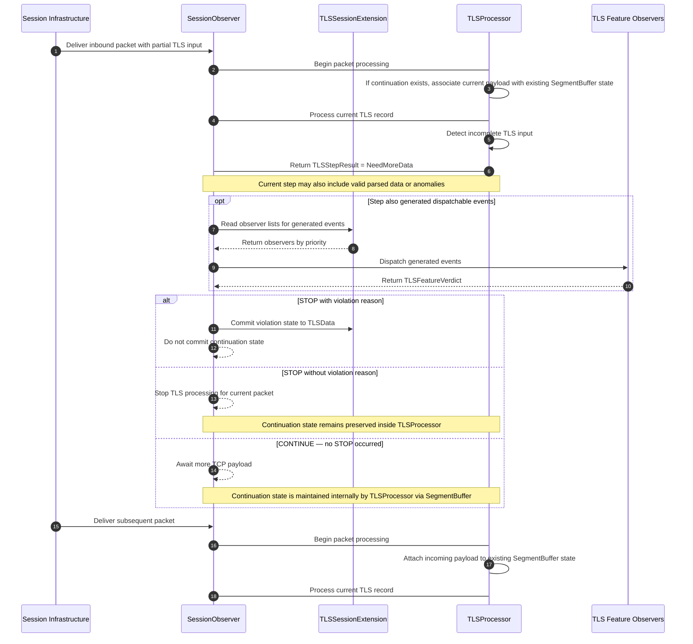
```mermaid
sequenceDiagram
    autonumber

    participant SI as Session Infrastructure
    participant SO as SessionObserver
    participant EX as TLSSessionExtension
    participant TP as TLSProcessor
    participant FO as TLS Feature Observers

    SI->>SO: Deliver inbound packet with partial TLS input
    SO -> TP: Begin packet processing

    TP -> TP: If continuation exists, associate current payload with existing SegmentBuffer state

    SO -> TP: Process current TLS record
    TP->>TP: Detect incomplete TLS input
    TP -> SO: Return TLSStepResult = NeedMoreData
    Note over SO,TP: Current step may also include valid parsed data or anomalies

    opt Step also generated dispatchable events
        SO->>EX: Read observer lists for generated events
        EX-->>SO: Return observers by priority
        SO->>FO: Dispatch generated events
        FO-->>SO: Return TLSFeatureVerdict
    end

    alt STOP with violation reason
        SO->>EX: Commit violation state to TLSData
        SO-->>SO: Do not commit continuation state
    else STOP without violation reason
        SO-->>SO: Stop TLS processing for current packet
        Note over SO,TP: Continuation state remains preserved inside TLSProcessor
    else CONTINUE — no STOP occurred
        SO-->>SO: Await more TCP payload
        Note over SO,TP: Continuation state is maintained internally by TLSProcessor via SegmentBuffer

    end

    SI->>SO: Deliver subsequent packet
    SO -> TP: Begin packet processing

    TP -> TP: Attach incoming payload to existing SegmentBuffer state

    SO -> TP: Process current TLS record
```

### §7.10 TLS Anomaly Reporting Flow

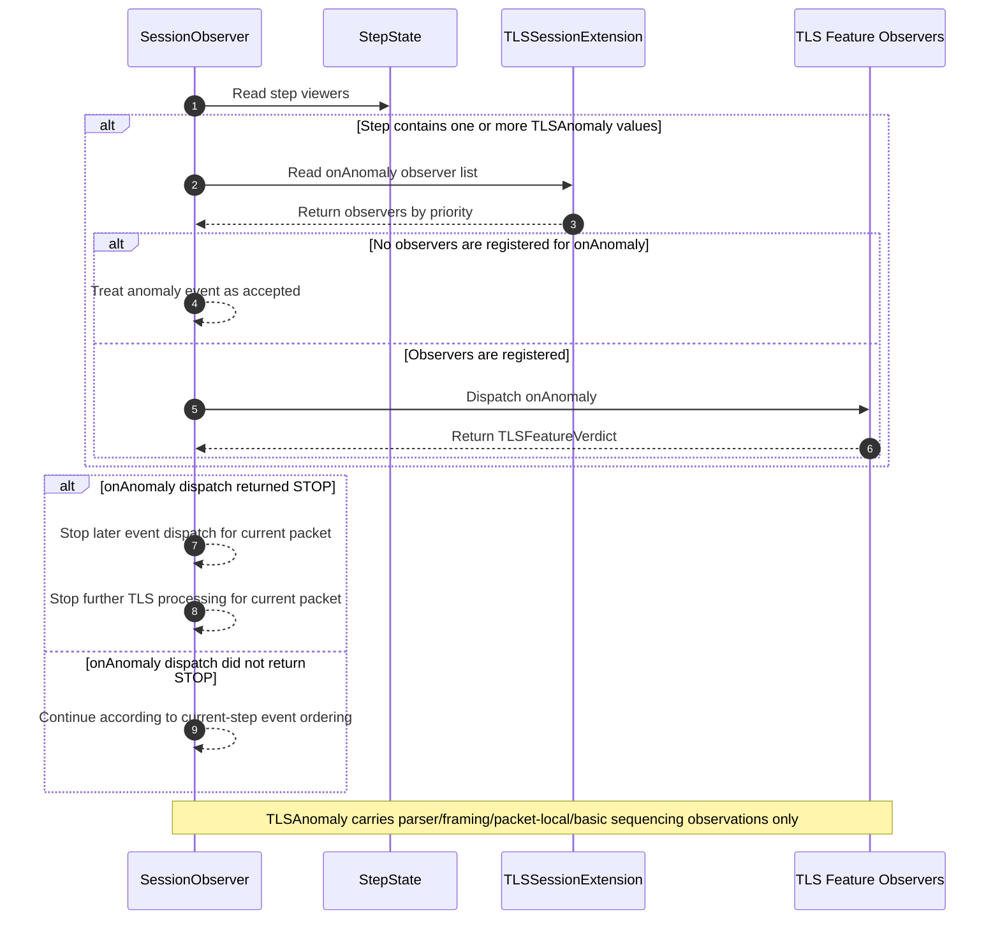
```mermaid
sequenceDiagram
    autonumber

    participant SO as SessionObserver
    participant SR as StepState
    participant EX as TLSSessionExtension
    participant FO as TLS Feature Observers

    SO->>SR: Read step viewers

    alt Step contains one or more TLSAnomaly values
        SO->>EX: Read onAnomaly observer list
        EX-->>SO: Return observers by priority

        alt No observers are registered for onAnomaly
            SO-->>SO: Treat anomaly event as accepted
        else Observers are registered
            SO->>FO: Dispatch onAnomaly
            FO-->>SO: Return TLSFeatureVerdict
        end
    end

    alt onAnomaly dispatch returned STOP
        SO-->>SO: Stop later event dispatch for current packet
        SO-->>SO: Stop further TLS processing for current packet
    else onAnomaly dispatch did not return STOP
        SO-->>SO: Continue according to current-step event ordering
    end

    Note over SO,FO: TLSAnomaly carries parser/framing/packet-local/basic sequencing observations only
```

### §7.11 Encrypted Parsing Boundary Flow

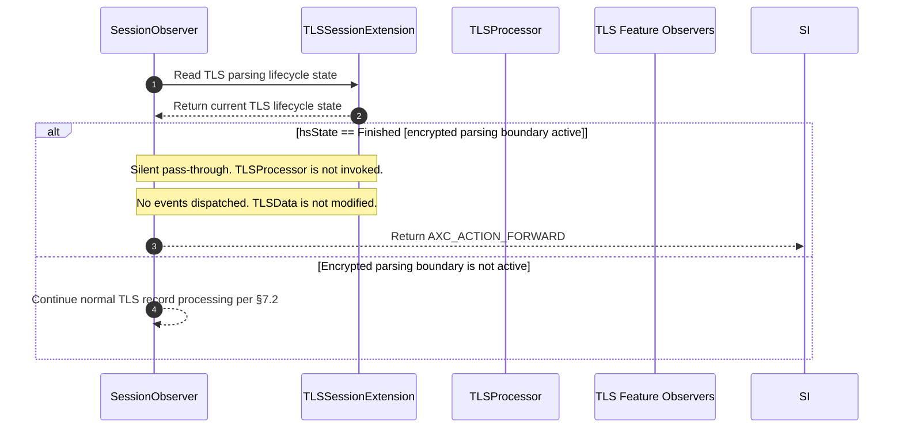
```mermaid
sequenceDiagram
    autonumber

    participant SO as SessionObserver
    participant EX as TLSSessionExtension
    participant TP as TLSProcessor
    participant FO as TLS Feature Observers

    SO->>EX: Read TLS parsing lifecycle state
    EX-->>SO: Return current TLS lifecycle state

    alt hsState == Finished  [encrypted parsing boundary active]
        Note over SO,EX: Silent pass-through. TLSProcessor is not invoked.
        Note over SO,EX: No events dispatched. TLSData is not modified.
        SO-->>SI: Return AXC_ACTION_FORWARD

    else Encrypted parsing boundary is not active
        SO-->>SO: Continue normal TLS record processing per §7.2
    end
```

### §7.12 Terminal-State Payload Packet Flow

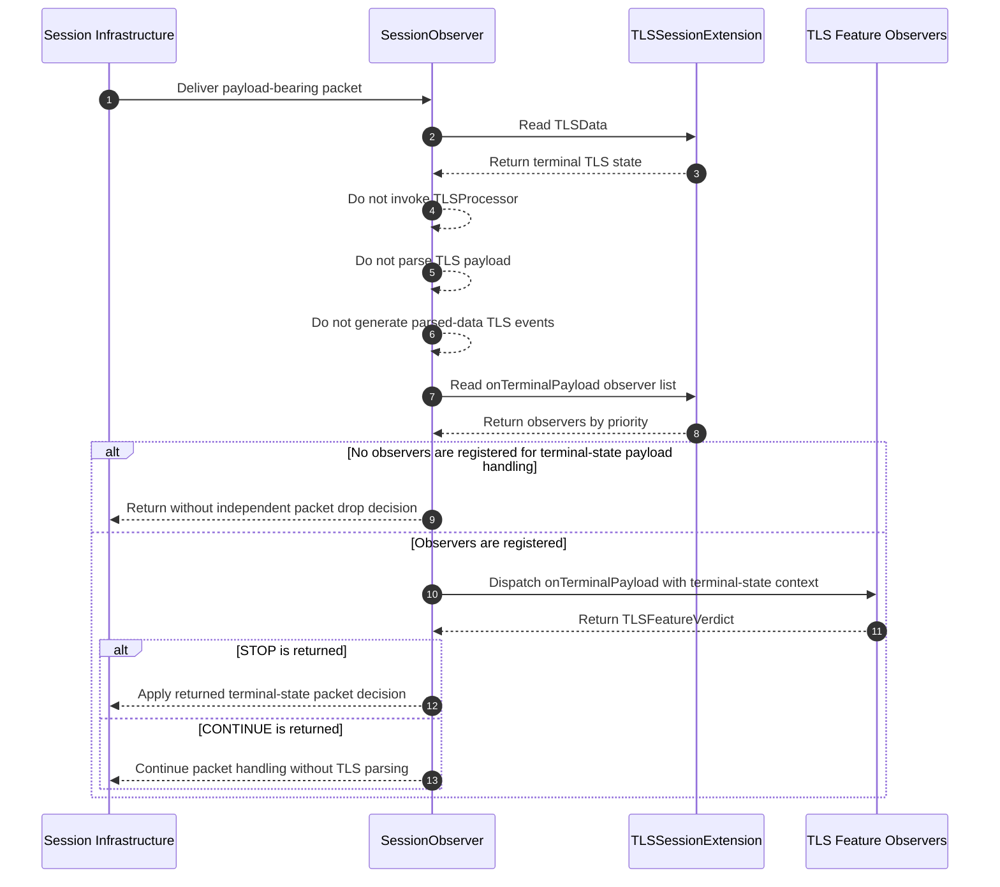
```mermaid
sequenceDiagram
    autonumber

    participant SI as Session Infrastructure
    participant SO as SessionObserver
    participant EX as TLSSessionExtension
    participant FO as TLS Feature Observers

    SI->>SO: Deliver payload-bearing packet
    SO->>EX: Read TLSData
    EX-->>SO: Return terminal TLS state

    SO-->>SO: Do not invoke TLSProcessor
    SO-->>SO: Do not parse TLS payload
    SO-->>SO: Do not generate parsed-data TLS events

    SO->>EX: Read onTerminalPayload observer list
    EX-->>SO: Return observers by priority

    alt No observers are registered for terminal-state payload handling
        SO-->>SI: Return without independent packet drop decision
    else Observers are registered
        SO->>FO: Dispatch onTerminalPayload with terminal-state context
        FO-->>SO: Return TLSFeatureVerdict

        alt STOP is returned
            SO-->>SI: Apply returned terminal-state packet decision
        else CONTINUE is returned
            SO-->>SI: Continue packet handling without TLS parsing
        end
    end
```

### §7.13 Terminal-State Non-Payload Packet Flow

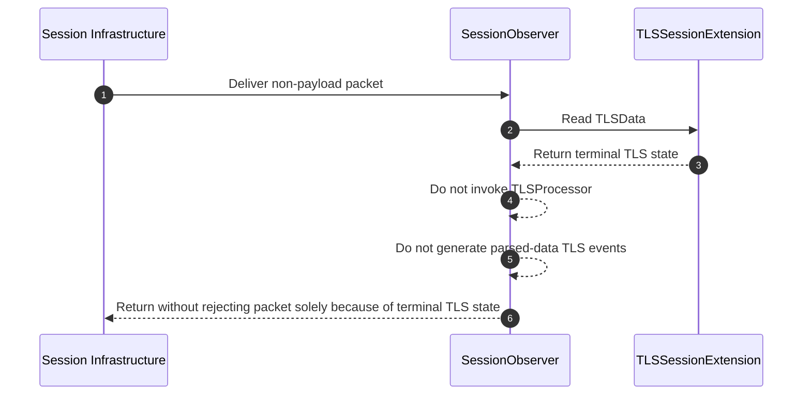
```mermaid
sequenceDiagram
    autonumber

    participant SI as Session Infrastructure
    participant SO as SessionObserver
    participant EX as TLSSessionExtension

    SI->>SO: Deliver non-payload packet
    SO->>EX: Read TLSData
    EX-->>SO: Return terminal TLS state

    SO-->>SO: Do not invoke TLSProcessor
    SO-->>SO: Do not generate parsed-data TLS events
    SO-->>SI: Return without rejecting packet solely because of terminal TLS state
    
```

### §7.14 TCP Reset Flow

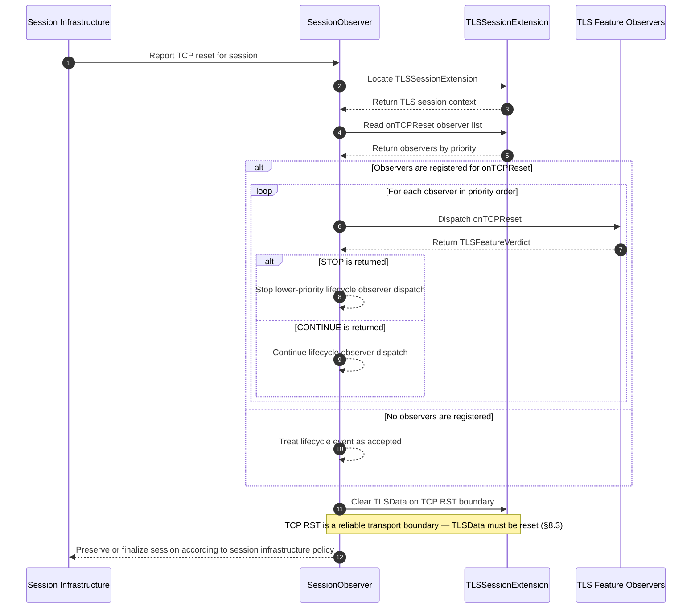
```mermaid
sequenceDiagram
    autonumber

    participant SI as Session Infrastructure
    participant SO as SessionObserver
    participant EX as TLSSessionExtension
    participant FO as TLS Feature Observers

    SI->>SO: Report TCP reset for session
    SO->>EX: Locate TLSSessionExtension
    EX-->>SO: Return TLS session context

    SO->>EX: Read onTCPReset observer list
    EX-->>SO: Return observers by priority

    alt Observers are registered for onTCPReset
        loop For each observer in priority order
            SO->>FO: Dispatch onTCPReset
            FO-->>SO: Return TLSFeatureVerdict

            alt STOP is returned
                SO-->>SO: Stop lower-priority lifecycle observer dispatch
            else CONTINUE is returned
                SO-->>SO: Continue lifecycle observer dispatch
            end
        end
    else No observers are registered
        SO-->>SO: Treat lifecycle event as accepted
    end

    SO->>EX: Clear TLSData on TCP RST boundary
    Note over SO,EX: TCP RST is a reliable transport boundary — TLSData must be reset (§8.3)
    SO-->>SI: Preserve or finalize session according to session infrastructure policy
```

### §7.15 Session Reuse Flow

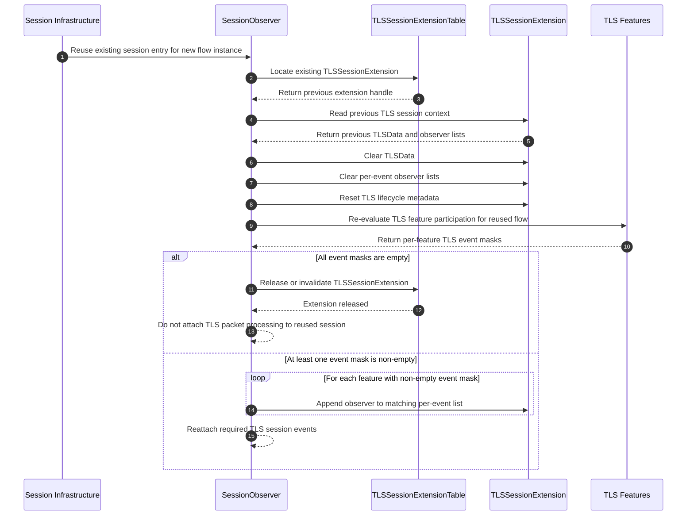
```mermaid
sequenceDiagram
    autonumber

    participant SI as Session Infrastructure
    participant SO as SessionObserver
    participant ET as TLSSessionExtensionTable
    participant EX as TLSSessionExtension
    participant FF as TLS Features

    SI->>SO: Reuse existing session entry for new flow instance
    SO->>ET: Locate existing TLSSessionExtension
    ET-->>SO: Return previous extension handle
    SO->>EX: Read previous TLS session context
    EX-->>SO: Return previous TLSData and observer lists

    SO->>EX: Clear TLSData
    SO->>EX: Clear per-event observer lists
    SO->>EX: Reset TLS lifecycle metadata

    SO->>FF: Re-evaluate TLS feature participation for reused flow
    FF-->>SO: Return per-feature TLS event masks

    alt All event masks are empty
        SO->>ET: Release or invalidate TLSSessionExtension
        ET-->>SO: Extension released
        SO-->>SO: Do not attach TLS packet processing to reused session
    else At least one event mask is non-empty
        loop For each feature with non-empty event mask
            SO->>EX: Append observer to matching per-event list
        end
        SO-->>SO: Reattach required TLS session events
    end
```

### §7.16 Session End / Cleanup Flow

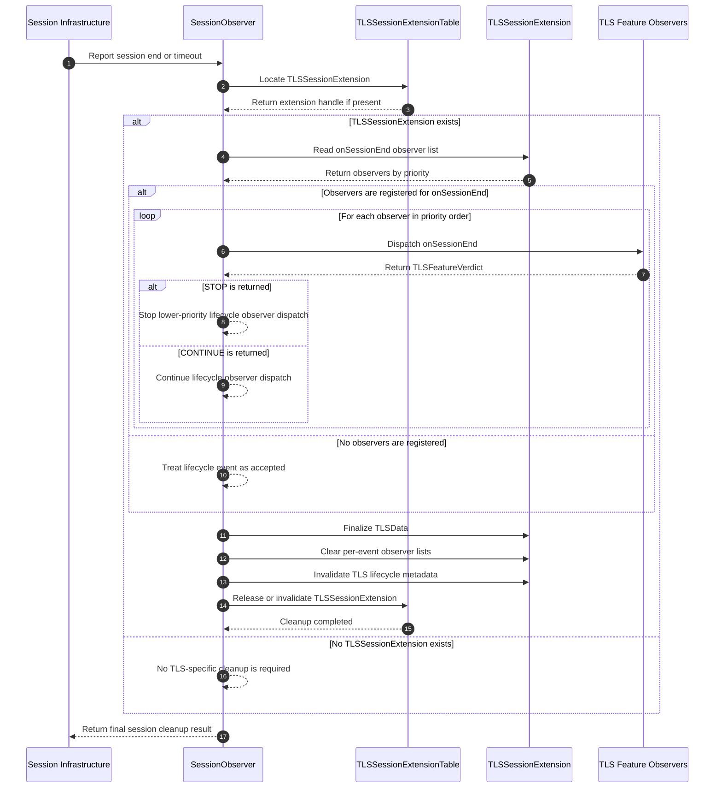
```mermaid
sequenceDiagram
    autonumber

    participant SI as Session Infrastructure
    participant SO as SessionObserver
    participant ET as TLSSessionExtensionTable
    participant EX as TLSSessionExtension
    participant FO as TLS Feature Observers

    SI->>SO: Report session end or timeout
    SO->>ET: Locate TLSSessionExtension
    ET-->>SO: Return extension handle if present

    alt TLSSessionExtension exists
        SO->>EX: Read onSessionEnd observer list
        EX-->>SO: Return observers by priority

        alt Observers are registered for onSessionEnd
            loop For each observer in priority order
                SO->>FO: Dispatch onSessionEnd
                FO-->>SO: Return TLSFeatureVerdict

                alt STOP is returned
                    SO-->>SO: Stop lower-priority lifecycle observer dispatch
                else CONTINUE is returned
                    SO-->>SO: Continue lifecycle observer dispatch
                end
            end
        else No observers are registered
            SO-->>SO: Treat lifecycle event as accepted
        end

        SO->>EX: Finalize TLSData
        SO->>EX: Clear per-event observer lists
        SO->>EX: Invalidate TLS lifecycle metadata
        SO->>ET: Release or invalidate TLSSessionExtension
        ET-->>SO: Cleanup completed

    else No TLSSessionExtension exists
        SO-->>SO: No TLS-specific cleanup is required
    end

    SO-->>SI: Return final session cleanup result
```

## §8 State-Machine
### §8.1 Handshake Progress States

The handshake progress state machine tracks the observable TLS handshake progression for the session.  
This section defines only the core handshake-progress states.  
Transient parser conditions such as split ClientHello continuation are handled separately in packet/step processing rules and are not modeled here as headline handshake states.  
Reporting outcomes and violation classifications are handled separately in §8.4 and §8.5.

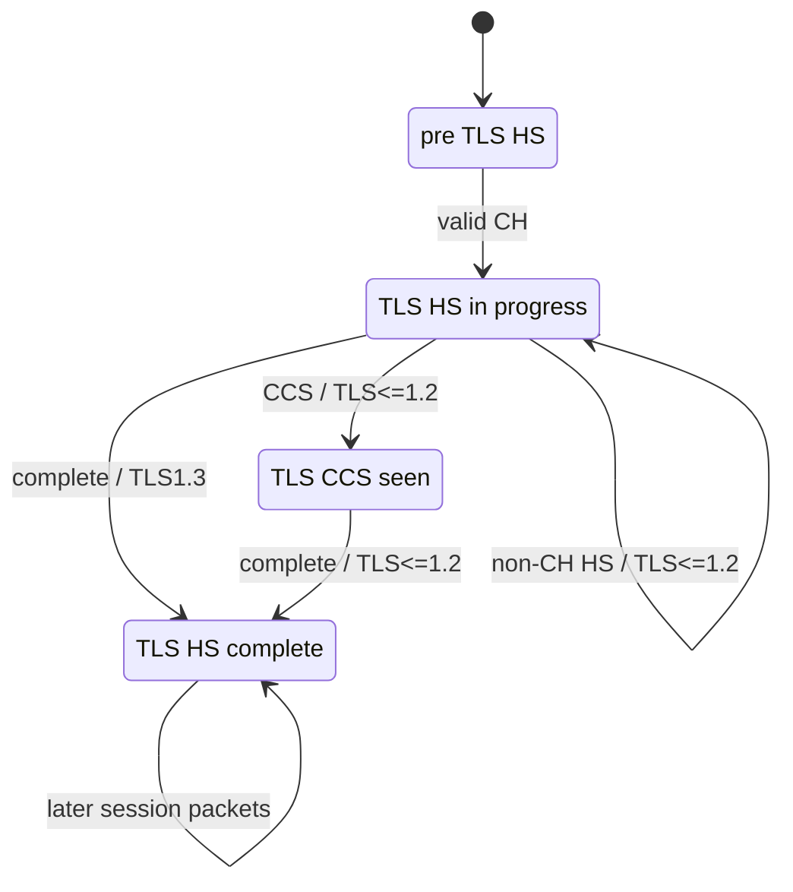
```mermaid
stateDiagram-v2
    [*] --> PreTLSHS

    state "pre TLS HS" as PreTLSHS
    state "TLS HS in progress" as HSInProgress
    state "TLS CCS seen" as CCSSeen
    state "TLS HS complete" as HSComplete

    PreTLSHS --> HSInProgress: valid CH
    HSInProgress --> HSInProgress: non-CH HS / TLS<=1.2
    HSInProgress --> CCSSeen: CCS / TLS<=1.2
    HSInProgress --> HSComplete: complete / TLS1.3
    CCSSeen --> HSComplete: complete / TLS<=1.2

    HSComplete --> HSComplete: later session packets
```

**Legend**
- **CH** — ClientHello
- **HS** — Handshake
- **non-CH HS** — plaintext TLS Handshake records that are not ClientHello
- **CKE** — ClientKeyExchange
- **CCS** — ChangeCipherSpec
- **complete** — handshake completion observed for the relevant TLS version
- **TLS<=1.2** — TLS version 1.2 and below
- **TLS1.3** — TLS version 1.3

### §8.2 Packet and Step Processing States

The packet and step processing state machine tracks the runtime execution path for a single packet.
It is separate from the handshake progress states in §8.1.  
The handshake progress state describes where the session is in TLS handshake progression, while this section describes how the current packet is processed step by step by SessionObserver, TLSProcessor, and the observer-dispatch path.
 [1](https://radwareil-my.sharepoint.com/personal/avist_radware_com/Documents/Microsoft%20Copilot%20Chat%20Files/FRD_Phase1_FP_Elimination.md)

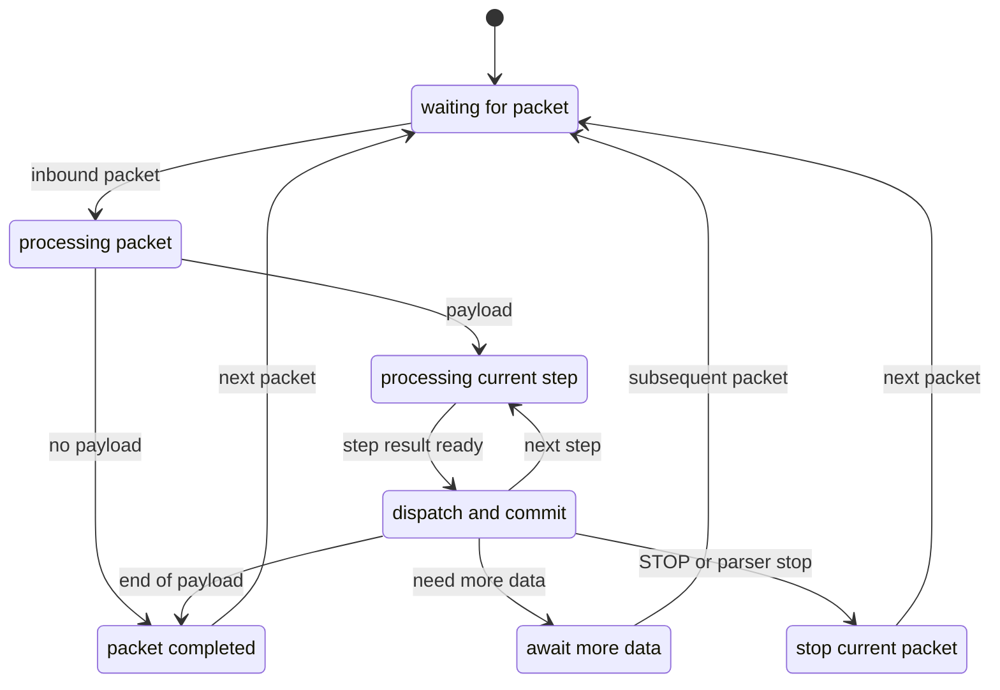
```mermaid
stateDiagram-v2
    [*] --> WaitingForPacket

    state "waiting for packet" as WaitingForPacket
    state "processing packet" as ProcessingPacket
    state "processing current step" as ProcessingStep
    state "dispatch and commit" as DispatchCommit
    state "await more data" as AwaitMoreData
    state "stop current packet" as StopPacket
    state "packet completed" as PacketCompleted

    WaitingForPacket --> ProcessingPacket: inbound packet
    ProcessingPacket --> PacketCompleted: no payload
    ProcessingPacket --> ProcessingStep: payload

    ProcessingStep --> DispatchCommit: step result ready

    DispatchCommit --> ProcessingStep: next step
    DispatchCommit --> AwaitMoreData: need more data
    DispatchCommit --> StopPacket: STOP or parser stop
    DispatchCommit --> PacketCompleted: end of payload

    AwaitMoreData --> WaitingForPacket: subsequent packet
    StopPacket --> WaitingForPacket: next packet
    PacketCompleted --> WaitingForPacket: next packet
```

**Legend**
- **step** — one TLS processing step, typically one TLS record
- **step result** — `TLSStepResult` returned by `TLSProcessor`
- **dispatch and commit** — event generation, optional observer dispatch, verdict handling, and eligible current-step state commit
- **need more data** — parser continuation is required before TLS processing can continue
- **parser stop** — parser returned `stop packet parsing`
- **STOP** — observer returned `TLSFeatureVerdict.STOP`
``
### §8.3 Reset and In-Place Reinitialization

The reset transition defines when the per-session TLS state held in `TLSData` is cleared and reinitialized.

`TLSData` is cleared only when the session infrastructure observes a reliable transport or session boundary, such as TCP reset, connection termination, aging, or timeout according to SessionTable policy.

Observed TLS `Alert` records do not reset `TLSData` by themselves, including fatal alerts.  
In a one-direction observer, an alert record alone is not a sufficiently reliable signal for reinitializing TLS session state.

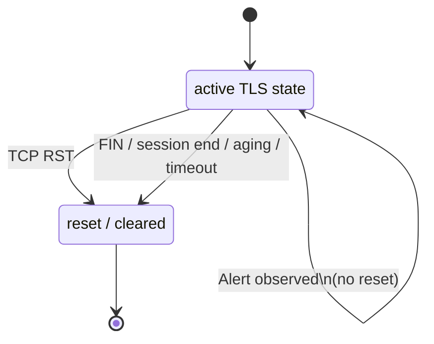
```mermaid
stateDiagram-v2
    [*] --> ActiveTLSState

    state "active TLS state" as ActiveTLSState
    state "reset / cleared" as Cleared

    ActiveTLSState --> Cleared: TCP RST
    ActiveTLSState --> Cleared: FIN / session end / aging / timeout

    ActiveTLSState --> ActiveTLSState: Alert observed\n(no reset)

    Cleared --> [*]
```

**Reset rule**
- `TLSData` is cleared on **TCP reset**, because `RST` terminates the transport connection and the current TLS flow cannot continue on that TCP connection.
- `TLSData` is cleared on **transport/session termination**, including `FIN`, session end, aging, or timeout, because these events form a reliable boundary after which the current TLS state must not be reused.
- `TLSData` is also cleared when session infrastructure policy reinitializes a session for a new flow instance.

**No reset on Alert**
- An observed TLS `Alert` record does **not** reset `TLSData` by itself. This rule applies even if the observed alert is fatal; `TLSData` reset still waits for a reliable transport or session boundary detected by the session infrastructure.
- This design is intentional because `TLS-Flow` observes only one traffic direction and therefore cannot reliably infer the full connection outcome from an `Alert` record alone.
- In TLS 1.2, not every `Alert` is a safe reset signal, and `close_notify` is a closure indication rather than a request to restart the handshake.
- In TLS 1.3, `close_notify` indicates that the sender will send no more messages on the connection, and any data received after a closure alert must be ignored.
- In both TLS 1.2 and TLS 1.3, a fatal alert terminates the connection. Therefore, an observed `Alert` is treated as a reporting or lifecycle signal, but **not** as a standalone trigger for clearing session TLS state.

**Implication for a later ClientHello**
- If a later `ClientHello` is observed after an `Alert`, it is treated as a new handshake only after a **new transport or session boundary** is established, such as a new connection, reset, session reuse, or fresh session allocation.
- The design does not rely on `Alert`-driven state clearing to permit a new `ClientHello`, because doing so would be prone to false positives in a one-direction observer.

**Note on TLS 1.2 renegotiation**
- TLS 1.2 renegotiation on an already established connection does not change the reset rule defined here. Reset of `TLSData` still depends on a reliable transport or session boundary, not on `Alert` observation alone.
- In this design, post-completion traffic is outside the normal early-handshake parsing path, so renegotiation does not justify clearing `TLSData` on `Alert` alone.

### §8.4 Terminal Outcomes

This section defines the terminal outcomes of the TLS-Flow runtime path.

A terminal outcome describes whether the session remains eligible for normal TLS processing or has entered a state in which normal TLS parsing and parsed-data event generation no longer continue for subsequent packets.  
Terminal outcomes belong to the TLS-Flow state model itself and are separate from any feature-specific reporting or enforcement naming.

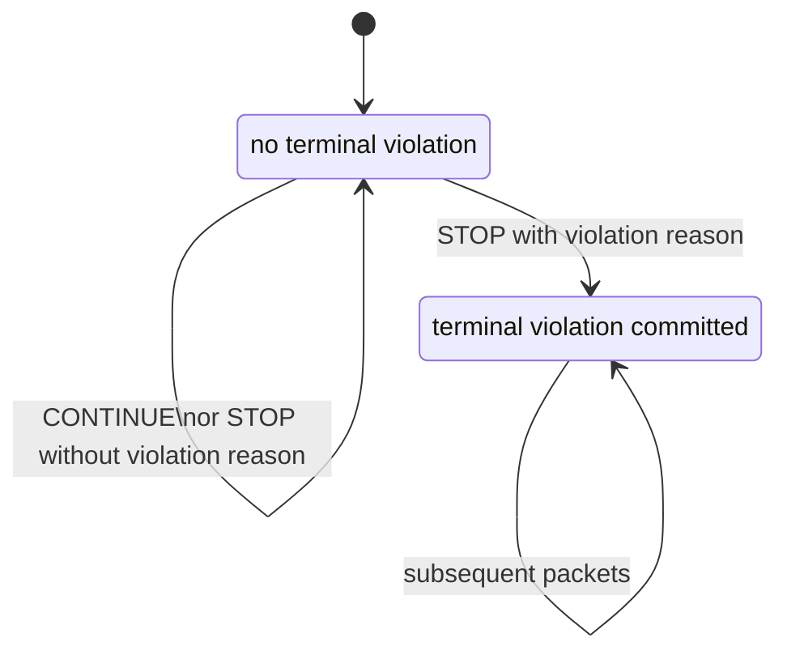
```mermaid
stateDiagram-v2
    [*] --> NoTerminalViolation

    state "no terminal violation" as NoTerminalViolation
    state "terminal violation committed" as TerminalViolationCommitted

    NoTerminalViolation --> NoTerminalViolation: CONTINUE\nor STOP without violation reason
    NoTerminalViolation --> TerminalViolationCommitted: STOP with violation reason
    TerminalViolationCommitted --> TerminalViolationCommitted: subsequent packets
```

**Terminal outcomes**
- **No terminal violation** — the session continues according to the handshake progress states and the packet/step processing rules. A `CONTINUE` verdict does not enter terminal state, and a `STOP` verdict without violation reason also does not by itself commit terminal TLS state.
- **Terminal violation committed** — a feature verdict caused violation-state commit in `TLSData`. From this point onward, normal TLS parsing does not continue for later packets of the session.

**Behavior after terminal violation**
- For a later **payload-bearing packet**, `TLS-Flow` does not invoke the normal TLS parsing path and does not generate parsed-data TLS events. Instead, terminal-state packet handling applies, as defined in the packet flows.
- For a later **non-payload packet**, `TLS-Flow` does not invoke the normal TLS parsing path and does not generate parsed-data events solely because the session is in terminal state.
- Entering terminal violation state does not by itself imply that `TLS-Flow` independently reports, mitigates, or drops traffic. Those decisions remain feature-owned and are expressed through the feature verdict path.

**State transition rule**
- The transition into terminal violation state occurs only when observer verdict handling results in violation-state commit.
- A `STOP` verdict without violation reason stops lower-priority dispatch and stops further TLS processing for the current packet, but does not by itself move the session into terminal TLS state.
- Once terminal violation state has been committed, subsequent packet handling follows the terminal-state flows rather than the normal parsing flows.

### §8.5 State Update Rules

This section defines the rules by which `TLS-Flow` updates session state.

`TLS-Flow` owns handshake-progress state, packet/step processing state, reset behavior, terminal outcome state, and all commits to `TLSData`.  
`TLS-Flow` does **not** own reporting, mitigation, or packet-drop policy. Those decisions remain feature-owned and are expressed through the feature verdict path.

#### §8.5.1 Handshake Progress State Update Rules

The core handshake-progress states are:
- `pre TLS HS`
- `TLS HS in progress`
- `TLS CCS seen`
- `TLS HS complete`

The following rules apply:

- A valid ClientHello advances the session from `pre TLS HS` to `TLS HS in progress`.
- For `TLS<=1.2`, observing `ChangeCipherSpec` after handshake progression advances the session from `TLS HS in progress` to `TLS CCS seen`.
- For `TLS1.3`, handshake completion may be observed without entering `TLS CCS seen`, and the session may therefore advance directly from `TLS HS in progress` to `TLS HS complete`.
- For `TLS<=1.2`, handshake completion after the CCS boundary advances the session from `TLS CCS seen` to `TLS HS complete`.
- Plaintext non-ClientHello handshake activity before the CCS boundary does not create a separate headline handshake state in this design; the session remains in `TLS HS in progress`.

#### §8.5.2 Packet and Step Processing Update Rules

For each packet processed through the TLS runtime path, `SessionObserver` evaluates the current TLS state, invokes `TLSProcessor` when applicable, reads step results via viewer accessors, dispatches relevant events, handles returned verdicts, and commits eligible updates into `TLSData`.

The following packet/step rules apply:

- If the packet carries no payload, `TLS-Flow` does not invoke the normal TLS parsing path for parsed-data generation.
- If the packet carries payload, processing proceeds step by step until one of the packet-local stop conditions occurs: end of payload, `need more data`, parser stop, or observer `STOP`.
- A step result may contain valid parsed data, anomalies, continuation information, candidate lifecycle updates, or any combination allowed by the best-effort parsing model.
- If a step generates both anomalies and parsed data, anomaly handling precedes parsed-data dispatch for that same step.

#### §8.5.3 Step Commit Rules

State commit remains owned by `TLS-Flow` and occurs only after verdict handling for the current step.

The following commit rules apply:

- If verdict handling results in **violation-state commit**, `TLS-Flow` commits terminal violation state and does **not** commit the normal current-step candidate updates derived from that step.
- A `STOP` verdict **with** a violation reason suppresses normal current-step candidate updates and also commits `HsState::Error`.
- A STOP verdict without a violation reason is packet-scoped and affects only observer dispatch and further TLS processing for the current packet.

It MUST NOT suppress eligible normal current-step candidate updates.

`TLS-Flow` MUST commit all eligible normal state updates derived from the current step, including lifecycle progression, counters, and hints.
- If verdict handling does **not** result in a STOP verdict, `TLS-Flow` may commit eligible normal current-step updates, including lifecycle, counters, and hints.
- A `CONTINUE` verdict with a non-terminal finding does **not** prevent eligible current-step state commit.
- Updates already committed from earlier steps of the session are not rolled back by a later step.

**Clarification — STOP Without Violation and State Correctness**

A STOP verdict without a violation reason does not invalidate the correctness of the parsed TLS data for the current step.

TLS-Flow state must always reflect successfully parsed TLS protocol observations, regardless of whether further packet processing is stopped.

Therefore, parsed facts such as record boundaries, handshake progression, and successfully parsed ClientHello messages MUST be committed even when processing is stopped without a violation.

#### §8.5.4 Reset and Reinitialization Rules

Reset and reinitialization rules are governed by reliable transport or session boundaries rather than by individual TLS observations alone.

The following rules apply:

- `TLSData` is cleared and reinitialized on `TCP RST`.
- `TLSData` is also cleared and reinitialized on reliable transport/session termination according to SessionTable policy, including session end, aging, or timeout.
- Observed TLS `Alert` records do **not** reset `TLSData` by themselves, including fatal alerts.
- If a later ClientHello is observed after an `Alert`, it is treated as a new handshake only after a new transport or session boundary has been established. Otherwise, the same live TLS context remains in effect.

#### §8.5.5 Terminal Outcome Rules

Terminal outcome is separate from handshake-progress state and is governed only by verdict handling.

The following rules apply:

- A `CONTINUE` verdict does not move the session into terminal TLS state.
- A `STOP` verdict without violation reason does not move the session into terminal TLS state.
- A `STOP` verdict with violation reason causes terminal violation state to be committed.
- Once terminal violation state is committed, normal TLS parsing does not continue for later packets of the session. Later packet handling follows the terminal-state flows instead.

### §9 Implementation Details

Component responsibilities, design intent, and ownership rules are defined in §6. This chapter is the implementation-specification layer: sub-component dependency diagram (§9.1), data structure and memory layouts (§9.2), interface definitions with formal operation contracts and class diagrams (§9.3), full class diagram (§9.4), and runtime path descriptions, memory sizing, and implementation blueprint (§9.5–§9.7).

#### §9.1 Sub-Component Dependency Diagram

This section shows the implementation-level dependencies between the TLS-Flow sub-components.

The diagram is a dependency and ownership view.  
It is not a full class model; the complete class-level view is defined later in §9.4.

```mermaid
classDiagram
    direction LR

    class SessionInfrastructure {
        <<external>>
        SessionTable
        Session lifecycle
        Packet delivery
    }

    class SessionObserver {
        <<runtime conductor>>
        Session initialization
        Packet processing
        Event dispatch
        Verdict handling
        State commit
    }

    class TLSSessionExtensionTable {
        <<sparse storage>>
        Allocate extension
        Lookup extension
        Release or invalidate extension
    }

    class TLSSessionExtension {
        <<per-session TLS context>>
        TLSData owner
        Observer-list owner
        Lifecycle metadata
    }

    class TLSData {
    <<compact session state>>
    Handshake progress
    Counters and hints
    Terminal context
    }   

    class PerEventObserverLists {
        <<per-session observer lists>>
        onAnomaly observers
        onClientHello observers
        onTLSRecord observers
        lifecycle observers
        terminal-state observers
    }

    class TLSProcessor {
        <<parser>>
        Step-based TLS parsing
        Record-layer parsing
        ClientHello parsing
        Anomaly detection
    }

    class TLSRecord {
        <<step-scoped data>>
        Record metadata
    }

    class ClientHelloData {
        <<step/event-scoped data>>
        Parsed ClientHello fields
    }

    class TLSAnomaly {
        <<step-scoped data>>
        Parser and framing observations
    }

    class EventViewers {
        <<read-only event access>>
        AnomalyViewer
        ClientHelloViewer
        TLSRecordViewer
    }

    class TLSFeatureObservers {
        <<feature-owned>>
        TLS-Enforcement
        TLS-Visibility
        TLS-Fingerprint
    }

    class TLSFeatureVerdict {
        <<feature verdict>>
        CONTINUE
        STOP
        Optional finding
        Optional violation reason
    }

    SessionInfrastructure ..> SessionObserver : packet and lifecycle callbacks

    TLSFeatureObservers ..> SessionObserver : startup subscription (ITlsSubject)

    SessionObserver ..> TLSSessionExtensionTable : allocate / lookup / release
    TLSSessionExtensionTable *-- TLSSessionExtension : sparse storage

    TLSSessionExtension *-- TLSData : owns
    TLSSessionExtension *-- PerEventObserverLists : owns
    PerEventObserverLists o-- TLSFeatureObservers : ordered observer references

    SessionObserver ..> TLSSessionExtension : read context and observer lists
    SessionObserver ..> TLSData : commit eligible updates through extension

    SessionObserver ..> TLSProcessor : invoke parsing step
    TLSProcessor ..> TLSRecord : step-scoped
    TLSProcessor ..> ClientHelloData : step/event-scoped
    TLSProcessor ..> TLSAnomaly : step-scoped

    SessionObserver ..> EventViewers : build event viewers from TLSProcessor viewers
    EventViewers ..> TLSProcessor : read-only backing data

    SessionObserver ..> TLSFeatureObservers : dispatch events
    TLSFeatureObservers ..> EventViewers : consume read-only event data
    TLSFeatureObservers ..> TLSFeatureVerdict : return verdict
    SessionObserver ..> TLSFeatureVerdict : handle verdict
```

##### Dependency Notes

- `SessionInfrastructure` owns the generic session lifecycle and delivers packet and lifecycle callbacks to `SessionObserver`.
- `SessionObserver` implements `ITlsSubject` and acts as the startup-time registration point for TLS feature listeners.
- Runtime packet dispatch does not re-enumerate the global listener list; it uses the per-session observer lists already stored in `TLSSessionExtension`.
- `TLSSessionExtensionTable` provides sparse TLS-specific storage and contains only sessions for which TLS processing is required.
- `TLSSessionExtension` owns the TLS-specific per-session context, including `TLSData`, per-event observer lists, and lifecycle metadata.
- `TLSData` contains compact session-level TLS state only. It does not own step-scoped parsed data.
- `PerEventObserverLists` holds ordered observer references for each TLS event type requested by the participating features.
- `TLSProcessor` parses TLS input one record at a time and returns a `TLSStepResult` enum. It holds step-scoped parsed data internally and exposes it through read-only viewer accessors. It does not dispatch observers, commit state, or make enforcement decisions.
- `TLSRecord`, `ClientHelloData`, and `TLSAnomaly` are step-scoped or event-scoped parsing artifacts held by `TLSProcessor` and not stored in `TLSData` by default.
- `EventViewers` expose read-only event-specific access to data backed by `TLSProcessor`'s current-step state.
- TLS feature observers own feature-specific interpretation, policy, reporting, mitigation state, and packet-drop decisions.
- TLS feature observers return `TLSFeatureVerdict`; `SessionObserver` consumes the verdict and applies the TLS-Flow dispatch and commit rules.


#### §9.2 Data Structures and Memory Layout

This section defines the TLS-Flow data layout by ownership and lifetime.

TLS-Flow data is organized by memory scope.  
Each scope defines where the data is stored, who owns it, and how long it remains valid.

##### §9.2.1 Memory Scope Overview

| Scope | Owner | Lifetime | Main contents |
|---|---|---|---|
| Startup scope | `SessionObserver` (`ITlsSubject` role) | Process or feature lifetime | Registered TLS feature listeners |
| Per TLS-enabled session | `TLSSessionExtension` | TLS-enabled session lifetime | `TLSData`, observer lists, lifecycle metadata |
| Per packet | `SessionObserver` runtime path | Current packet | Packet-local cursor, stop condition, step progression |
| Per processing step | TLS-Flow runtime path | Current TLS record | Processor return status, packet-local step context, and event-viewer backing data when applicable |
| Per event | TLS-Flow runtime path | Current event dispatch | `EventViewers` exposing read-only access to event data |
| Feature-owned | TLS feature observers | Feature-defined | Feature policy, reporting, mitigation, counters, and historical state |

##### §9.2.2 TLSSessionExtension Layout

`TLSSessionExtension` is the TLS-specific per-session attachment.

| Data group | Purpose |
|---|---|
| `TLSData` | Compact TLS session information owned by TLS-Flow |
| Per-event observer lists | Ordered observer references grouped by TLS event type |
| TLS lifecycle metadata | Initialization, reset, terminal-state, and cleanup metadata |
| Extension association metadata | Association between the generic session and its TLS extension, if required by the implementation |

##### §9.2.3 TLSData Layout

`TLSData` stores compact TLS session-level information that must survive across packets.

`TLSData` does not own parser execution state.
Continuation caused by TCP segmentation is maintained internally by `TLSProcessor` through `SegmentBuffer` and `SegmentBufferManager`.

| Data group | Purpose |
|---|---|
| Handshake progress state | Tracks `pre TLS HS`, `TLS HS in progress`, `TLS CCS seen`, and `TLS HS complete` |
| Terminal context | Tracks terminal TLS outcome or compact terminal context maintained by TLS-Flow |
| Alert observation context | Stores compact context for visible terminating TLS alerts when needed for feature interpretation |
| Counters and hints | Stores compact record, ClientHello, anomaly, or flow counters required by shared TLS processing |
| ClientHello hints | Stores compact ClientHello-derived session hints when needed |
| Client-side version hints | Stores best-effort client-advertised TLS version information |
| TLS flow flags | Tracks compact TLS parsing, terminal, reset, or active-state flags required by TLS-Flow |


##### §9.2.4 Per-Event Observer Lists

Per-event observer lists are stored in `TLSSessionExtension`.

| Observer list | Purpose |
|---|---|
| `onAnomaly` observers | Features interested in TLS anomaly events |
| `onClientHello` observers | Features interested in parsed ClientHello data |
| `onTLSRecord` observers | Features interested in TLS record metadata |
| `onTCPReset` observers | Features interested in TCP reset lifecycle events |
| `onSessionEnd` observers | Features interested in session end or cleanup events |
| `onTerminalPayload` observers | Verdict-capable features interested in terminal-state payload handling |

Observer lists hold ordered references to feature observers.  
Runtime packet dispatch uses these per-session lists directly and does not re-enumerate via `ITlsSubject`.

##### §9.2.5 TLS Step Result Status

`TLSProcessor` returns a `TLSStepResult` enum for each processed record.

`TLSStepResult` is a compact status indicator. It is not a data container. Parsed data (record metadata, `ClientHelloData`, `TLSAnomaly` values) is held internally by `TLSProcessor` and accessed through viewer accessor methods.

| Value | Meaning |
|---|---|
| `RecordParsed` | The current TLS record was successfully processed. SessionObserver checks viewer accessors to determine which events should be generated and dispatched for the step.|
| `NeedMoreData` | Additional TCP payload is required to complete the current TLS record. Continuation state has been updated in the TLSProcessor SegmentBuffer. Processing of the current packet stops until more data arrives. |
| `Stop` | TLSProcessor cannot continue parsing the current packet. Any anomaly or parsed information associated with the current step remains accessible through viewer accessors.|
| `EndOfPacket` | No additional TLS records remain in the currently associated packet. Packet processing is complete. |

TLS record facts, parsed ClientHello information, and anomaly observations are exposed to features through `EventViewers` built by `SessionObserver` from the processor's current-step viewer accessors.

##### §9.2.6 Event Viewer Data

`EventViewers` expose read-only event-specific data to TLS feature observers.

| Viewer | Purpose |
|---|---|
| `AnomalyViewer` | Exposes parser, framing, packet-local, or basic sequencing observations |
| `ClientHelloViewer` | Exposes parsed ClientHello data and ClientHello parsing status |
| `TLSRecordViewer` | Exposes TLS record-level metadata |
| Terminal-state context viewer | Exposes terminal-state packet context when applicable |
| Lifecycle context viewer | Exposes reset, session-end, or cleanup event context when applicable |

`EventViewers` are valid only during event dispatch.  
They expose event data as read-only information and do not provide mutable access to `TLSData`, parser runtime context, or TLS-Flow-owned state.

##### §9.2.7 Memory Ownership Summary

| Data item | Owner | Lifetime |
|---|---|---|
| `TLSSessionExtension` | `TLSSessionExtensionTable` | TLS-enabled session lifetime |
| `TLSData` | `TLSSessionExtension` | TLS-enabled session lifetime |
| Per-event observer lists | `TLSSessionExtension` | TLS-enabled session lifetime |
| Processor return status | TLS-Flow runtime path | Current processing step |
| Event-viewer backing data | TLS-Flow runtime path | Current processing step / event dispatch |
| `EventViewers` | TLS-Flow runtime path | Current event dispatch |
| Feature-owned state | TLS feature observer | Feature-defined |

##### §9.2.8 Memory Layout Principles

The implementation should follow these principles:

- Keep `TLSData` compact.
- Store long-lived TLS flow information in `TLSData`.
- Store parser execution and continuation state separately from `TLSData`.
- Store per-event observer lists in `TLSSessionExtension`.
- Treat processor output as control/status information.
- Expose parsed TLS facts to features through read-only event viewers.
- Keep parsed TLS artifacts step-scoped or event-scoped unless compact hints are explicitly promoted to `TLSData`.
- Keep feature policy, reporting, mitigation, and packet-drop state feature-owned.

#### §9.3 Interface Definitions

This section defines the design-level interfaces between TLS-Flow sub-components.

The interfaces in this section define formal operation contracts, behavioral semantics, and class-level relationship diagrams for TLS-Flow's core interface types.
Operation names are design-level names and may be adapted to target codebase naming conventions.

##### §9.3.1 ITlsSubject Interface

`ITlsSubject` is the startup-time registration interface implemented by `SessionObserver`.

TLS features subscribe their listener object to `SessionObserver` (via `ITlsSubject`) during feature initialization.  
This registration makes the feature discoverable for later per-session participation evaluation.

`ITlsSubject` does not evaluate per-session registration conditions.  
Per-session participation is determined by asking each registered listener for its TLS event mask during session initialization.

`ITlsSubject` is not consulted during runtime packet dispatch.

```mermaid
classDiagram
    direction LR

    class ITlsSubject {
        <<interface>>
        Subscribe TLS listener
        Unsubscribe TLS listener
        Enumerate registered listeners
    }

    class SessionObserver {
        <<runtime conductor>>
        Session initialization
        Observer-list construction
    }

    class TLSFeatureListener {
        <<feature observer>>
        Session participation evaluation
        TLS event handlers
    }

    class PerEventObserverLists {
        <<per-session observer lists>>
        Ordered event observers
    }

    ITlsSubject <|-- SessionObserver : implements
    TLSFeatureListener ..> SessionObserver : subscribes during feature startup
    SessionObserver ..> PerEventObserverLists : builds from listener masks
    SessionObserver o-- TLSFeatureListener : registered listener references
```

**Responsibilities**

| Responsibility | Description |
|---|---|
| Startup listener registration | `SessionObserver` stores TLS feature listener references during feature initialization |
| Listener discovery | `SessionObserver` enumerates registered listeners during session initialization |
| Priority preservation | Preserves deterministic feature ordering for later per-session observer-list construction |
| Startup-only role | Provides feature discovery only; it is not part of runtime packet dispatch |

**Operations**

| Operation | Input | Output | Effect |
|---|---|---|---|
| Subscribe TLS listener | TLS feature listener reference and feature priority | Registration result | Makes the listener discoverable for future session initialization |
| Unsubscribe TLS listener | Feature identity or priority key | Unregistration result | Removes the listener from future discovery |
| Enumerate registered listeners | No session-specific input | Ordered registered listener list | Allows `SessionObserver` to evaluate per-session participation by querying each listener |

**Non-responsibilities**

- `ITlsSubject` does not evaluate per-session participation or policy.
- `ITlsSubject` does not store per-session event masks or observer lists.
- `ITlsSubject` is not consulted during runtime packet dispatch.
- `ITlsSubject` does not make feature policy, reporting, mitigation, or packet-drop decisions.

##### §9.3.2 TLS Feature Listener Interface

`TLSFeatureListener` represents a TLS feature observer.

`TLSFeatureListener` is the design-level name for the listener role.  
The concrete codebase may expose this role through the existing `ITlsListener` interface.

A listener has two design-level roles:

1. It declares whether the feature participates in a specific session by returning a TLS event mask.
2. It receives TLS events for that session only when the listener was inserted into the matching per-event observer lists.

The participation operation belongs to the listener itself.  
No separate provider object is required in the current design.

```mermaid
classDiagram
    direction LR

    class TLSFeatureListener {
        <<feature observer>>
        Evaluate session event mask
        Handle ClientHello event
        Handle TLSRecord event
        Handle Anomaly event
        Handle TCPReset event
        Handle SessionEnd event
        Handle TerminalPayload event
    }

    class TLSEventMask {
        <<session-scoped subscription>>
        onClientHello
        onTLSRecord
        onAnomaly
        onTCPReset
        onSessionEnd
        onTerminalPayload
    }

    class SessionObserver {
        <<runtime conductor>>
        Session initialization
        Event dispatch
        Verdict handling
    }

    class PerEventObserverLists {
        <<per-session observer lists>>
        Ordered event observers
    }

    class EventViewers {
        <<read-only event access>>
        ClientHelloViewer
        TLSRecordViewer
        AnomalyViewer
        Lifecycle context
        Terminal-state context
    }

    class TLSFeatureVerdict {
        <<feature verdict>>
        CONTINUE
        STOP
        Optional finding
        Optional violation reason
    }

    SessionObserver ..> TLSFeatureListener : asks for session event mask
    TLSFeatureListener ..> TLSEventMask : returns requested events
    SessionObserver ..> PerEventObserverLists : inserts listener by mask
    PerEventObserverLists o-- TLSFeatureListener : ordered listener references

    SessionObserver ..> TLSFeatureListener : dispatches requested events
    TLSFeatureListener ..> EventViewers : consumes read-only event data
    TLSFeatureListener ..> TLSFeatureVerdict : returns verdict
    SessionObserver ..> TLSFeatureVerdict : consumes verdict
```

**Session participation operation**

| Operation | Input | Output | Effect |
|---|---|---|---|
| Evaluate session event mask | Session initialization context, including policy and session information available to TLS-Flow | TLS event mask | Determines which TLS events this listener wants to receive for the current session |

**Session participation semantics**

- The event mask is evaluated during TLS session initialization.
- An empty event mask means the listener does not participate in the session.
- A non-empty event mask means `SessionObserver` inserts the listener into the matching per-event observer lists in `TLSSessionExtension`.
- The returned event mask is session-scoped.
- The returned event mask is used for observer-list construction only.
- Runtime packet dispatch does not re-evaluate the event mask.
- Runtime packet dispatch uses the per-session observer lists stored in `TLSSessionExtension`.

**Supported event mask entries**

| Event mask entry | Runtime event |
|---|---|
| `onClientHello` | Generated when a ClientHello is successfully parsed |
| `onTLSRecord` | Generated when TLS record-level metadata is available |
| `onAnomaly` | Generated when parser, framing, packet-local, or basic sequencing observations are available |
| `onTCPReset` | Generated when a TCP reset lifecycle event is observed |
| `onSessionEnd` | Generated when the session reaches termination, timeout, or cleanup |
| `onTerminalPayload` | Generated for payload-bearing packets after terminal TLS state has been reached |

**Event handling operations**

| Operation | Input | Output | Effect |
|---|---|---|---|
| Handle ClientHello event | Read-only session context and `ClientHelloViewer` | `TLSFeatureVerdict` | Allows the feature to inspect parsed ClientHello data |
| Handle TLSRecord event | Read-only session context and `TLSRecordViewer` | `TLSFeatureVerdict` | Allows the feature to inspect TLS record-level facts |
| Handle Anomaly event | Read-only session context and `AnomalyViewer` | `TLSFeatureVerdict` | Allows the feature to interpret TLS anomaly observations |
| Handle TCPReset event | Read-only session and lifecycle context | `TLSFeatureVerdict` | Allows the feature to react to TCP reset lifecycle handling |
| Handle SessionEnd event | Read-only session and lifecycle context | `TLSFeatureVerdict` | Allows the feature to finalize feature-owned session handling |
| Handle TerminalPayload event | Read-only terminal-state context and packet context | `TLSFeatureVerdict` | Allows verdict-capable features to handle payload packets after terminal TLS state |

##### §9.3.3 TLSSessionExtensionTable Interface

`TLSSessionExtensionTable` provides sparse storage for TLS-specific session extensions.

It is used by the TLS-Flow runtime path to allocate, locate, release, or invalidate `TLSSessionExtension` instances for sessions that require TLS processing.

```mermaid
classDiagram
    direction LR

    class SessionObserver {
        <<runtime conductor>>
        Session initialization
        Packet processing
        Cleanup handling
    }

    class TLSSessionExtensionTable {
        <<sparse TLS storage>>
        Allocate extension
        Lookup extension
        Release extension
        Invalidate extension
    }

    class TLSSessionExtension {
        <<per-session TLS context>>
        TLSData
        Observer lists
        Lifecycle metadata
    }

    SessionObserver ..> TLSSessionExtensionTable : allocate / lookup / release
    TLSSessionExtensionTable *-- TLSSessionExtension : owns sparse entries
```

**Operations**

| Operation | Input | Output | Effect |
|---|---|---|---|
| Allocate TLS extension | Session identity or session reference | `TLSSessionExtension` handle | Creates TLS-specific context for a TLS-enabled session |
| Lookup TLS extension | Session identity or session reference | Existing `TLSSessionExtension` handle, if present | Allows `SessionObserver` to access TLS-specific session context |
| Release TLS extension | Session identity or extension handle | Release result | Removes TLS-specific state when session lifecycle requires cleanup |
| Invalidate TLS extension | Session identity or extension handle | Invalidation result | Marks TLS-specific state as no longer valid without requiring immediate generic session destruction |

**Interface semantics**

- `TLSSessionExtensionTable` is sparse and scales with the number of TLS-enabled sessions.
- A `TLSSessionExtension` is allocated only after TLS-Flow determines that at least one feature returned a non-empty event mask for the session.
- Lookup may return no extension when the session does not require TLS processing.
- Release or invalidation follows session infrastructure policy.
- The generic `Session` object may outlive the TLS-specific extension state.

**Non-responsibilities**

##### §9.3.4 TLSSessionExtension Access Interface

`TLSSessionExtension` is the per-session TLS attachment used by TLS-Flow.

It provides access to the TLS-specific context associated with a generic session, including compact TLS session state, per-event observer lists, and lifecycle metadata.

`TLSSessionExtension` is accessed by the TLS-Flow runtime path.  
TLS feature observers receive read-only context derived from TLS-Flow event dispatch, but do not mutate `TLSSessionExtension` directly.

```mermaid
classDiagram
    direction LR

    class SessionObserver {
        <<runtime conductor>>
        Read TLS context
        Read observer lists
        Commit TLSData updates
        Reset or cleanup context
    }

    class TLSSessionExtension {
        <<per-session TLS context>>
        Access TLSData
        Access observer lists
        Access lifecycle metadata
        Clear or reinitialize context
    }

    class TLSData {
        <<compact session state>>
        Handshake progress
        Terminal context
        Counters and hints
        TLS flow flags
    }

    class PerEventObserverLists {
        <<per-session observer lists>>
        Ordered event observers
    }

    class EventViewers {
        <<read-only event access>>
        Session context
        Event-specific data
    }

    SessionObserver ..> TLSSessionExtension : access TLS session context
    TLSSessionExtension *-- TLSData : owns
    TLSSessionExtension *-- PerEventObserverLists : owns

    SessionObserver ..> TLSData : commit eligible TLS updates through extension
    SessionObserver ..> PerEventObserverLists : read observers for event dispatch
    SessionObserver ..> EventViewers : expose read-only derived context
```

**Access groups**

| Access group | Purpose |
|---|---|
| TLSData access | Allows TLS-Flow to read and commit compact TLS flow state |
| Observer-list access | Allows `SessionObserver` to retrieve ordered observers for generated events |
| Lifecycle metadata access | Allows TLS-Flow to track initialization, reset, terminal, and cleanup status |
| Read-only derived context | Allows event contexts and viewers to expose safe TLS session information to features |

**Operations**

| Operation | Input | Output | Effect |
|---|---|---|---|
| Access TLSData | Session processing context | TLS-Flow-owned access to `TLSData` | Allows TLS-Flow to inspect or commit TLS state according to ownership rules |
| Access observer list | TLS event type | Ordered listener list for the event | Allows `SessionObserver` to dispatch the event to registered listeners |
| Clear or reinitialize TLS context | Reset, reuse, or cleanup context | Updated TLS-specific context | Clears, rebuilds, or invalidates TLSData, observer lists, and lifecycle metadata according to lifecycle policy |
| Invalidate extension context | Cleanup or release context | Invalidated TLS context | Marks the TLS-specific session context as no longer active |

**Interface semantics**

- `TLSSessionExtension` is allocated only for sessions that require TLS processing.
- `TLSSessionExtension` owns `TLSData`, per-event observer lists, and TLS lifecycle metadata.
- `TLSData` stores compact TLS flow information only.
- Per-event observer lists are stored in `TLSSessionExtension`, not in `TLSData`.
- TLS feature observers do not receive mutable access to `TLSSessionExtension`.
- Runtime packet dispatch reads observer lists from `TLSSessionExtension`; it does not re-enumerate via `ITlsSubject`.
- Reset, reuse, aging, timeout, or cleanup may clear or invalidate TLS-specific state according to session infrastructure policy.

**Non-responsibilities**

##### §9.3.5 TLSProcessor Interface

`TLSProcessor` is the TLS parsing component used by the TLS-Flow runtime path.

It processes the current TLS parsing step and returns a compact processor status that tells `SessionObserver` how packet processing should continue.

`TLSProcessor` does not own session state, does not dispatch events, does not commit updates to `TLSData`, and does not make enforcement decisions.

```mermaid
classDiagram
    direction LR

    class SessionObserver {
        <<runtime conductor>>
        Invoke TLSProcessor
        Associate packet payload
        Consume processor status
        Continue or stop packet path
    }

    class TLSProcessor {
        <<parser>>
        Begin packet processing
        Process next TLS record
        Parse visible record boundary
        Parse visible ClientHello when applicable
        Detect parser observations
    }

    class TLSStepResult {
        <<enum>>
        RecordParsed
        NeedMoreData
        EndOfPacket
        Stop
    }

    SessionObserver ..> TLSProcessor : invokes parsing step
    TLSProcessor ..> TLSStepResult : returns
    SessionObserver ..> TLSStepResult : consumes
```

**Operation**

| Operation | Input | Output | Effect |
|---|---|---|---|
| Begin packet processing | Packet payload and packet context | None | Associates the current packet payload with TLSProcessor and prepares record processing. |
| Process next TLS record | Previously associated packet | TLSStepResult | Processes at most one TLS record and returns the corresponding processing status. |

**Processor status categories**

| Status category | Meaning |
|---|---|
| Continue processing | The current step was processed and packet processing may continue when applicable |
| Need more data | Additional TCP payload is required before TLS parsing can continue |
| Stop packet parsing | TLS parsing for the current packet should stop |

**Interface semantics**

- `TLSProcessor` returns processor status, not a long-lived parsed-data container.
- TLS record facts, parsed ClientHello information, and anomaly observations are exposed to features through `EventViewers` by the TLS-Flow runtime path.
- `TLSProcessor` does not mutate `TLSData`.
- `TLSProcessor` does not access per-event observer lists.
- `TLSProcessor` does not dispatch events to feature listeners.
- `TLSProcessor` does not consume or interpret `TLSFeatureVerdict`.

**Non-responsibilities**

##### §9.3.6 Event Viewer Interfaces

`EventViewers` provide read-only, event-specific access to TLS data exposed during observer dispatch.

Event viewers are created by the TLS-Flow runtime path for the current event dispatch.  
They allow TLS feature listeners to inspect event-specific TLS facts without receiving mutable access to `TLSData`, `TLSSessionExtension`, parser runtime context, or TLS-Flow-owned state.

```mermaid
classDiagram
    direction LR

    class SessionObserver {
        <<runtime conductor>>
        Build event viewers
        Dispatch TLS events
        Consume verdicts
    }

    class EventViewers {
        <<read-only event access>>
        ClientHelloViewer
        TLSRecordViewer
        AnomalyViewer
        Lifecycle context viewer
        Terminal-state context viewer
    }

    class TLSFeatureListener {
        <<feature observer>>
        Consume read-only event data
        Return TLSFeatureVerdict
    }

    class TLSFeatureVerdict {
        <<feature verdict>>
        CONTINUE
        STOP
        Optional finding
        Optional violation reason
    }

    SessionObserver ..> EventViewers : creates for current event
    SessionObserver ..> TLSFeatureListener : dispatches event with viewer
    TLSFeatureListener ..> EventViewers : reads event data
    TLSFeatureListener ..> TLSFeatureVerdict : returns verdict
    SessionObserver ..> TLSFeatureVerdict : consumes verdict
```

**Viewer types**

| Viewer | Purpose |
|---|---|
| `ClientHelloViewer` | Exposes parsed ClientHello information when a ClientHello event is dispatched |
| `TLSRecordViewer` | Exposes TLS record-level metadata when record metadata is dispatchable |
| `AnomalyViewer` | Exposes parser, framing, packet-local, or basic sequencing observations |
| Lifecycle context viewer | Exposes reset, session-end, aging, cleanup, or lifecycle event context |
| Terminal-state context viewer | Exposes terminal-state packet context when terminal-state handling applies |

**Interface semantics**

- Event viewers are event-scoped and valid only during the current event dispatch.
- Event viewers expose read-only data to TLS feature listeners.
- Event viewers may expose data derived from current packet processing, current step processing, compact TLS session context, or lifecycle context.
- Event viewers do not own long-lived TLS session state.
- Event viewers do not mutate `TLSData`, `TLSSessionExtension`, or observer lists.
- Event viewers do not dispatch events and do not consume `TLSFeatureVerdict`.
- TLS feature listeners may keep feature-owned derived information, but they must not retain mutable TLS-Flow-owned state through a viewer.

**Non-responsibilities**

##### §9.3.7 TLSFeatureVerdict Interface

`TLSFeatureVerdict` is the result returned by a TLS feature listener after handling a TLS event.

The verdict is consumed by `SessionObserver` and controls observer dispatch, current-packet TLS processing, and terminal violation-state commit when required.

`TLSFeatureVerdict` does not commit TLS state by itself and does not perform reporting, mitigation, suspend-table handling, or packet-drop logic.

```mermaid
classDiagram
    direction LR

    class TLSFeatureListener {
        <<feature observer>>
        Handle TLS event
        Return verdict
    }

    class TLSFeatureVerdict {
        <<feature verdict>>
        CONTINUE
        STOP
        Optional finding
        Optional violation reason
    }

    class SessionObserver {
        <<runtime conductor>>
        Consume verdict
        Continue or stop dispatch
        Continue or stop packet processing
        Commit terminal violation when required
    }

    class TLSData {
        <<compact session state>>
        Terminal context
        TLS flow flags
    }

    TLSFeatureListener ..> TLSFeatureVerdict : returns verdict
    SessionObserver ..> TLSFeatureVerdict : consumes verdict
    SessionObserver ..> TLSData : commits terminal state when required
```

**Verdict fields**

| Field | Purpose |
|---|---|
| Verdict action | Indicates whether TLS-Flow should `CONTINUE` or `STOP` |
| Optional finding | Carries feature-owned, non-terminal finding information |
| Optional violation reason | Carries the reason for terminal violation-state commit |

**Verdict outcomes**

| Verdict outcome | TLS-Flow behavior |
|---|---|
| `CONTINUE` without finding | Continue dispatch and processing according to the current runtime path |
| `CONTINUE` with finding | Allow the feature to expose a non-terminal finding while continuing dispatch and processing |
| `STOP` without violation reason | Stop lower-priority dispatch and stop further TLS processing for the current packet, without committing terminal TLS state |
| `STOP` with violation reason | Stop lower-priority dispatch, stop further TLS processing for the current packet, and commit terminal violation state |

**Interface semantics**

- `TLSFeatureVerdict` is returned by a TLS feature listener after handling an event.
- `SessionObserver` consumes the verdict and applies the TLS-Flow dispatch, packet-processing, and commit rules.
- `CONTINUE` does not move the session into terminal TLS state.
- `STOP` without violation reason does not move the session into terminal TLS state.
- `STOP` with violation reason causes TLS-Flow to commit terminal violation state.
- When terminal violation state is committed, TLS-Flow does not commit normal state updates derived from the current step.
- Previously committed updates from earlier steps are not rolled back.
- Feature policy, reporting, mitigation, suspend-table behavior, and packet-drop intent remain feature-owned; TLS-Flow only consumes the verdict according to its dispatch and commit rules.

#### §9.4 Full Class Diagram

This diagram is the authoritative class-level view of TLS-Flow.  
It shows all TLS-Flow classes, their members, their relationships, and the external roles that interact with the subsystem.

The diagram uses the following relationship conventions:

| Symbol | Meaning |
|---|---|
| `*--` | Composition — the owner allocates and destroys the owned object |
| `o--` | Aggregation — the container holds references to objects it does not own |
| `<\|--` | Inheritance or interface implementation |
| `..>` | Uses / depends on |
| `..>` with label | Named role dependency |

```mermaid
classDiagram
    direction TB

    %% ─────────────────────────────────────────
    %% External boundary
    %% ─────────────────────────────────────────

    class SessionInfrastructure {
        <<external>>
        +onEvent(session, event)
    }

    class SessionEvent {
        <<external event>>
        +type : SessionEventType
        +packet
        +direction
        +reason
    }

    class SessionEventType {
        <<enum>>
        NewSession
        Inbound
        Outbound
        TCPReset
        SessionEnd
        Aging
    }

    SessionInfrastructure ..> SessionEvent : delivers
    SessionEvent ..> SessionEventType : contains

    %% ─────────────────────────────────────────
    %% Runtime conductor
    %% ─────────────────────────────────────────

    class ITlsSubject {
        <<interface>>
        +registerFeature(priority : TLSPriority, listener : weak_ptr~ITlsListener~)
        +unregisterFeature(priority : TLSPriority)
        +enumerateListeners() : ordered listener list
    }

    class SessionObserver {
        <<runtime conductor>>
        -extensionTable : TLSSessionExtensionTable
        -registeredListeners : ordered listener registry
        +onEvent(session, event)
        -initializeTlsSession(session) TLSSessionExtension*
        -buildObserverLists(session, extension)
        -invokeProcessor(input, extension) TLSStepResult
        -dispatchClientHello(viewer : ClientHelloViewer, observers) TLSFeatureVerdict
        -dispatchTLSRecord(viewer : TLSRecordViewer, observers) TLSFeatureVerdict
        -dispatchAnomaly(viewer : AnomalyViewer, observers) TLSFeatureVerdict
        -dispatchSessionEvent(event, observers) TLSFeatureVerdict
        -consumeVerdict(verdict, extension)
        -commitTlsState(updates, extension)
    }

    ITlsSubject <|-- SessionObserver : implements

    %% ─────────────────────────────────────────
    %% Session extension storage
    %% ─────────────────────────────────────────

    class TLSSessionExtensionTable {
        <<sparse TLS storage>>
        +allocate(sessionId) TLSSessionExtension*
        +lookup(sessionId) TLSSessionExtension*
        +release(sessionId)
        +invalidate(sessionId)
    }

    class TLSSessionExtension {
        <<per-session TLS context>>
        -tlsData : TLSData
        -observerLists : PerEventObserverLists
        -lifecycleFlags : uint32_t
        +getTlsData() TLSData&
        +getObserverList(event) ObserverList&
        +clear()
        +reinitialize()
        +invalidate()
    }

    SessionObserver *-- TLSSessionExtensionTable : owns
    TLSSessionExtensionTable *-- TLSSessionExtension : sparse

    %% ─────────────────────────────────────────
    %% Per-session TLS state
    %% ─────────────────────────────────────────

    class TLSData {
        <<compact session state>>
        +hsState : HsState
        +supportedVersionsMask : uint16_t
        +clientHelloCount : uint8_t
        +firstChFingerprint : uint32_t
        +earlyDataCount : uint8_t
        +preCcsSeen : bool
        +terminalViolation : TLSViolation
        +terminalState : TerminalState
        +alertContext : uint8_t
        +flags : uint16_t
    }

    class HsState {
        <<enum>>
        PreTls
        InProgress
        CcsSeen
        Complete
        Error
    }

    class TerminalState {
        <<enum>>
        None
        NormalEnd
        Reset
        Timeout
        Violation
    }

    class PerEventObserverLists {
        <<per-session observer lists>>
        +onClientHello : ObserverList
        +onTLSRecord : ObserverList
        +onAnomaly : ObserverList
        +onTCPReset : ObserverList
        +onSessionEnd : ObserverList
        +onTerminalPayload : ObserverList
    }

    TLSSessionExtension *-- TLSData : owns
    TLSSessionExtension *-- PerEventObserverLists : owns
    TLSData ..> HsState : uses
    TLSData ..> TerminalState : uses
    TLSData ..> TLSViolation : uses

    %% ─────────────────────────────────────────
    %% TLS processor and processor-owned buffers
    %% ─────────────────────────────────────────

    class SegmentBuffer {
        <<partial-input buffer>>
        +append(data, len)
        +peek() : span
        +consume(len)
        +clear()
    }

    class SegmentBufferManager {
        <<processor-owned buffer manager>>
        +getBuffer(session) SegmentBuffer&
        +releaseBuffer(session)
        +clearBuffer(session)
    }

    class TLSProcessor {
        <<parser and viewer provider>>
        -segmentBufferManager : SegmentBufferManager
        +beginPacket(input)
        +processRecord() TLSStepResult
        +getClientHelloViewer() ClientHelloViewer
        +getTLSRecordViewer() TLSRecordViewer
        +getAnomalyViewer() AnomalyViewer
    }

    class TLSStepResult {
        <<enum>>
        RecordParsed
        NeedMoreData
        EndOfPacket
        Stop
    }

    TLSProcessor *-- SegmentBufferManager : owns
    SegmentBufferManager *-- SegmentBuffer : manages
    SessionObserver ..> TLSProcessor : invokes
    TLSProcessor ..> TLSStepResult : returns
    TLSProcessor ..> TLSData : reads and proposes updates

    %% ─────────────────────────────────────────
    %% Event viewers
    %% ─────────────────────────────────────────

    class ClientHelloViewer {
        <<interface>>
        +getCipherSuites() : span
        +getCompressionMethods() : span
        +getExtensions() : span
        +getVersion() : uint16_t
        +getSupportedVersions() : span
        +getFingerprint() : uint32_t
    }

    class TLSRecordViewer {
        <<interface>>
        +getContentType() : uint8_t
        +getRecordVersion() : uint16_t
        +getLength() : uint16_t
    }

    class AnomalyViewer {
        <<interface>>
        +getAnomalyType() : TLSAnomaly
        +isMalformed() : bool
    }

    ClientHelloViewer <|-- TLSProcessor : currently implements
    TLSRecordViewer <|-- TLSProcessor : currently implements
    AnomalyViewer <|-- TLSProcessor : currently implements

    SessionObserver ..> ClientHelloViewer : dispatches
    SessionObserver ..> TLSRecordViewer : dispatches
    SessionObserver ..> AnomalyViewer : dispatches

    TLSProcessor ..> ClientHelloViewer : exposes
    TLSProcessor ..> TLSRecordViewer : exposes
    TLSProcessor ..> AnomalyViewer : exposes

    %% ─────────────────────────────────────────
    %% Feature listener interface and verdict
    %% ─────────────────────────────────────────

    class TLSEventMask {
        <<bitmask>>
        +onClientHello : bit 0
        +onTLSRecord : bit 1
        +onAnomaly : bit 2
        +onTCPReset : bit 3
        +onSessionEnd : bit 4
        +onTerminalPayload : bit 5
    }

    class TLSFeatureVerdict {
        <<feature verdict>>
        +action : Dispatch
        +violation : TLSViolation
    }

    class Dispatch {
        <<enum>>
        Continue
        Stop
    }

    class TLSViolation {
        <<enum>>
        None
        MalformedClientHello
        WrongOrder
        IncompleteHandshake
        SuspectedBadActor
        HandshakeAgingTimeout
        ...
    }

    class ITlsListener {
        <<interface>>
        +getSessionEventMask(session) : TLSEventMask
        +onClientHello(viewer : ClientHelloViewer) : TLSFeatureVerdict
        +onTLSRecord(viewer : TLSRecordViewer) : TLSFeatureVerdict
        +onAnomaly(viewer : AnomalyViewer) : TLSFeatureVerdict
        +onTCPReset(session, event) : TLSFeatureVerdict
        +onSessionEnd(session, event) : TLSFeatureVerdict
        +onTerminalPayload(session, event) : TLSFeatureVerdict
    }

    TLSFeatureVerdict ..> Dispatch : contains
    TLSFeatureVerdict ..> TLSViolation : contains
    ITlsListener ..> TLSEventMask : returns
    ITlsListener ..> TLSFeatureVerdict : returns
    ITlsListener ..> ClientHelloViewer : consumes
    ITlsListener ..> TLSRecordViewer : consumes
    ITlsListener ..> AnomalyViewer : consumes
    ITlsListener ..> SessionEvent : consumes lifecycle events

    %% ─────────────────────────────────────────
    %% Feature listener implementations
    %% ─────────────────────────────────────────

    class TLSEnforcementListener {
        <<tls-enforcement>>
        +getSessionEventMask(session) : TLSEventMask
        +onClientHello(viewer : ClientHelloViewer) : TLSFeatureVerdict
        +onTLSRecord(viewer : TLSRecordViewer) : TLSFeatureVerdict
        +onAnomaly(viewer : AnomalyViewer) : TLSFeatureVerdict
        +onTCPReset(session, event) : TLSFeatureVerdict
        +onSessionEnd(session, event) : TLSFeatureVerdict
        +onTerminalPayload(session, event) : TLSFeatureVerdict
    }

    class TLSFingerprintListener {
        <<tls-fingerprint>>
        +getSessionEventMask(session) : TLSEventMask
        +onClientHello(viewer : ClientHelloViewer) : TLSFeatureVerdict
    }

    class TLSVisibilityListener {
        <<tls-visibility>>
        +getSessionEventMask(session) : TLSEventMask
        +onClientHello(viewer : ClientHelloViewer) : TLSFeatureVerdict
    }

    ITlsListener <|-- TLSEnforcementListener
    ITlsListener <|-- TLSFingerprintListener
    ITlsListener <|-- TLSVisibilityListener

    %% ─────────────────────────────────────────
    %% Observer list population and dispatch
    %% ─────────────────────────────────────────

    PerEventObserverLists o-- ITlsListener : ordered references
    SessionObserver o-- ITlsListener : registered at startup via ITlsSubject
    SessionObserver ..> TLSFeatureVerdict : consumes
    SessionObserver ..> TLSData : commits via extension

    %% ─────────────────────────────────────────
    %% External interactions
    %% ─────────────────────────────────────────

    SessionInfrastructure ..> SessionObserver : delivers session events
    ITlsListener ..> ITlsSubject : subscribes at startup
```

**Diagram notes**

- `SessionObserver` is the single coordinator of the TLS-Flow runtime path. It implements `ITlsSubject` to accept startup-time feature subscriptions and acts as the runtime conductor for TLS processing, event dispatch, verdict handling, and TLS state commit.

- `SessionInfrastructure` exposes a single runtime callback: `onEvent(session, event)`. The event describes the actual runtime case, such as new session, inbound traffic, outbound traffic, TCP reset, session end, or aging.

- `TLSSessionExtensionTable` is sparse. A `TLSSessionExtension` is created only when at least one feature returns a non-empty `TLSEventMask` during session initialization.

- `TLSSessionExtension` owns only the TLS per-session state and the per-session observer lists. It owns `TLSData` and `PerEventObserverLists` by composition. These objects are destroyed, cleared, or reinitialized together with the extension according to TLS lifecycle policy.

- `ParserRuntimeContext` was removed from the design. Parser runtime buffering is not owned by the session extension.

- `SegmentBuffer` and `SegmentBufferManager` belong to the processor layer. `TLSProcessor` owns `SegmentBufferManager`, and the manager owns or manages the `SegmentBuffer` instances required for partial input and TLS record reconstruction.

- `TLSProcessor` processes TLS input through `processStep(input, tlsCtx)` and returns `TLSStepResult`. It reads the current TLS state and may produce parser-derived state updates. `SessionObserver` is responsible for committing those updates into `TLSData`.

- `TlsVersionPath` was removed. TLS version-related state is represented through concrete TLS state fields such as `supportedVersionsMask`, handshake state, and flags.

- The only event viewers in this design are `ClientHelloViewer`, `TLSRecordViewer`, and `AnomalyViewer`.

- `ClientHelloViewer`, `TLSRecordViewer`, and `AnomalyViewer` are independent interfaces. They do not inherit from a shared viewer interface.

- `IEventViewer` was removed.

- `LifecycleContextViewer` was removed.

- `TerminalStateContextViewer` was removed.

- Currently, `TLSProcessor` implements `ClientHelloViewer`, `TLSRecordViewer`, and `AnomalyViewer` directly. This means the processor exposes the current parsed step through these read-only viewer interfaces. This implementation detail may change later if viewer ownership is moved outside the processor.

- Feature listeners do not receive mutable access to TLS-Flow-owned data. Parser-related callbacks receive one of the read-only viewer interfaces. Lifecycle-related callbacks receive the session and the session event.

- `ITlsListener` provides default no-op implementations for all event methods returning `{Continue, None}`. Feature listeners override only the events they need.

- `TLSEnforcementListener`, `TLSFingerprintListener`, and `TLSVisibilityListener` are the three known feature implementations. They subscribe globally at startup and declare per-session participation through `getSessionEventMask`.

- `PerEventObserverLists` holds ordered references to `ITlsListener` instances selected per session. Runtime dispatch iterates these lists in priority order without re-consulting `ITlsSubject` or `TLSSessionExtensionTable`.

- `TLSFeatureVerdict` carries a `Dispatch` action, either `Continue` or `Stop`, and an optional `TLSViolation`.

- When `Stop` with a non-`None` violation is returned, `SessionObserver` commits terminal violation state into `TLSData` and stops further TLS processing for the current event or packet.

#### §9.5 Critical Runtime Path Descriptions

#### §9.6 Memory Sizing Summary

#### §9.7 Implementation Blueprint

---

## §10 Implementation Changes

### §10.1 Overview

This section specifies the concrete delta between the current implementation and the design described in §1–§9. It is authoritative for any conflict between the existing implementation and the target design.

The changes are:

* New data structures: `TLSData`, `TLSFeatureVerdict`, `EventMask`
* New session components: `TLSSessionExtension`, `TLSSessionExtensionTable`
* Updated feature observer interface: `ITlsListener`, `ITlsSubject`
* Conductor rename and restructuring (currently `SessionObserver`)
* `TLSProcessor` contract clarification — stateless, no session state parameter
* Responsibility boundary between `TLS-Flow` and `TLS-Enforcement`

---

### §10.2 Responsibility Boundary: TLS-Flow vs TLS-Enforcement

`TLS-Flow` owns session-level TLS state and is responsible for:

* Allocating, maintaining, and releasing `TLSData` for each active TLS-enabled session.
* Advancing `HsState` for lifecycle transitions that are intrinsic to TLS parsing progression (§10.5).
* Incrementing flow counters — `earlyDataCount`, `preCcsSeen`, `clientHelloCount` — as records are processed.
* Storing the fingerprint of the first parsed ClientHello as a reference value in `TLSData`.
* Exposing `TLSData` as read-only context to TLS feature observers at every event dispatch.
* Committing `HsState::Error` only when a TLS feature observer returns a `TLSFeatureVerdict` with a non-`None` violation.

`TLS-Flow` is **not** responsible for:

* Evaluating whether a counter value, state transition, or record sequence represents a violation.
* Comparing TLSFP values across ClientHello records.
* Enforcing any threshold such as `maxEarlyData`. That parameter belongs to `TLS-Enforcement`.
* Deciding whether a packet should be dropped, mitigated, or reported.

All detection logic and enforcement decisions belong to `TLS-Enforcement` and are expressed through `TLSFeatureVerdict`.

---

### §10.3 TLSData

`TLSData` is the compact per-session TLS state owned exclusively by `TLS-Flow`. No TLS feature observer may write it.

```
struct TLSData {
    HsState     hsState                    // §10.3.1
    uint8_t     tlsVersionMask             // §10.3.2
    uint8_t     clientHelloCount           // number of ClientHello messages parsed
    uint8_t     earlyDataCount             // AppData records seen before first ClientHello
    uint8_t     preCcsSeen                 // CCS records seen before first ClientHello
    Fingerprint firstChFingerprint         // TLSFP of first parsed ClientHello
    bool        firstChFingerprintValid    // whether firstChFingerprint is populated
}
```

`TLSData` is initialized to `{HsState::PreHandshake, 0, 0, 0, 0, {}, false}` when a `TLSSessionExtension` is allocated.

##### §10.3.1 HsState

```cpp
enum class HsState : uint8_t {
    PreHandshake,   // initial; no ClientHello seen yet
    InProgress,     // valid ClientHello parsed; handshake ongoing
    Finished,       // TLS <= 1.2: CCS seen after InProgress; payload is encrypted
    Error           // terminal violation; committed only via TLSFeatureVerdict
};
```

`Finished` and `Error` are terminal states for normal TLS parsing:

1. `Finished` — encrypted parsing boundary.  
   The conductor does not invoke `TLSProcessor`, does not dispatch TLS events, does not modify `TLSData`, and returns continue / forward immediately. Cleanup of this TLS state occurs only on a reliable transport or session lifecycle boundary, such as TCP reset, session end, timeout, aging, or session reuse.

2. `Error` — terminal violation state.  
   The conductor does not invoke `TLSProcessor`. Payload-bearing packets are handled through `onTerminalPayload` when observers are registered. Non-payload packets are not rejected by TLS-Flow solely because the session is in `Error`.

TLS-Flow advances `HsState` autonomously only for the transitions in §10.5.

All transitions to `Error` are committed exclusively through a `TLSFeatureVerdict` with `Dispatch::Stop` and a non-`None` `TLSViolation`.

#### §10.3.2 tlsVersionMask

`tlsVersionMask` is a `uint8_t` bitmask representing the TLS versions advertised by the client. It replaces the single `Misc::TLSVersion` field currently used in the enforcement-side `TlsData`.

| Bit | Version | Wire value |
|-----|---------|-----------|
| 0   | SSL 3.0 | 0x0300    |
| 1   | TLS 1.0 | 0x0301    |
| 2   | TLS 1.1 | 0x0302    |
| 3   | TLS 1.2 | 0x0303    |
| 4   | TLS 1.3 | 0x0304    |
| 5–7 | reserved| —         |

**Population rules:**
* When the `supported_versions` extension is present in the ClientHello, `tlsVersionMask` is built from the extension's version list.
* When the extension is absent, `tlsVersionMask` is set from `ClientHello.legacy_version`.
* Before a ClientHello is parsed, `tlsVersionMask` is 0.

The conductor commits `tlsVersionMask` to `TLSData` after a successful ClientHello parse.

Convenience predicates used internally by the conductor:

```cpp
static bool isTLS13(uint8_t mask)       { return (mask & (1u << 4)) != 0; }
static bool isAtMostTLS12(uint8_t mask) { return mask != 0 && !(mask & (1u << 4)); }
```

#### §10.3.3 Flow Counters and Reference Fingerprint

The following fields are incremented or set by the conductor as records are processed. They are read-only to TLS feature observers:

* `earlyDataCount` — incremented on each `ApplicationData` record seen while `hsState == PreHandshake`.
* `preCcsSeen` — incremented on each `ChangeCipherSpec` record seen while `hsState == PreHandshake`.
* `clientHelloCount` — incremented on each successfully parsed ClientHello.
* `firstChFingerprint` / `firstChFingerprintValid` — set from the first successfully parsed ClientHello. Used by `TLS-Enforcement` to compare subsequent ClientHello TLSFP values (HelloRetry path) without maintaining its own per-session copy.

Threshold evaluation (e.g., `earlyDataCount > maxEarlyData`) is the responsibility of `TLS-Enforcement`.

---

### §10.4 TLSFeatureVerdict

`TLSFeatureVerdict` is the value returned by each TLS feature observer to the conductor after an event dispatch. Because this codebase targets C++14, `std::optional` is not used.

#### §10.4.1 TLSViolation Enum

`TLSViolation` is defined by `TLS-Flow` and represents the set of terminal session violations that `TLS-Flow` recognises as triggers for committing `HsState::Error`. The values are protocol-sequencing conditions; policy interpretation and reporting remain the responsibility of `TLS-Enforcement`.

```cpp
enum class TLSViolation : uint8_t {
    None = 0,              // no violation; verdict is non-terminal

    // ── TLS-Enforcement violations ─────────────────────────────────────────
    // Covers both protocol-sequencing conditions detected by TLS-Flow on behalf
    // of TLS-Enforcement, and policy-level checks performed directly by the
    // TLS-Enforcement feature observer.  TLS-Flow passes all values through
    // without interpreting them beyond the None / non-None distinction.
    TLSEnforcementEarlyDataExceeded,        // AppData before CH exceeds allowed count (TLS 1.3)
    TLSEnforcementUnexpectedPreCCS,         // excess CCS records before CH
    TLSEnforcementAlertDuringHandshake,     // clear Alert record seen during HS
    TLSEnforcementMalformedClientHello,     // ClientHello structure could not be parsed
    TLSEnforcementUnexpectedRecord,         // record type not permitted in current HS state
    TLSEnforcementMultipleClientHello,      // second ClientHello not permitted (TLS ≤1.2)
    TLSEnforcementMaxCiphers,               // cipher suite count exceeds configured maximum
    TLSEnforcementMaxCompression,           // compression method count exceeds configured maximum
    TLSEnforcementMaxExtensions,            // extension count exceeds configured maximum
    TLSEnforcementWrongVersion,             // negotiated TLS version does not meet policy requirement
    TLSEnforcementPrematureClosure,         // TCP-Reset immidiatly after CH
    TLSEnforcementIncompleteHandshake,      // session closed before handshake completed

    // ── TLS-Fingerprint (optional) ─────────────────────────────────────────
    // TLS-Fingerprint may return a violation to signal a TLSFP match against a
    // known-malicious fingerprint database.  This is optional; TLS-Fingerprint
    // may choose to report matches out-of-band and always return {Continue, None}.
    // TLSFingerprintKnownMalicious,        // TLSFP matched known-malicious fingerprint
};
```

New violation types may be added as the state machine is refined. `TLS-Flow` uses only the distinction between `None` and non-`None`; the specific value is passed through to feature observers for their own reporting purposes.

##### §10.4.2 TLSFeatureVerdict Structure

```cpp
struct TLSFeatureVerdict {
    enum class Dispatch : uint8_t { Continue, Stop };

    Dispatch dispatch;
    TLSViolation violation;  // None -> non-terminal; non-None + Stop -> commit HsState::Error
};
```

Semantics:

1. `{Continue, None}` — dispatch continues to the next observer. No terminal state is committed. Eligible normal current-step updates are committed.

2. `{Continue, non-None}` — treated as a non-terminal finding from the TLS-Flow point of view. Dispatch continues to the next observer. No terminal state is committed. Eligible normal current-step updates are committed.

3. `{Stop, None}` — stops dispatch and further TLS processing for the current packet. Does not commit `HsState::Error`. Eligible normal current-step updates are still committed.

4. `{Stop, non-None}` — stops dispatch and further TLS processing for the current packet. Commits `HsState::Error` into `TLSData`. Normal current-step updates are suppressed.

---

### §10.5 HsState Transition Rules Owned by TLS-Flow

The conductor applies the following transitions autonomously, without requiring a feature verdict:

| Current `HsState` | Record | Condition | New `HsState` |
|---|---|---|---|
| `PreHandshake` | Handshake / ClientHello | parse succeeds | `InProgress` |
| `InProgress` | ChangeCipherSpec | `isAtMostTLS12(tlsVersionMask)` | `Finished` |

All other transitions — including all transitions to `Error` — are committed only when a `TLSFeatureVerdict` with a non-`None` violation is received.

For TLS 1.3 sessions, `ChangeCipherSpec` before or during the handshake does not advance `HsState` to `Finished`; the state remains `InProgress`. TLS 1.3 sessions do not transition to `Finished` from tls-flow's perspective.

Counter increments applied autonomously by the conductor:

| Counter | Condition |
|---|---|
| `clientHelloCount` | valid ClientHello parsed |
| `earlyDataCount` | `ApplicationData` record, `hsState == PreHandshake` |
| `preCcsSeen` | `ChangeCipherSpec` record, `hsState == PreHandshake` |

---

### §10.6 EventMask and Updated Event Interface

#### §10.6.1 EventMask Type

```cpp
using EventMask = uint8_t;  // one bit per Event value
```

A value of `0` means the feature does not participate in TLS processing for the session.

#### §10.6.2 Updated Event Enum

```cpp
enum class Event : uint8_t {
    ClientHello     = 0,
    Anomaly         = 1,
    TCPReset        = 2,
    SessionEnd      = 3,
    TLSRecord       = 4,
    TerminalPayload = 5,
    MaxTypes        = 6
};
```

Events removed compared to the current implementation: `PartialClientHello`, `ApplicationData`, `OtherType`, `PreProcess`, `Aging` (superseded by `SessionEnd`).

Events added: `TLSRecord`, `TerminalPayload`.

#### §10.6.3 Updated ITlsListener Interface

```cpp
class ITlsListener {
public:
    //
    // Session registration — called once per new potential TLS session.
    // Returns the EventMask this feature requests for the session.
    // A return value of 0 means this feature does not participate for this session.
    //
    // Open: whether const DPPolicyItem& should be included is under consideration.
    // Including it allows features to gate registration on profile/policy state
    // without an additional lookup. Omitting it keeps the interface simpler and
    // pushes policy lookup into the feature implementation.
    //
    virtual EventMask getSessionEventMask(const Session&
                                          /*, const DPPolicyItem& */) noexcept = 0;

    // Parsed-data events
    virtual TLSFeatureVerdict onClientHello(Session&, DPFrame&,
                                            const ClientHelloData&,
                                            const TLSData&) noexcept;

    // Record-level events
    virtual TLSFeatureVerdict onTLSRecord(Session&, DPFrame&,
                                          const Record&,
                                          const TLSData&) noexcept;

    // Anomaly events
    virtual TLSFeatureVerdict onAnomaly(Session&, DPFrame&,
                                        Anomaly,
                                        const TLSData&) noexcept;

    // Terminal-state events
    virtual TLSFeatureVerdict onTerminalPayload(Session&, DPFrame&,
                                                const TLSData&) noexcept;

    // Lifecycle events
    virtual TLSFeatureVerdict onTCPReset(Session&, DPFrame&,
                                         const TLSData&) noexcept;
    virtual TLSFeatureVerdict onSessionEnd(Session&,
                                           const TLSData&) noexcept;

    virtual ~ITlsListener() = default;
};
```

`getSessionEventMask` is the only pure virtual method. All event handlers have default implementations returning `{Dispatch::Continue, TLSViolation::None}`.

The `TLSData` parameter on every event handler is `const` and read-only. Feature observers must not cache a pointer to it across event dispatch.

#### §10.6.4 Example EventMask Values

```
TLS-Enforcement  →  all events              →  0b00111111  (bits 0–5)
TLS-Visibility   →  ClientHello only        →  0b00000001
TLS-Fingerprint  →  ClientHello only        →  0b00000001
```

---

### §10.7 Updated ITlsSubject — Global Feature Registry

`ITlsSubject` is simplified to a global registration interface. Per-session observer lists are no longer stored in the subject; they are built into `TLSSessionExtension` at session initialization time by the conductor.

```cpp
class ITlsSubject {
public:
    virtual void registerFeature(TLSPriority priority,
                                 weak_ptr<ITlsListener> listener) = 0;
    virtual void unregisterFeature(TLSPriority priority) = 0;
    virtual ~ITlsSubject() = default;
};
```

The conductor's implementation of `ITlsSubject` holds:

```cpp
std::map<TLSPriority, weak_ptr<ITlsListener>> m_features;  // ordered by priority
```

`weak_ptr` is used so that the conductor does not extend the lifetime of feature listener objects. Feature owners (e.g., tls-enforcement, tls-fingerprint) hold the `shared_ptr`; the conductor holds only a non-owning reference.

On each new session the conductor iterates `m_features` in priority order, locks each `weak_ptr`, calls `getSessionEventMask` on listeners that are still alive, and stores listeners that return a non-zero mask in the per-event observer lists of the newly allocated `TLSSessionExtension`.

The `subscribe(Event, TLSPriority, shared_ptr<ITlsListener>)`, `unsubscribe(Event, TLSPriority)`, and `addRegistrationCondition(...)` methods of the current design are removed.

---

### §10.8 TLSSessionExtension

`TLSSessionExtension` is the per-session anchor allocated by the conductor when at least one feature returns a non-zero `EventMask` for the session.

#### §10.8.1 Inheritance Decision (open)

Two options are under consideration:

**Option A — Inherit from `SessionExtension`** ([stm/include/SessionExtension.hpp](vDP/stm/include/SessionExtension.hpp))

Reuses the `baseSessionIndex` tracking and the `reset()` / `onAging()` lifecycle contract already established for ssl-inspection.

Suitable if coupling to the existing session-extension infrastructure is acceptable.

**Option B — Independent implementation**

Avoids any dependency on the ssl-inspection session-extension base. Requires a custom pool and session-to-slot mapping.

Preferred if the heap-allocated `std::unordered_map` in `SessionExtensionTable` is incompatible with data-path memory constraints.

The external interface to the conductor is identical under both options. The decision is deferred.

#### §10.8.2 Responsibilities and Interface

```cpp
class TLSSessionExtension {  // optionally : public SessionExtension
public:
    void init();
    void reset();      // clears TLSData; clears per-event observer lists
    void onAging();    // dispatches onSessionEnd to registered observers; then reset()

    // Writers — called exclusively by the conductor
    void setHsState(HsState);
    void setTlsVersionMask(uint8_t);
    void incClientHelloCount();
    void incEarlyDataCount();
    void incPreCcsSeen();
    void setFirstChFingerprint(const Fingerprint&);
    void addObserver(Event, TLSPriority, weak_ptr<ITlsListener>);

    // Read-only access for the conductor and feature observers
    const TLSData& getTlsData() const;

    // Observer iteration for the conductor during dispatch
    // Returns observers registered for the given event, in priority order
    ...

private:
    TLSData m_tlsData;
    // Per-event observer lists, ordered by TLSPriority
    std::map<TLSPriority, weak_ptr<ITlsListener>> m_observers[static_cast<size_t>(Event::MaxTypes)];
};
```

`TLSSessionExtension` does not parse TLS payloads, does not make packet handling decisions, and does not own feature policy logic. No TLS feature observer may write to it.

---
#### §10.9 TLSSessionExtensionTable

The `TLSSessionExtensionTable` is a private member of the conductor.  
It is not exposed through `IFactory` or any external interface.

The table provides sparse pre-allocated storage for `TLSSessionExtension` instances, keyed by the generic session index.  
The conductor derives the key from `Session::getSessionIndex()` at the call site and passes the session index to the table API.

Using the session index directly keeps the table API simple and improves unit-testability, because table allocation, lookup, and release behavior can be tested without constructing a full `Session`, `SessionKey`, and `DPFrame`.

```cpp
class TLSSessionExtensionTable {
public:
    bool init(size_t capacity);

    TLSSessionExtension* alloc(int sessionId);   // nullptr if pool is full
    TLSSessionExtension* get(int sessionId);     // nullptr if not found
    void release(int sessionId);                 // reset() + return to pool
};
```

The inheritance decision follows the same options as §10.8.1.

Interface semantics:

1. The table is sparse and holds entries only for sessions that require TLS processing.

2. A `TLSSessionExtension` is allocated only after at least one feature listener returns a non-zero `EventMask`.

3. Lookup may return `nullptr` when the session does not require TLS processing or when allocation failed.

4. `release()` clears the extension state and returns the slot to the pool according to the implementation policy.

5. The generic `Session` object may outlive the TLS-specific extension state.

---
### §10.10 TLSFlowConductor — Rename of SessionObserver

The class currently named `SessionObserver` is renamed to `TLSFlowConductor`.

Renaming rationale: the class owns `TLSSessionExtensionTable`, holds the global TLS feature registry, drives the TLS processing pipeline, dispatches observer events, handles `TLSFeatureVerdict`, and commits `TLSData` state transitions. The name `SessionObserver` understates these responsibilities.

The conductor:

- Implements `Observer` to receive session events from `SessionTable`.
- Implements `ITlsSubject` for global TLS feature registration.
- Owns `TLSSessionExtensionTable` as a private member.
- Owns `std::map<TLSPriority, weak_ptr<ITlsListener>> m_registeredFeatures`.
- Builds per-session observer lists lazily inside `TLSSessionExtension`.
- Dispatches runtime TLS events only from per-session observer lists, never from the global feature registry.

Dropped members compared to the current `SessionObserver`:

- `std::unordered_map<Event, std::map<TLSPriority, weak_ptr<ITlsListener>>> listeners` — replaced by per-session observer lists in `TLSSessionExtension`.
- `std::vector<std::function<bool(const DPPolicyItem&, Session&)>> registrationConditionsCallbacks` — replaced by `getSessionEventMask` on `ITlsListener`.
- `DPPolicyItem* currentPolicy` — not stored as conductor state. Policy access, when needed, belongs to feature-side participation logic or local packet/session handling.

The `IFactory` interface and the `getClientHelloParserSubject()` getter are unchanged. The conductor still exposes itself as `ITlsSubject` to consumers.

#### TLSFlowConductor Header-Level Structure

`TLSFlowConductor` exposes only two production-facing API surfaces:

- The generic session observer entry point used by the session infrastructure.
- The TLS feature registration interface used by TLS features during startup.

All TLS-flow runtime operations remain private implementation details.

The internal method layout is intentionally small and data-path-oriented. It balances SLAP with KISS: high-level routing is separated from packet processing, dispatch, and state commit, but simple hot-path decisions remain close to the code path that uses them.

```cpp
class TLSFlowConductor : public Observer, public ITlsSubject
{
#ifdef UNIT_TEST
    friend class TLSFlowConductorTestAccess;
#endif

public:
    /// --------------------------
    /// Constructors & Destructors
    /// --------------------------

    TLSFlowConductor(std::shared_ptr<NSProcessor::Engine::IProcessor> processor,
                     std::unique_ptr<TLSSessionExtensionTable> extensionTable);

    ~TLSFlowConductor() override = default;


    /// --------------------------
    /// Observer API
    /// --------------------------

    int onEvent(Session* session, DPFrame* packet, int event) noexcept override;
    /*
     * Entry point from the generic Session infrastructure.
     * Routes STM session events to the matching TLS-Flow handler.
     *
     * Expected handled events:
     * - New session
     * - Inbound packet
     * - Aging / session end
     *
     * This method stays thin and only performs event routing.
     */


    /// --------------------------
    /// ITlsSubject API
    /// --------------------------

    void registerFeature(TLSPriority priority,
                         std::weak_ptr<ITlsListener> listener) override;
    /*
     * Registers a TLS feature listener globally.
     * The listener is not attached to any specific session here.
     * Per-session participation is decided later during buildExtension().
     */

    void unregisterFeature(TLSPriority priority) override;
    /*
     * Removes a globally registered TLS feature listener by priority.
     * Future sessions will not evaluate or attach this listener.
     */


private:
    /// --------------------------
    /// Members
    /// --------------------------

    std::shared_ptr<NSProcessor::Engine::IProcessor> m_processor;
    /*
     * TLS processor used by the conductor to process TLS records.
     * The processor owns parsing and parser-continuation state.
     * It does not own TLSData and does not dispatch listeners.
     */

    std::unique_ptr<TLSSessionExtensionTable> m_extensionTable;
    /*
     * Sparse per-session TLS extension storage.
     * Holds TLSSessionExtension objects only for sessions that require TLS processing.
     */

    std::map<TLSPriority, std::weak_ptr<ITlsListener>> m_registeredFeatures;
    /*
     * Global TLS feature registry.
     * Ordered by TLSPriority to preserve deterministic participation evaluation.
     * Runtime packet dispatch does not use this map directly.
     * Runtime dispatch uses per-session observer lists stored in TLSSessionExtension.
     */


    /// --------------------------
    /// STM Event Handlers
    /// --------------------------

    ObserverResult handleNewSession(Session& session, DPFrame* packet);
    /*
     * Handles STM new-session notification.
     * Builds a TLS extension only if at least one registered TLS feature participates.
     * Registers this conductor as inbound / aging observer only when TLS processing was attached.
     */

    ObserverResult handleInbound(Session& session, DPFrame& packet);
    /*
     * Handles inbound packet processing for a session.
     * Looks up the session TLS extension by session.getSessionIndex().
     * If no extension exists, returns continue immediately.
     * Otherwise delegates to processInboundWithExtension().
     */

    ObserverResult handleAging(Session& session);
    /*
     * Handles session aging / session-end lifecycle.
     * Dispatches session-end lifecycle event to registered TLS observers when an extension exists.
     * Releases or invalidates the TLS extension according to lifecycle policy.
     */


    /// --------------------------
    /// Session Extension Build Path
    /// --------------------------

    bool buildExtension(Session& session);
    /*
     * Lazily builds and attaches a TLSSessionExtension for the session.
     *
     * Flow:
     * - Iterate globally registered TLS listeners by priority.
     * - Skip expired weak listeners.
     * - Ask each live listener for getSessionEventMask(session).
     * - Ignore listeners that return an empty mask.
     * - On the first non-empty mask, allocate a TLSSessionExtension.
     * - If allocation fails, return false immediately.
     * - Add each participating listener to the matching per-event observer lists.
     *
     * Returns:
     * - true  if an extension was allocated and at least one listener was attached.
     * - false if no listener participated or allocation failed.
     */

    void addListenerToExtension(TLSSessionExtension& extension,
                                TLSPriority priority,
                                const std::shared_ptr<ITlsListener>& listener,
                                EventMask mask);
    /*
     * Adds a participating listener to the extension observer lists according to its EventMask.
     * Preserves deterministic priority ordering.
     * Does not allocate the extension.
     * Does not call getSessionEventMask().
     */

    void registerSessionObservers(Session& session);
    /*
     * Registers TLSFlowConductor as a session observer for the STM events required by TLS-Flow.
     * Expected events:
     * - Inbound packet processing
     * - Aging / session end
     *
     * Called only after buildExtension() succeeds.
     */


    /// --------------------------
    /// Inbound Packet Processing
    /// --------------------------

    ObserverResult processInboundWithExtension(Session& session,
                                               DPFrame& packet,
                                               TLSSessionExtension& extension);
    /*
     * Main inbound TLS packet router after a TLS extension was found.
     *
     * Handles, in order:
     * - TCP reset packets.
     * - Packets without payload.
     * - Finished TLS state: immediate continue, no parser invocation.
     * - Error / terminal TLS state: terminal payload handling.
     * - Normal payload packets: TLS processor loop.
     */

    ObserverResult processNoPayloadPacket(Session& session,
                                          DPFrame& packet,
                                          TLSSessionExtension& extension);
    /*
     * Handles inbound packets that do not carry TLS payload.
     * Does not invoke the TLS processor.
     * Does not generate parsed-data events.
     * May handle lifecycle-like packet cases if required by the implementation.
     */

    ObserverResult processPayloadPacket(Session& session,
                                        DPFrame& packet,
                                        TLSSessionExtension& extension);
    /*
     * Handles normal payload-bearing packets for non-terminal, non-finished TLS sessions.
     *
     * Flow:
     * - Begin packet processing in the TLS processor.
     * - Repeatedly call processRecord().
     * - For each dispatchable processed record, dispatch current-record events.
     * - Commit TLSData according to the returned TLSFeatureVerdict.
     * - Stop on EndOfPacket, NeedMoreData, processor Stop, or listener Stop verdict.
     */

    ObserverResult processTerminalPayloadPacket(Session& session,
                                                DPFrame& packet,
                                                TLSSessionExtension& extension);
    /*
     * Handles payload-bearing packets after TLSData is already in terminal Error state.
     * Does not invoke the TLS processor.
     * Does not generate parsed-data events.
     * Dispatches onTerminalPayload observers when registered.
     */


    /// --------------------------
    /// Current Record Dispatch
    /// --------------------------

    TLSFeatureVerdict dispatchCurrentRecordEvents(Session& session,
                                                  DPFrame& packet,
                                                  TLSSessionExtension& extension);
    /*
     * Dispatches all events produced by the current processor record / step.
     *
     * Event order:
     * - Anomaly, if present.
     * - TLSRecord, if record metadata is present.
     * - ClientHello, if parsed ClientHelloData exists.
     *
     * Stops immediately if any observer returns Stop.
     * Returns the first Stop verdict, or Continue/None if dispatch completes.
     */

    TLSFeatureVerdict dispatchObservers(Session& session,
                                        DPFrame& packet,
                                        const ObserverList& observers,
                                        Event event);
    /*
     * Dispatches a single event to the provided per-session observer list.
     * Invokes observers in the order stored in TLSSessionExtension.
     * Stops on the first Stop verdict.
     *
     * This function does not decide which event should be dispatched.
     * Event selection is done by dispatchCurrentRecordEvents() based on processor viewers.
     */


    /// --------------------------
    /// State Commit
    /// --------------------------

    void commitState(TLSSessionExtension& extension,
                     const TLSFeatureVerdict& verdict);
    /*
     * Commits TLSData updates after current-record dispatch.
     *
     * Rules:
     * - Stop + non-None violation:
     *   commit terminal Error state and suppress normal current-record update.
     *
     * - Continue + None:
     *   commit normal current-record update.
     *
     * - Continue + non-None violation:
     *   treat as non-terminal finding and commit normal current-record update.
     *
     * - Stop + None:
     *   stop current packet processing, but still commit normal current-record update.
     */

    void commitNormalCurrentRecord(TLSSessionExtension& extension);
    /*
     * Commits normal TLSData updates derived from the current processor record.
     * Updates may include handshake state, counters, TLS version mask, and first ClientHello fingerprint.
     * Does not commit terminal Error state.
     */

    void commitError(TLSSessionExtension& extension,
                     TLSViolation violation);
    /*
     * Commits terminal Error state into TLSData.
     * Called only when a listener returns Stop with a non-None TLSViolation.
     */


    /// --------------------------
    /// Packet Helpers
    /// --------------------------

    bool hasPayload(const DPFrame& packet) const;
    /*
     * Returns whether the packet carries L7 payload relevant for TLS processing.
     * Used before invoking the TLS processor.
     */

    bool isTcpReset(const DPFrame& packet) const;
    /*
     * Returns whether the inbound packet is a TCP reset packet.
     * TCP reset is handled inside the inbound path, not as a separate top-level STM event.
     */
};
```

#### Design Notes

`buildExtension()` uses lazy allocation. It does not allocate a `TLSSessionExtension` before a participating listener is found. The first listener that returns a non-zero `EventMask` triggers allocation. If allocation fails, `buildExtension()` returns `false`, and the conductor does not register itself as an inbound or aging observer for that session.

`processInboundWithExtension()` intentionally keeps simple hot-path routing decisions inline. It checks TCP reset, no-payload, `Finished`, `Error`, and normal payload cases directly. No separate packet-route object or classification layer is introduced.

`commitState()` is the single private entry point for applying verdict-to-state rules. It receives the returned `TLSFeatureVerdict` and applies the full commit rule directly: `Stop + violation` commits `Error`; every other verdict outcome commits eligible normal current-record state.
---
#### §10.11 TLSProcessor — Session-State and Parsing Responsibility Clarification

`TLSProcessor` and its `Processor` implementation do not own TLS session state and do not commit updates to `TLSData`.

The conductor consults `TLSData.hsState` before invoking the processor for a packet:

1. `hsState == Error` — the processor is not invoked. Payload-bearing packets are handled through `onTerminalPayload`; non-payload packets are not parsed and are not rejected by TLS-Flow solely due to terminal state.

2. `hsState == Finished` — the processor is not invoked. The packet is passed through immediately with no parsing, no event dispatch, and no `TLSData` modification. Cleanup of this TLS state occurs only when the session infrastructure signals a reliable transport or session lifecycle boundary.

3. Otherwise — the conductor invokes `beginPacket()` and repeatedly calls `processRecord()`.

For each processed record, the conductor dispatches current-record events, handles returned `TLSFeatureVerdict`, and commits eligible state changes before requesting the next record.

Processing stops when `TLSProcessor` returns `EndOfPacket`, `NeedMoreData`, `Stop`, or when observer verdict handling stops packet processing.

`TLSProcessor` maintains internal parsing state required for packet-level record iteration and TCP-segmentation handling through `SegmentBuffer` and `SegmentBufferManager`.

State-based decisions that currently live inside `Processor`, such as detection of unexpected additional ClientHello occurrences, are re-evaluated. In the new design, the processor surfaces such conditions as anomalies rather than aborting packet processing, allowing `TLSFlowConductor` and TLS feature observers to apply verdict handling consistently through `TLSFeatureVerdict`.

---

## §11 TLS-Enforcement Detection — Adaptation to TLS-Flow

### §11.1 Overview

This section specifies the changes required in the `tls-enforcement` Detection component to integrate with the TLS-Flow event pipeline defined in §10. It describes the delta between the current implementation and the target state; existing classes are referenced by their current file paths.

The changes affect the following layers of the detection component:

* **`TlsListener`** (`packet-flow/engine/include/TlsListener.hpp`) — implements the updated `ITlsListener` interface from §10.6.3. This is the primary integration point.
* **`Manager`** (`detection/engine/include/Manager.hpp` / `Manager.cpp`) — its public API is refactored to align with the new event set; several methods are removed or renamed.
* **`TlsData`** (`detection/engine/include/TlsData.hpp`) — the enforcement-owned per-session state struct is slimmed down; fields now owned by TLS-Flow's `TLSData` are removed.
* **`ISessionParamsViewer`** (`detection/engine/include/ISessionParamsViewer.hpp`) — state-management methods that TLS-Flow now owns are removed.

#### TLSData Visibility Semantics

The `TLSData` object passed to `tls-enforcement` event handlers represents the committed TLS-Flow session state before applying the current record updates.

For example, during an `onClientHello` callback, `TLSData::clientHelloCount` represents the number of ClientHello records that were already accepted and committed before the current ClientHello.

Similarly, during an `onTLSRecord` callback for an ApplicationData record, `TLSData::earlyDataCount` represents the number of early-data records already committed before the current record.

Enforcement detectors that validate the current event must account for the current record explicitly.

---

### §11.2 Responsibility Shifts into TLS-Flow

With the introduction of TLS-Flow, the following responsibilities move out of `tls-enforcement` entirely:

| Responsibility | Previously in enforcement | Now owned by |
|---|---|---|
| Per-session TLS state machine (`TlsData::State`) | `TlsData.state` + detectors' `onNoViolation` / `onViolation` | `TLSData.hsState` in TLS-Flow |
| TLS version tracking (`TlsData::tlsVersion`) | `TlsData.tlsVersion`, updated in `RuleBasedDetector::onNoViolation` | `TLSData.tlsVersionMask` in TLS-Flow |
| Partial ClientHello accumulation | `Manager::onPartialClientHello`, `TlsData::oldPackets` | TLS-Flow reassembly |
| Per-packet suspension pre-check | `Manager::onPreProcess` → `SuspensionDetector` | Mapped to `onTerminalPayload` (§11.8) |
| Session initialisation signal | `Manager::onNewSession` | `ITlsListener::getSessionEventMask` |

The following responsibilities remain in `tls-enforcement`:

* Rule lookup and policy extraction (via `ISessionParamsViewer`).
* ClientHello field validation: cipher count, compression count, extension count, version allowlist.
* ClientHello flow validation based on committed TLS-Flow state.
* Early-data threshold enforcement using `TLSData::earlyDataCount` and the configured `max-early-data` value.
* Anomaly-to-violation mapping for TLS-flow violations reported through `tls-enforcement`.
* Record-order enforcement where enforcement-specific reporting or mitigation is required.
* Handshake aging and premature closure detection.
* Mitigation (`IMitigator`) and reporting.
* Enforcement-specific per-session data: ClientHello timestamp (aging), mitigation state.

---

### §11.3 Event Mapping — Old API to New Callbacks

The current `Manager` public event API is replaced by the new `ITlsListener` callbacks. The mapping is:

| Old `Manager` method | New `ITlsListener` callback | Notes |
|---|---|---|
| `onNewSession` | `getSessionEventMask` | Registration check, not an event |
| `onPreProcess` | `onTerminalPayload` | Suspension check on terminal-state packets; see §11.8 |
| `onParsedClientHello` | `onClientHello` | Runs ClientHello flow validation first, then rule-based ClientHello validation |
| `onMalformedClientHello` | `onAnomaly` | `Anomaly` value carries parser-detected TLS anomaly identity; enforcement maps it to a TLS-flow violation where applicable |
| `onOtherType(records)` | `onTLSRecord` | Now called per-record by the conductor; used for record-level enforcement such as early-data threshold validation |
| `onTCPReset` | `onTCPReset` | Same purpose; signature gains `const TLSData&` |
| `onSessionEnd` | `onSessionEnd` | Same purpose; signature gains `const TLSData&` |

---

### §11.4 `TLSViolation` ↔ `FailureType` Translation

The detectors currently produce a `Violation` bitmask built from `FailureType` values. The `TlsListener` translates each `FailureType` bit into a single `TLSViolation` value when constructing the `TLSFeatureVerdict` to return to the conductor.

Because `TLSFeatureVerdict` carries a single `TLSViolation` (not a bitmask), the translation picks the highest-priority set bit using `ViolationAPI::getHighest()`. This is consistent with the existing `ViolationAPI::getHighest` semantics already present in enforcement.

#### §11.4.1 Translation Table
Parser anomalies and TLS-flow enforcement violations are mapped to a generic TLS-flow violation type rather than a ClientHello-specific violation.

| `FailureType` | `TLSViolation` |
|---|---|
| `MalformedTLSFlow` | `TLSEnforcementMalformedTLSFlow` |
| `VersionViolation` | `TLSEnforcementWrongVersion` |
| `CipherCountViolation` | `TLSEnforcementMaxCiphers` |
| `CompressionCountViolation` | `TLSEnforcementMaxCompression` |
| `ExtensionCountViolation` | `TLSEnforcementMaxExtensions` |
| `ClientRstAfterOnlyClientHello` | `TLSEnforcementPrematureClosure` |
| `IncompleteHandshake` | `TLSEnforcementIncompleteHandshake` |
| `MalformedSession` | *(not mapped — removed from the new path; see §11.9)* |

#### §11.4.2 Translation Helper

`TlsListener` shall contain a private static method:

```cpp
static TLSViolation toTLSViolation(FailureType ft) noexcept;
```

Mapping logic: a `switch` over `FailureType` values returning the corresponding `TLSViolation`. Unrecognised values return `TLSViolation::None`.

#### §11.4.3 Verdict Construction

After calling the appropriate `Manager` method and receiving a `Violation` bitmask, `TlsListener` constructs the verdict by consulting the configured packet action:

* **No violation** → `{Continue, None}` regardless of action.
* **Violation + `ReportOnly`** → `{Continue, TLSViolation}`. Dispatch continues so subsequent observers still run; TLS-Flow does **not** commit `HsState::Error` because the dispatch is not stopped (§10.4.2 requires `Stop` for the error commit).
* **Violation + `BlockAndReport`** → `{Stop, TLSViolation}`. Dispatch stops and TLS-Flow commits `HsState::Error`.

The packet action is read from `ISessionParamsViewer::getPacketAction()`, which reflects the action configured in the matched rule for the session.

```cpp
TLSFeatureVerdict makeVerdict(Violation v) noexcept {
    if (!ViolationAPI::hasAny(v)) {
        return {TLSFeatureVerdict::Dispatch::Continue, TLSViolation::None};
    }
    FailureType ft = ViolationAPI::getHighest(v);
    TLSViolation tv = toTLSViolation(ft);

    Action action = m_detector->getPacketAction();
    if (action == Action::BlockAndReport) {
        return {TLSFeatureVerdict::Dispatch::Stop, tv};
    }
    // ReportOnly (or any non-blocking action): report the violation without
    // committing HsState::Error so the session continues to be parsed.
    return {TLSFeatureVerdict::Dispatch::Continue, tv};
}
```

`{Continue, non-None}` is therefore used by enforcement in report-only mode. TLS-Flow passes the violation value through to any remaining observers without committing a terminal state (§10.4.2).

---

### §11.5 Updated `TlsListener` Declaration

`TlsListener` (`packet-flow/engine/include/TlsListener.hpp`) is updated to implement the new `ITlsListener` interface from §10.6.3. The old callback signatures are replaced. The class retains its existing members (`m_detector`, `m_reportingManager`, `m_statisticsRecorder`, PcapWriters).

```cpp
class TlsListener : public TLSFlow::PacketFlow::Engine::ITlsListener {
    // ── Aliases ──────────────────────────────────────────────────────────
    using TLSData     = TLSFlow::PacketFlow::Engine::TLSData;
    using ClientHelloData = TLSFlow::PacketFlow::Engine::ClientHelloData;
    using Record      = TLSFlow::NSProcessor::Engine::Record;
    using Anomaly     = TLSFlow::PacketFlow::Engine::Anomaly;
    using TLSViolation = TLSFlow::PacketFlow::Engine::TLSViolation;
    using TLSFeatureVerdict = TLSFlow::PacketFlow::Engine::TLSFeatureVerdict;
    using EventMask   = TLSFlow::PacketFlow::Engine::EventMask;
    using Detector    = TLSEnforcement::Detection::Engine::Manager;

public:
    // ── ITlsListener — registration ──────────────────────────────────────
    EventMask getSessionEventMask(const Session&) noexcept override;

    // ── ITlsListener — parsed-data events ────────────────────────────────
    TLSFeatureVerdict onClientHello(Session&, DPFrame&,
                                    const ClientHelloData&,
                                    const TLSData&) noexcept override;

    // ── ITlsListener — record-level events ───────────────────────────────
    TLSFeatureVerdict onTLSRecord(Session&, DPFrame&,
                                  const Record&,
                                  const TLSData&) noexcept override;

    // ── ITlsListener — anomaly events ────────────────────────────────────
    TLSFeatureVerdict onAnomaly(Session&, DPFrame&,
                                Anomaly,
                                const TLSData&) noexcept override;

    // ── ITlsListener — lifecycle events ──────────────────────────────────
    TLSFeatureVerdict onTCPReset(Session&, DPFrame&,
                                  const TLSData&) noexcept override;
    TLSFeatureVerdict onSessionEnd(Session&,
                                    const TLSData&) noexcept override;

    // ── ITlsListener — terminal-state events ─────────────────────────────
    TLSFeatureVerdict onTerminalPayload(Session&, DPFrame&,
                                         const TLSData&) noexcept override;

private:
    static TLSViolation    toTLSViolation(FailureType ft) noexcept;
    TLSFeatureVerdict      makeVerdict(Violation v) noexcept;

    // existing members unchanged
    std::shared_ptr<Detector>         m_detector;
    std::shared_ptr<ReportingManager> m_reportingManager;
    std::shared_ptr<StatisticsRecorder> m_statisticsRecorder;
    PcapWriter malformedWriter;
    PcapWriter versionMismatchWriter;
    PcapWriter maxCiphersWriter;
    PcapWriter maxExtensionsWriter;
    PcapWriter maxCompressionWriter;
    PcapWriter tcpResetWriter;
    PcapWriter generalViolationWriter;
};
```

Removed methods compared to the current declaration: `onPartialClientHello`, `onOtherType`, `onPreProcess`.

`onTerminalPayload` is added and overridden (it is no longer inherited as a no-op); see §11.8.

---

### §11.6 `getSessionEventMask` Implementation

Enforcement participates in the following events for every session on an HTTPS port:

```
ClientHello     = bit 0
Anomaly         = bit 1
TCPReset        = bit 2
SessionEnd      = bit 3
TLSRecord       = bit 4
TerminalPayload = bit 5
```

`EventMask = 0b00111111` (0x3F) when enforcement is active for the session; `0` otherwise.

```cpp
EventMask TlsListener::getSessionEventMask(const Session& session) noexcept {
    // Enforcement participates only on HTTPS-designated ports
    // and only when the feature is globally enabled.
    // Rule lookup is deferred to the first per-packet event.
    if (!m_featureStatus->isEnabled()) {
        return 0;
    }
    uint16_t dstPort = /* extract from session */;
    if (!m_detector->getSessionParamsViewer()->isHttpsPort(dstPort)) {
        return 0;
    }
    constexpr EventMask mask =
        (1u << static_cast<uint8_t>(Event::ClientHello))      |
        (1u << static_cast<uint8_t>(Event::Anomaly))          |
        (1u << static_cast<uint8_t>(Event::TCPReset))         |
        (1u << static_cast<uint8_t>(Event::SessionEnd))       |
        (1u << static_cast<uint8_t>(Event::TLSRecord))        |
        (1u << static_cast<uint8_t>(Event::TerminalPayload));
    return mask;
}
```

`TerminalPayload` is included because `SuspensionDetector` runs in `onTerminalPayload` (§11.8).

---

### §11.7 Updated `Manager` API

`Manager`'s public interface is refactored to match the new event set. Methods that have been superseded are removed. Signatures of retained methods gain `const TLSData&` where they need flow-owned state.

#### §11.7.1 Methods Removed

| Removed method | Reason |
|---|---|
| `onNewSession` | Replaced by `getSessionEventMask` in `TlsListener` |
| `onPartialClientHello` | TLS-Flow handles partial CH internally |
| `onPreProcess` | Mapped to `onTerminalPayload` via `SuspensionDetector` (§11.8) |

#### §11.7.2 Retained and Updated Methods

```cpp
class Manager {
public:
    // Called from TlsListener::onClientHello
    // Runs ClientHelloFlowDetector first, then RuleBasedDetector if no flow violation was detected.
    Violation onParsedClientHello(Session&, DPFrame&,
                                   const ClientHelloData&,
                                   const TLSData& flowData) noexcept;

    // Called from TlsListener::onAnomaly
    Violation onAnomaly(Session&, DPFrame&, Anomaly, const TLSData& flowData) noexcept;


    // Called from TlsListener::onTLSRecord.
    // Runs record-level enforcement detectors such as EarlyDataLimitDetector,
    // and delegates to WrongOrderDetector where applicable.
    Violation onTLSRecord(Session&, DPFrame&,
                      const Record&,
                      const TLSData& flowData) noexcept;


    // Called from TlsListener::onTerminalPayload — runs SuspensionDetector
    Violation onTerminalPayload(Session&, DPFrame&,
                                const TLSData& flowData) noexcept;

    // Called from TlsListener::onTCPReset
    Violation onTCPReset(Session&, DPFrame&,
                          const TLSData& flowData) noexcept;

    // Called from TlsListener::onSessionEnd
    Violation onSessionEnd(Session&,
                            const TLSData& flowData) noexcept;

    // Unchanged
    Action getPacketAction() const noexcept;
    void   setMitigator(std::unique_ptr<IMitigator>) noexcept;
    void   clear() noexcept;
};
```

The `const TLSData& flowData` parameter is passed through to detectors that previously read session state from `ISessionParamsViewer::getTlsData()`. Detectors consuming `HsState` or `tlsVersionMask` now read them from `flowData` instead.

#### §11.7.3 `DetectorsPack` Changes

`DetectorsPack` retains all existing detector instances and adds TLS-flow-specific detectors required by the SRS.

New detector instances:

* `ClientHelloFlowDetector`
* `EarlyDataLimitDetector`

No existing detector return types are changed.

The `SuspensionDetector` is no longer invoked via a dedicated `onPreProcess` path. It is called from the new `onTerminalPayload` method (§11.8).

#### §11.7.4 TLS-Flow Enforcement Detectors

Two dedicated detectors are added for TLS-flow enforcement logic introduced by the SRS.

##### ClientHelloFlowDetector

`ClientHelloFlowDetector` validates whether the current ClientHello is allowed according to the committed TLS-Flow state.

It runs before `RuleBasedDetector` in `Manager::onParsedClientHello`.

The detector uses `TLSData::clientHelloCount` as the number of ClientHello records already committed before the current ClientHello.

Validation rules:

* TLS 1.2 or lower:
  * `clientHelloCount >= 1` is a TLS-flow violation.
* TLS 1.3:
  * `clientHelloCount >= 2` is a TLS-flow violation.

If no violation is detected, `RuleBasedDetector` runs normally and validates the ClientHello contents against the matched rule.

##### EarlyDataLimitDetector

`EarlyDataLimitDetector` validates the configured early-data threshold for ApplicationData records received before ClientHello.

It runs from `Manager::onTLSRecord` when the current TLS record is ApplicationData and the TLS session is still before ClientHello.

The detector uses `TLSData::earlyDataCount` as the number of early-data records already committed before the current ApplicationData record.

The configured `max-early-data` value is read from the TLS-Enforcement configuration path introduced in §14.10. The detector does not own this configuration value.

Validation rule:

* If `earlyDataCount >= max-early-data`, the current ApplicationData record exceeds the allowed threshold and produces a TLS-flow violation.
* Otherwise, the current ApplicationData record is allowed.

The detector does not update `TLSData`; commit is performed only by TLS-Flow after verdict handling.

---

### §11.8 `SuspensionDetector` — Handling in the New Model

`SuspensionDetector` currently fires on every packet via `Manager::onPreProcess`. In the new model it maps to `onTerminalPayload`. This is the correct event because `onTerminalPayload` is dispatched exactly when `hsState == Error` — i.e., the session is already in a terminal state, which is precisely the condition under which the suspension check is meaningful: the session was failed and enforcement must decide whether to keep blocking packets for a suspended source.

`onTLSRecord` does not run the suspension pre-check. Instead, it runs record-level enforcement detectors that apply to the current TLS record.

For ApplicationData records before ClientHello, `onTLSRecord` first runs `EarlyDataLimitDetector`.

If `EarlyDataLimitDetector` reports a violation, `onTLSRecord` returns that violation immediately.

If no early-data threshold violation is detected, `onTLSRecord` continues to the generic record-order validation path by invoking `WrongOrderDetector`.


```cpp
Violation Manager::onTLSRecord(Session& session,
                                DPFrame& packet,
                                const Record& record,
                                const TLSData& flowData) noexcept {
    if (record.recordType == ApplicationData &&
        flowData.hsState == HsState::PreHandshake) {

        auto& earlyDataDetector = m_detectorsPackPimpl->earlyDataLimitDetector;
        earlyDataDetector.setTlsData(&flowData);
        earlyDataDetector.setRecord(&record);

        Violation violation = handleEvent(earlyDataDetector, session, &packet);
        if (ViolationAPI::hasAny(violation)) {
            return violation;
        }
    }

    WrongOrderDetector& detector = m_detectorsPackPimpl->wrongOrderDetector;
    detector.setLastRecordSeen(&record);
    return handleEvent(detector, session, &packet);
}
```

`onTerminalPayload` runs `SuspensionDetector`:

```cpp
Violation Manager::onTerminalPayload(Session& session, DPFrame& packet,
                                      const TLSData& flowData) noexcept {
    return handleEvent(m_detectorsPackPimpl->suspensionDetector, session, &packet);
}
```

`SuspensionDetector` is handled as a terminal-state mitigation gate.

When suspension handling requires stopping the current packet, `TlsListener::onTerminalPayload` returns a packet-scoped stop verdict without introducing a new TLS violation state, because `TLSData.hsState` is already `Error`.

This path is handled separately from the normal `makeVerdict()` translation used for TLS parsing and enforcement violations.

---

### §11.9 Enforcement-Side `TlsData` Refactor

`TLSEnforcement::Detection::Engine::TlsData` (`detection/engine/include/TlsData.hpp`) currently contains a full state machine whose values duplicate TLS-Flow's `HsState`. With TLS-Flow owning session state, enforcement's `TlsData` is reduced to the fields that are genuinely enforcement-private.

#### §11.9.1 Fields Removed

| Field | Reason |
|---|---|
| `State` enum and `state` member | Superseded by `TLSData.hsState` from TLS-Flow, passed via `const TLSData&` |
| `tlsVersion` | Superseded by `TLSData.tlsVersionMask` from TLS-Flow |
| `oldPackets` | Partial-CH reassembly is now TLS-Flow's responsibility |
| `stateToFailureType` / `failureTypeToState` helpers | No longer needed without the state machine |

#### §11.9.2 Fields Retained

| Field | Purpose |
|---|---|
| `clientHelloTimeStamp` | Used by `HandshakeAgingTimeDetector` to compute handshake duration |

#### §11.9.3 Resulting Struct

```cpp
struct TlsData {
    unsigned long clientHelloTimeStamp = 0;
};
```

The struct is small enough that its allocation is managed by a flat per-session table inside `SessionParamsViewer` (§11.10). No heap allocation is required per session.

---

### §11.10 `ISessionParamsViewer` Simplification

With enforcement's `TlsData` reduced to a single timestamp field (§11.9) and TLS-Flow's `TLSData` passed as `const TLSData&` through every event callback, all per-session state management methods are removed from `ISessionParamsViewer`.

Enforcement has **no right to modify `TLSData`** — it is owned exclusively by TLS-Flow and received as a read-only reference. Consequently, all methods in `ISessionParamsViewer` that previously created, updated, or destroyed enforcement's own TLS state are also removed, because the enforcement-private `TlsData` struct is now small enough to be managed directly by the concrete `SessionParamsViewer` implementation without surfacing lifecycle methods in the interface.

#### §11.10.1 Methods Removed

| Method | Reason |
|---|---|
| `updateTlsState(const TlsData&)` | TLS-Flow owns state writes; enforcement must not write `HsState` |
| `getTlsData()` | Enforcement-private `TlsData` (§11.9) is managed internally by `SessionParamsViewer`; detectors access the timestamp through a narrower getter (§11.10.3) |
| `initTlsState()` | Internal lifecycle detail of `SessionParamsViewer`; not needed in the interface |
| `deleteTlsState()` | Same — managed internally on `onSessionEnd` |
| `clearTLSDataTable()` | Same — internal to `SessionParamsViewer` |

#### §11.10.2 Methods Retained

```cpp
virtual void extractMatchedSessionParams(Session&, bool loadRule = true) = 0;
virtual bool hasRule()                    const noexcept = 0;
virtual const Policy*      getMatchedPolicy() const noexcept = 0;
virtual const SharedRule*  getMatchedRule()   const noexcept = 0;
virtual PacketAction       getPacketAction()  const noexcept = 0;
virtual uint64_t           getLastPacketTimestamp() const noexcept = 0;
// Enforcement-private timestamp for HandshakeAgingTimeDetector
virtual unsigned long      getClientHelloTimestamp() const noexcept = 0;
virtual void               setClientHelloTimestamp(unsigned long ts) noexcept = 0;
```

The `getClientHelloTimestamp` / `setClientHelloTimestamp` pair replaces the old `getTlsData()` accessor for the one field that `HandshakeAgingTimeDetector` needs. All other session state is provided via the `const TLSData&` parameter on `Manager` methods.

#### §11.10.3 Detector Impact

Detectors that currently call `m_sessionParamsViewer->updateTlsState(...)` to advance the `TlsData::State` machine are updated as follows:

* `RuleBasedDetector::onNoViolation` — currently sets `TlsData::State::ValidClientHello` and `tlsVersion`. Both fields are removed (§11.9). The `onNoViolation` override is removed; `RuleBasedDetector` inherits the no-op base implementation from `DetectorTemplate`.
* `WrongOrderDetector::onNoViolation` — currently sets `TlsData::State::Other`. Removed for the same reason.

`HandshakeAgingTimeDetector` reads the ClientHello timestamp via `m_sessionParamsViewer->getClientHelloTimestamp()` and writes it via `setClientHelloTimestamp()`.
New TLS-flow detectors consume the `const TLSData&` passed through the event callbacks. They do not access or modify enforcement-private `TlsData`.

---

### §11.11 Detector Return Type

The `IDetector::detect()` method and all `DetectorTemplate` overrides continue to return `Violation` (the existing enforcement bitmask type). The translation to `TLSFeatureVerdict` is performed exclusively in `TlsListener` via `makeVerdict()` (§11.4.3). No changes to `IDetector`, `DetectorTemplate`, or any concrete detector's return type are required.

---

## §12 TLS-Fingerprint and TLS-Visibility — Adaptation to TLS-Flow

### §12.1 Overview

Both `tls-fingerprint` and `tls-visibility` are lighter consumers of TLS-Flow than `tls-enforcement`. They register only for the `ClientHello` event and do not participate in anomaly handling or session lifecycle events. Their adaptation involves three areas:

1. **Global registration** — replacing the per-event `subscribe()` call (plus `addRegistrationCondition`) with a single `registerFeature()` call that supplies only the `TLSPriority`.
2. **Per-session event mask** — implementing `getSessionEventMask()` to replace the registration condition callback, expressing per-session feature participation as an `EventMask` bitmask.
3. **HelloRetry behaviour** — deciding whether a second `ClientHello` in a TLS 1.3 HelloRetryRequest flow should be recorded as a new fingerprint/visibility event.

No changes to `TLSFeatureVerdict` construction are needed; both features return `{Continue, None}` for every event (they are observers, not enforcement actors).

---

### §12.2 Global Registration — `registerFeature` Replaces `subscribe`

#### §12.2.1 Current Model

Both features call `ITlsSubject::subscribe(Event, TLSPriority, shared_ptr<ITlsListener>)` once per event they care about, and `tls-fingerprint` additionally calls `addRegistrationCondition(...)` to gate per-session participation on whether the session's policy has a TLS-Fingerprint profile:

```cpp
// tls-fingerprint (current)
clientHelloParserSubject->addRegistrationCondition([this](const DPPolicyItem& policy, Session& session) {
    return policy.profileExists[IDS_PROFILE_TLS_FINGERPRINT];
});
clientHelloParserSubject->subscribe(Event::ClientHello, TLSPriority::Fingerprint, m_pClientHelloParserListener);

// tls-visibility (current)
clientHelloParserSubject->subscribe(Event::ClientHello, TLSPriority::Visibility, m_pClientHelloParserListener);
```

#### §12.2.2 New Model

`ITlsSubject` is simplified to `registerFeature(TLSPriority, weak_ptr<ITlsListener>)` (§10.7). The event selection and per-session participation condition both move into the listener's `getSessionEventMask()` implementation.

```cpp
// tls-fingerprint (new)
clientHelloParserSubject->registerFeature(TLSPriority::Fingerprint, m_pClientHelloParserListener);

// tls-visibility (new)
clientHelloParserSubject->registerFeature(TLSPriority::Visibility, m_pClientHelloParserListener);
```

The `addRegistrationCondition` method is removed from `ITlsSubject` entirely (§10.7); its logic is absorbed by `getSessionEventMask`.

---

### §12.3 Per-Session Event Mask — `getSessionEventMask` Implementation

Both `TlsFlowListener` classes (`tls-fingerprint/packet-flow/src/TlsFlowListener.hpp` and `tls-visibility/monitor/engine/src/TlsFlowListener.hpp`) must implement `getSessionEventMask`.

#### §12.3.1 TLS-Fingerprint

```cpp
EventMask TlsFlowListener::getSessionEventMask(const Session& session) noexcept {
    // Participate only when the matched policy has a TLS-Fingerprint profile.
    // This replaces the former addRegistrationCondition lambda.
    const DPPolicyItem* policy = /* derive from session */;
    if (policy == nullptr || !policy->profileExists[IDS_PROFILE_TLS_FINGERPRINT]) {
        return 0;
    }
    return (1u << static_cast<uint8_t>(Event::ClientHello));  // 0x01
}
```

The profile existence check — previously expressed as a registration condition on `ITlsSubject` — is now local to the listener.

#### §12.3.2 TLS-Visibility

```cpp
EventMask TlsFlowListener::getSessionEventMask(const Session& session) noexcept {
    // Visibility determines participation through its own internal logic
    // (global feature flag and per-policy configuration).
    // The implementation details are owned by the tls-visibility team.
    ...
}
```

#### §12.3.3 Updated `ITlsListener` Method Signatures

Both classes currently implement the old `ITlsListener` interface (returning `Action`, no `TLSData` parameter). Their overrides are updated to match the new signatures from §10.6.3:

| Old signature | New signature |
|---|---|
| `Action onClientHello(Session&, DPFrame&, const ClientHelloData&)` | `TLSFeatureVerdict onClientHello(Session&, DPFrame&, const ClientHelloData&, const TLSData&)` |
| `Action onAnomaly(Session&, DPFrame&, Anomaly)` | `TLSFeatureVerdict onAnomaly(Session&, DPFrame&, Anomaly, const TLSData&)` |
| `Action onApplicationData(Session&, DPFrame&)` | *(removed — `ApplicationData` event no longer exists; §10.6.2)* |

Both `onClientHello` implementations return `{Dispatch::Continue, TLSViolation::None}`.

`onAnomaly` and all other `ITlsListener` event methods that these features do not care about are **not overridden**. `ITlsListener` provides a default (no-op) implementation for every event method that returns `{Continue, None}`, so features only override the events they need. The existing `onAnomaly` override in `tls-fingerprint` is removed.

---

### §12.4 HelloRetry — Second ClientHello Handling

TLS 1.3 defines a HelloRetryRequest (HRR) flow in which the server sends a HelloRetryRequest in lieu of a ServerHello, causing the client to send a second ClientHello. TLS-Flow exposes this second ClientHello as a normal `ClientHello` event; `TLSData.clientHelloCount` will be 2 at that point, and `TLSData.firstChFingerprintValid` will be true with `firstChFingerprint` holding the fingerprint of the first ClientHello.

#### §12.4.1 TLS-Fingerprint

The second ClientHello in an HRR flow is a legitimately different ClientHello: the client is expected to include the cipher suite and extensions requested by the server, so the fingerprint will typically differ from the first. Processing it as a second independent fingerprint event could inflate per-session counts and mislead behavioral detection.

**Decision**: `tls-fingerprint` shall process the second ClientHello only if its fingerprint differs from `TLSData.firstChFingerprint`. If the fingerprints are identical the event is silently skipped — this avoids double-counting while still capturing a genuinely changed fingerprint in the rare case where the client sends the same bytes again.

Implementation sketch inside `onClientHello`:

```cpp
if (tlsData.clientHelloCount > 1 && tlsData.firstChFingerprintValid) {
    Fingerprint current = computeFingerprint(data);
    if (current == tlsData.firstChFingerprint) {
        return {TLSFeatureVerdict::Dispatch::Continue, TLSViolation::None}; // skip
    }
}
// proceed with normal fingerprint processing
```

#### §12.4.2 TLS-Visibility

TLS-Visibility records ClientHello metadata for logging and reporting purposes. A second identical ClientHello carries no new information.

**Decision**: `tls-visibility` shall skip the second ClientHello if `TLSData.clientHelloCount > 1`. The visibility record was already written for the first ClientHello in the session; a retry does not change the observed client identity or SNI.

```cpp
if (tlsData.clientHelloCount > 1) {
    return {TLSFeatureVerdict::Dispatch::Continue, TLSViolation::None}; // skip
}
// proceed with normal visibility processing
```

---

### §12.5 Items Not Requiring Change

| Item | Reason |
|---|---|
| `TLSFeatureVerdict` construction | Both features always return `{Continue, None}`; no helper needed. A convenience constructor `TLSFeatureVerdict(Dispatch d)` may be added to tls-flow for clarity, but neither feature is blocked on it. |
| Internal processing logic (`PacketFlowManager`, `ICollector`, etc.) | Unchanged; only the glue layer (`TlsFlowListener`) is affected. |
| Unsubscription / teardown | `unregisterFeature(TLSPriority)` replaces the current per-event `unsubscribe` loop; call sites in `onSSLLicenseDisabled` are updated analogously to §12.2.2. |

---

## §13 Suggestions: State Machine and Detection Enhancements

This section proposes design improvements for consideration in future phases of TLS-Flow and TLS-Enforcement. The content is non-normative — it documents architectural suggestions, open requirements, and threshold corrections intended to inform future design decisions without modifying the current implementation.

---

### §13.1 Refined State Machine: Introducing an Explicit `Finish` State

#### §13.1.1 Motivation

The SRS defines four TLS handshake states: `pre TLS HS`, `TLS HS in progress`, `TLS HS finish`, and `TLS HS error`. The current implementation expanded this to eight states by decomposing `TLS HS in progress` into `ValidClientHello`, `Other`, and `CSSseen`, and added `LegitimateClose` and `Violation` as terminal states. However, the transition from `CSSseen` directly to `Finish` — triggered by the encrypted Finished record (`0x16 ≥ threshold` or `0x17 ≥ threshold`) — collapses two semantically distinct events into a single hop:

1. **Receipt of the encrypted Finished record** — the client has completed its side of the TLS handshake.
2. **Session-level confirmation** — all expected handshake steps are complete.

Introducing an explicit `Finish` state between `CSSseen` and handshake completion separates these two events. This enables:

- **Finer-grained incomplete-handshake detection** — `CSSseen` (CCS sent, no Finished) is already the highest-confidence incomplete-handshake signal; exposing this as a distinct final state improves VR-1.5 weight precision (see §13.2).
- **Alignment with the SRS state model** — the SRS `TLS HS finish` state corresponds semantically to CCS arrival. An explicit `Finish` state captures the subsequent encrypted Finished, making the state machine self-documenting against the SRS.

#### §13.1.2 Proposed State Set

The following table extends the state definitions in §8 of this document. States marked **NEW** are additions.

| State | TLS 1.2 | TLS 1.3 | Meaning |
|---|---|---|---|
| `None` | ✓ | ✓ | No TLS record observed yet. Maps to SRS "pre TLS HS". |
| `PartialClientHello` | ✓ | ✓ | First segment of a split ClientHello received; awaiting continuation. |
| `ValidClientHello` | ✓ | ✓ | A complete, structurally valid ClientHello has been parsed. Maps to SRS "TLS HS in progress". |
| `Other` | ✓ | ✗ | At least one non-ClientHello `0x16` record seen before CCS (e.g., CKE, Certificate); `versionVector` atomically locked to `Locked_1.2`. Maps to SRS "TLS HS in progress". |
| `CSSseen` | ✓ | ✗ | ChangeCipherSpec record received; session has entered the encrypted phase. Maps to SRS "TLS HS finish". |
| **`Finish`** | ✓ | ✓ | **NEW. Terminal.** Encrypted Finished record confirmed (`0x16 ≥ threshold` in `CSSseen` for TLS 1.2; `0x17 ≥ threshold` in `ValidClientHello` or `CSSseen` for TLS 1.3). The client-side handshake is complete. |
| `LegitimateClose` | ✓ | ✓ | Terminal. Alert (`0x15`) received before the encryption boundary. No penalty. |
| `Violation` | ✓ | ✓ | Terminal. A confirmed RFC violation was detected. Consumers penalise via `SessionEnd`. |

#### §13.1.3 Transition Delta

Only the transitions that currently target `Finish` directly are affected. In the current transition table, the following rows:

| Current | State | Trigger | `versionVector` | Action |
|---|---|---|---|---|
| | `CSSseen` | `0x16 ≥ 32 bytes payload` | `Locked_1.2` | Fire `Finish` event; → `Finish` |
| | `CSSseen` | `0x16 ≥ 32 bytes payload` | `Pending` | Lock `versionVector → Locked_1.2`; fire `ChangeCipherSpec`; fire `Finish` event; → `Finish` |
| | `CSSseen` | `0x17 ≥ 11 bytes payload` | `Pending` | Discard deferred `ChangeCipherSpec`; lock `versionVector → Locked_1.3`; fire `Finish` event; → `Finish` |
| | `ValidClientHello` | `0x17 ≥ 11 bytes payload` | `Locked_1.3` / `Pending` | Lock `versionVector → Locked_1.3`; fire `Finish` event; → `Finish` |

Would be replaced with:

| Proposed | State | Trigger | `versionVector` | Action |
|---|---|---|---|---|
| | `CSSseen` | `0x16 ≥ threshold` | `Locked_1.2` | → `Finish`; fire `Finish` event |
| | `CSSseen` | `0x16 ≥ threshold` | `Pending` | Lock `versionVector → Locked_1.2`; fire `ChangeCipherSpec`; → `Finish`; fire `Finish` event |
| | `CSSseen` | `0x17 ≥ threshold` | `Pending` | Discard deferred `ChangeCipherSpec`; lock `versionVector → Locked_1.3`; → `Finish`; fire `Finish` event |
| | `ValidClientHello` | `0x17 ≥ threshold` | `Locked_1.3` / `Pending` | Lock `versionVector → Locked_1.3`; → `Finish`; fire `Finish` event |

> **Note on thresholds:** `threshold` here refers to the corrected record-length or payload-length value as specified in §13.4. The transition semantics are independent of which length basis is used.

#### §13.1.4 Impact on Parser Gating

The `Finish` state is terminal — the client-side handshake is confirmed complete. No further payload inspection is performed. The parser gating table gains one row:

| State | Parser behaviour |
|---|---|
| `Finish` | No inspection; packet forwarded. |

---

### §13.2 Strengthening Incomplete Handshake Detection (VR-1.5)

#### §13.2.1 SRS Requirement

The SRS states:

> For TLS 1.2 and less, in case the client's final clear TLS HS success record is not received — the ChangeCipherSpec record for TLS 1.2, or the Handshake Finish record for TLS 1.1 and below — more than three times, suspend the client.

The SRS identifies the **ChangeCipherSpec** (`0x14`) as the "final clear TLS HS success record" for TLS 1.2. The encrypted Finished (`0x16` post-CCS) is the last handshake message but is transmitted under the newly negotiated keys and is therefore not "clear". Per the SRS intent, **failing to reach `CSSseen`** is the operative trigger for VR-1.5, with the encrypted Finished being an additional, stronger confirmation.

The introduction of the explicit `Finish` state (§13.1) enables the following refined weight table:

#### §13.2.2 Revised Per-State VR-1.5 Weight Table

| Final State at `SessionEnd` | Client demonstrated | Suggested VR-1.5 weight |
|---|---|---|
| `None` | No TLS records sent; joined mid-stream or pure noise | 0 |
| `PartialClientHello` | Partial ClientHello only; may be network disruption or retransmit race | Low |
| `ValidClientHello` | Valid ClientHello sent; no further handshake progress | Low–Medium |
| `Other` | ClientHello + CKE-phase records seen; CCS never sent | Medium |
| `CSSseen` | **ClientHello + CKE + CCS sent; encrypted Finished never received** — highest-confidence incomplete-handshake signal; directly matches SRS VR-1.5 definition | **High** |
| `Finish` | Encrypted Finished received; client-side handshake complete | 0 (successful completion; no penalty) |
| `LegitimateClose` | Alert received before encryption boundary | 0 (no penalty) |
| `Violation` | RFC violation detected | 0 (penalised separately via `Anomaly` path) |

The key insight: sessions terminating in `CSSseen` are the most actionable incomplete-handshake signal available in a passive, client-to-server-only observer. The client demonstrated TLS capability through key exchange and CCS, then failed to complete — a pattern consistent with low-cost TLS handshake abuse where the attacker avoids the computational cost of key establishment but completes enough of the protocol to avoid trivial detection.

#### §13.2.3 Mutual Exclusion with VR-1.4 (Premature RST)

The mutual-exclusion rule extends to the new state: a session terminating in `CSSseen` via TCP RST is subject to VR-1.4 only; VR-1.5 is not incremented. Sessions terminating in `CSSseen` via `GracefulClose` or `SessionAging` are subject to the High VR-1.5 weight above.

---

### §13.3 Handshake Flow Verification in One-Way Observation

#### §13.3.1 Background: Neglected SRS Requirement

The SRS contains the following requirement, marked optional for release 10.12:

> For TLS 1.2 and less (optional for 10.12): in case of a 2-way policy, verify the entire TLS HS message flow; in case of failure more than three times, suspend the client.

Even in a **1-way** (client-to-server only) observation model, the state machine can verify the full client-side TLS 1.2 handshake sequence using RFC-grounded heuristics. No server-side observation is required because:

1. RFC 5246 §7.3 mandates the client-side message ordering unconditionally.
2. Each mandatory client-side message produces a state transition in the TLS-Flow state machine that can be verified passively.

#### §13.3.2 Expected Client-Side TLS 1.2 Full-Handshake Sequence

The mandatory client-side record sequence for a TLS 1.2 full handshake (non-resumption) is:

```
ClientHello (0x16, HS type 0x01)
  → ClientKeyExchange [+ optional Certificate] (0x16, HS type ≠ 0x01, one or more)
  → ChangeCipherSpec (0x14)
  → Encrypted Finished (0x16, ≥ threshold, under new keys)
```

Each step has a direct state-machine correlate:

| Step | Record | State before | State after |
|---|---|---|---|
| 1 | ClientHello | `None` / `PartialClientHello` | `ValidClientHello` |
| 2 | CKE / Certificate | `ValidClientHello` | `Other` |
| 3 | ChangeCipherSpec | `Other` | `CSSseen` |
| 4 | Encrypted Finished | `CSSseen` | `Finish` |

#### §13.3.3 Existing Coverage

Step 2 is already enforced for confirmed TLS 1.2 non-resumption sessions by **S-8** (`CSSWithoutCKE`): if CCS arrives in `ValidClientHello` (not `Other`) with `versionVector == Locked_1.2` and `resumptionRequested == false`, this triggers an `Anomaly(HandshakeFlowViolation, CSSWithoutCKE)` → `Violation`. S-8 provides a zero-false-positive guarantee that the CKE step cannot be skipped in confirmed TLS 1.2 non-resumption sessions.

Step 4 is covered indirectly by VR-1.5 with the High weight for `CSSseen` final state (§13.2.2): sessions that reach CCS but never deliver the encrypted Finished accumulate toward suspension.

#### §13.3.4 Remaining Gap: `Pending` Sessions and Resumption

S-8 does not fire for `Pending` sessions (because the server may select TLS 1.3, making `CH → CCS` legitimate per RFC 8446 §D.4) or for `resumptionRequested == true` sessions (abbreviated handshake). This gap is intentional and acceptable:

- For `Pending` sessions: `versionVector` locking will confirm or rule out TLS 1.2 on subsequent records, at which point later anomaly detections apply.
- For resumption sessions: RFC 5246 §7.3 permits an abbreviated handshake without a ClientKeyExchange, so the sequence `CH → CCS` is valid.

---

### §13.4 Completion Threshold: Record Length vs Payload Length

#### §13.4.1 Current Specification

Completion thresholds are specified in terms of **payload length** — the value of the `length` field in the TLS record header, which reports the number of bytes in the record fragment alone:

- **TLS 1.2**: `0x16` record with payload ≥ **32 bytes** in `CSSseen` signals the encrypted Finished.
- **TLS 1.3**: `0x17` record with payload ≥ **11 bytes** in `ValidClientHello` or `CSSseen` signals completion.

#### §13.4.2 TLS Record Header Size

A TLS record header occupies exactly **5 bytes** on the wire (RFC 5246 §6.2 / RFC 8446 §5.1):

| Header field | Size |
|---|---|
| `ContentType` | 1 byte |
| `legacy_record_version` | 2 bytes |
| `length` (payload byte count) | 2 bytes |
| **Total header** | **5 bytes** |

The total wire size of a TLS record is `5 + payload_length`.

#### §13.4.3 Decision: Use Record `length` Field Directly

The implementation reads the **`length` field from the TLS record header** (the payload byte count as written by the peer) and compares it against the threshold directly. No wire-size offset is applied.

| Threshold | Check |
|---|---|
| TLS 1.2 Finished | `record.length` ≥ **32 bytes** |
| TLS 1.3 completion | `record.length` ≥ **11 bytes** |

This is consistent with how the TLS stack naturally exposes the record length and avoids coupling the threshold logic to how many bytes have been physically received.

#### §13.4.4 RFC Derivation Is Unchanged

The RFC-derived minimum payload sizes remain:

| Cipher suite | Minimum payload |
|---|---|
| ChaCha20-Poly1305 (RFC 7905 §2) | 32 bytes |
| AES-128-CCM-8 (RFC 6655 §3) | 32 bytes |
| AES-128/256-GCM (RFC 5288 §3) | 40 bytes |
| AES-CBC TLS 1.1/1.2 (RFC 5246 §6.2.3.2) | ≥ 64 bytes |

The floor constraint is preserved: threshold values are directly compared against the `length` field as written in the record header.

### §14 Implementation Plan

This section specifies the implementation work as a sequence of ordered commits.

The ordering is driven by three constraints:

1. Every commit must compile and must not leave the tree in a broken intermediate state.
2. API migrations that affect all current TLS consumers are performed atomically.
3. Runtime TLS-Flow implementation is split into small, dependency-aware commits to keep each task clear for GitHub Copilot.

The `ITlsSubject::subscribe` name is preserved.  
The old event-scoped subscription API is replaced by a global TLS feature subscription API:

- Old model: `subscribe(Event, TLSPriority, listener)`
- New model: `subscribe(TLSPriority, listener)`

Per-session event selection is performed by `ITlsListener::getSessionEventMask`.

`TLSFlowConductor` is the new name for the class currently named `SessionObserver`.

```mermaid
graph LR
    C1["Commit 1\nEvent + EventMask"] --> C2["Commit 2\nVerdict types"]
    C2 --> C3["Commit 3\nTLSData"]

    C1 --> C4["Commit 4\nTLSSubject migration + integration"]
    C2 --> C4
    C3 --> C4

    C4 --> C5["Commit 5\nRename to TLSFlowConductor"]

    C3 --> C6["Commit 6\nTLSSessionExtension"]
    C4 --> C6
    C6 --> C7["Commit 7\nTLSSessionExtensionTable"]

    C5 --> C8["Commit 8\nConductor dependency wiring"]
    C7 --> C8

    C8 --> C9["Commit 9\nbuildExtension"]
    C9 --> C10["Commit 10\nNew session integration"]
    C10 --> C11["Commit 11\nInbound extension lookup"]
    C11 --> C12["Commit 12\nExisting ClientHello dispatch through extension"]

    C3 --> C13["Commit 13\nTLSProcessor API"]
    C13 --> C14["Commit 14\nTLSProcessor record processing"]
    C14 --> C15["Commit 15\nTLSProcessor viewers"]

    C11 --> C16["Commit 16\nConductor payload loop"]
    C15 --> C16
    C16 --> C17["Commit 17\nCurrent record dispatch"]
    C17 --> C18["Commit 18\nState update preparation and commit"]
    C18 --> C19["Commit 19\nFinished/Error/non-payload routing"]
    C19 --> C20["Commit 20\nTCP reset"]
    C20 --> C21["Commit 21\nSession end / aging"]
    C21 --> C22["Commit 22\nSession reuse"]

    C4 --> C23["Commit 23\nEnforcement Manager cleanup"]
    C23 --> C24["Commit 24\nEnforcement TlsData + SessionParamsViewer"]
    C24 --> C25["Commit 25\nEnforcement runtime wiring cleanup"]
    C25 --> C26["Commit 26\nEnforcement SRS detectors"]
    C26 --> C27["Commit 27\nLegacy test rewrite"]
    C26 --> C28["Commit 28\nEnforcement configuration"]
    C28 --> C29["Commit 29\nEnforcement CLI"]
```

---

#### §14.1 Commit 1 — TLS Event Types and EventMask

**Goal**: Introduce the final TLS event set and `EventMask` type without breaking existing call sites.

This commit is additive and should not change runtime behavior.

##### Changes

1. Add the final TLS-Flow event values to the TLS event enum.

Target final event set after legacy event removal:

```cpp
enum class Event : uint8_t {
    ClientHello     = 0,
    Anomaly         = 1,
    TCPReset        = 2,
    SessionEnd      = 3,
    TLSRecord       = 4,
    TerminalPayload = 5,
    MaxTypes        = 6
};
```

2. Add:

```cpp
using EventMask = uint8_t;
```

3. Do not remove legacy event values in this commit.

Legacy event values may remain temporarily for compile compatibility.  
They are removed only in Commit 4, when all current listeners and call sites are migrated to the new `TLSSubject` / `ITlsListener` API.

Legacy values that may remain temporarily include:

- `PartialClientHello`
- `ApplicationData`
- `OtherType`
- `Aging`
- `PreProcess`

If legacy event values remain in the enum for compile compatibility, the compatibility enum size / `MaxTypes` must remain large enough for all still-referenced legacy values until Commit 4 removes those references.

The final `MaxTypes = 6` value becomes authoritative only after Commit 4 removes all legacy event call sites.

Commit 1 may introduce the new event constants without changing the legacy-compatible `MaxTypes` value used by existing arrays. Commit 4 finalizes the event enum and sets `MaxTypes = 6` after all legacy event usages are removed.

##### Verification

- The new `Event` values compile.
- `EventMask` can represent all supported event bits.
- Existing code that still references legacy event values continues to compile.
- Existing arrays / loops remain safe while legacy event values are still referenced.
- No behavior is changed in this commit.
- No legacy call site is forced to migrate in this commit.

##### HLTP Mapping

No primary HLTP section.

Reason: this is a type-only compatibility commit. It enables later Chapter 1, Chapter 3, Chapter 6, Chapter 7, Chapter 8, Chapter 9, and Chapter 10 tests.

---

#### §14.2 Commit 2 — TLSViolation and TLSFeatureVerdict

**Goal**: Introduce the feature-to-TLS-Flow verdict types.

This commit is additive and should not change runtime behavior.

##### Changes

1. Add `TLSViolation.hpp`.

```cpp
enum class TLSViolation : uint8_t {
    None = 0,
    ...
};
```

2. Add `TLSFeatureVerdict.hpp`.

```cpp
struct TLSFeatureVerdict {
    enum class Dispatch : uint8_t {
        Continue,
        Stop
    };

    Dispatch dispatch;
    TLSViolation violation;

    TLSFeatureVerdict(Dispatch d)
        : dispatch(d), violation(TLSViolation::None)
    {
    }

    TLSFeatureVerdict(Dispatch d, TLSViolation v)
        : dispatch(d), violation(v)
    {
    }
};
```

3. Add C++14-friendly convenience construction so a verdict can be created from dispatch action alone.

Required behavior:

- returning / constructing from `Continue` produces `TLSFeatureVerdict{Dispatch::Continue, TLSViolation::None}`;
- returning / constructing from `Stop` produces `TLSFeatureVerdict{Dispatch::Stop, TLSViolation::None}`;
- explicit construction with a non-None `TLSViolation` remains available for enforcement violations.

This allows existing listener code paths that only decide continue/stop to migrate without constructing a full verdict manually.

If the codebase wants to support syntax such as `return Continue;` without qualification, the required symbols or aliases are implementation details. The semantic requirement remains action-only construction into `TLSFeatureVerdict` with `TLSViolation::None`.

##### Verification

- `TLSViolation::None` exists.
- `TLSFeatureVerdict` supports `Continue` and `Stop`.
- The new headers compile standalone.
- Existing code still compiles.
- Constructing or returning a dispatch action alone creates a verdict with `TLSViolation::None`.
- Explicit construction with `Dispatch + TLSViolation` remains supported.

##### HLTP Mapping

No primary HLTP section.

Reason: verdict behavior is tested later through dispatch, state commit, and TLS-Enforcement adaptation tests.

---

#### §14.3 Commit 3 — HsState and TLSData

**Goal**: Introduce `TLSData` as the compact TLS-Flow-owned per-session state.

`TLSData` must exist before `TLSSessionExtension`, because `TLSSessionExtension` owns `TLSData`.

##### Changes

1. Add `HsState`.

```cpp
enum class HsState : uint8_t {
    PreHandshake,
    InProgress,
    Finished,
    Error
};
```

2. Add `TLSData`.

`TLSData` contains:

- `hsState`
- `tlsVersionMask`
- `clientHelloCount`
- `earlyDataCount`
- `preCcsSeen`
- `firstChFingerprint`
- `firstChFingerprintValid`
- terminal violation state, if represented separately from `hsState`

3. Add default initialization.

Default state:

- `hsState == PreHandshake`
- all counters are zero
- version mask is zero
- first ClientHello fingerprint is invalid
- no terminal violation is set

4. Add `clear()` / `resetToDefaults()` or equivalent.

This is required so HLTP §2.2 can be tested in this commit.

5. Add version-mask helpers if needed:

```cpp
static bool isTLS13(uint8_t mask);
static bool isAtMostTLS12(uint8_t mask);
```

##### Verification

- New `TLSData` starts with documented defaults.
- `clear()` restores dirty state to documented defaults.
- Calling `clear()` on a clean object is safe.
- Calling `clear()` twice is safe.

##### HLTP Mapping

- **2.1 Default Initialization**
- **2.2 Reset / Clear**

---

#### §14.4 Commit 4 — TLSSubject - Migration + Integration

**Goal**: Migrate the TLS subject/listener API and all current consumers in one compile-safe commit.

This commit intentionally spans TLS-Flow, TLS-Enforcement, TLS-Fingerprint, and TLS-Visibility.  
Splitting it would create intermediate states where the tree either does not compile or contains stale runtime paths.

This commit is primarily a compile-safe API migration commit.  
Full enforcement callback delegation, enforcement violation-to-verdict mapping, and terminal-payload suspension behavior are finalized later in Commit 25.

##### Changes

1. Update `ITlsSubject`.

Keep the `subscribe` name.

```cpp
class ITlsSubject {
public:
    virtual void subscribe(TLSPriority priority,
                           std::weak_ptr<ITlsListener> listener) = 0;

    virtual void unsubscribe(TLSPriority priority) = 0;

    virtual ~ITlsSubject() = default;
};
```

2. Remove the old event-scoped registration API and its call sites.

Remove:

```cpp
subscribe(Event, TLSPriority, listener)
unsubscribe(Event, TLSPriority)
addRegistrationCondition(...)
```

3. Remove temporary legacy event values only after current call sites are migrated.

Legacy values retained in Commit 1 may be removed here once no production call site still depends on them.

4. Update `ITlsListener`.

Add `getSessionEventMask` with a default no-participation implementation:

```cpp
virtual EventMask getSessionEventMask(const Session&) noexcept
{
    return 0;
}
```

This method is intentionally not pure virtual.  
The default return value means that a listener does not participate in TLS-Flow for the current session unless it explicitly overrides the method.

Update event callbacks to return `TLSFeatureVerdict` and receive `const TLSData&` where applicable.

Expected event callbacks:

- `onClientHello`
- `onTLSRecord`
- `onAnomaly`
- `onTerminalPayload`
- `onTCPReset`
- `onSessionEnd`

All event callbacks should have default no-op implementations returning `{Continue, None}`.

5. Update the current subject implementation.

Replace the old global event-to-listener registry with:

```cpp
std::map<TLSPriority, std::weak_ptr<ITlsListener>> m_subscribers;
```

or equivalent.

6. Update TLS-Enforcement listener for compile-safe participation.

- Override `getSessionEventMask`.
- Return all six event bits for active HTTPS sessions.
- Return zero when TLS-Enforcement is disabled or the session is not relevant.
- Update all callback signatures.
- TLS-Enforcement callbacks may return action-only verdicts during this migration, relying on the `TLSFeatureVerdict` action-only construction from Commit 2.
- Full enforcement violation-to-verdict mapping is not required in this commit unless already implemented.
- Temporary compile-safe adapters are allowed if full Manager cleanup is deferred to Commit 25.

7. Update TLS-Fingerprint listener.

- Replace old `subscribe(Event::ClientHello, ...)` call with `subscribe(priority, listener)`.
- Remove `addRegistrationCondition`.
- Move profile gating into `getSessionEventMask`.
- Update `onClientHello` signature.
- Return `{Continue, None}`.

8. Update TLS-Visibility listener.

- Replace old `subscribe(Event::ClientHello, ...)` call with `subscribe(priority, listener)`.
- Override `getSessionEventMask` only if TLS-Visibility participates in TLS-Flow sessions.
- Update `onClientHello` signature.
- Return `{Continue, None}`.

9. Keep runtime compile-safe.

If `TLSSessionExtension` is not integrated yet, temporary dispatch may still use `m_subscribers` directly.  
That temporary path must not crash and must be removed once per-session observer-list dispatch is introduced.

##### Verification

- Full build compiles.
- No call site passes `Event` to `subscribe`.
- `addRegistrationCondition` is not referenced.
- No production code references legacy event values removed in this commit.
- `ITlsListener::getSessionEventMask` has a default implementation returning zero.
- Existing listeners that do not override `getSessionEventMask` still compile and do not participate by default.
- All listener implementations compile with the new callback signatures.
- Default callbacks return `{Continue, None}`.
- Action-only verdict returns compile and produce `TLSViolation::None`.
- TLS-Enforcement `getSessionEventMask` returns all six event bits for active HTTPS sessions.
- TLS-Fingerprint / TLS-Visibility compile with the new API.
- Runtime does not crash before `TLSSessionExtension` integration.

##### HLTP Mapping

Primary mapping:

- **10.1 Session Participation Mask**

Not covered in this commit:

- **10.3 Enforcement Violation to TLSFeatureVerdict Construction** — enforcement violation mapping is completed later when `makeVerdict` / `toTLSViolation` are finalized.

Commit-level validation only:

- updated listener signatures compile;
- `getSessionEventMask` defaults to no participation;
- default callbacks return `Continue + None`;
- action-only verdict migration compiles;
- all consumers compile;
- no stale `subscribe(Event, ...)` call sites remain;
- temporary adapters, if present, are compile-safe only.

Commit 25 provides the primary mapping for:

- **10.2 Updated TLS-Flow Callback Overrides and Delegation**
- **10.3 Enforcement Violation to TLSFeatureVerdict Construction**
- **10.4 Terminal Payload Suspension Adapter**
- **10.9 Manager TerminalPayload Event Routing**
- **10.14 SuspensionDetector Adaptation**

##### Notes

- TLS-Fingerprint and TLS-Visibility migration is included here for compile safety.
- TLS-Fingerprint / TLS-Visibility functionality remains outside the current HLTP primary scope.
- Any temporary compatibility path introduced here must be explicitly removed or finalized by a later commit.

---

#### §14.5 Commit 5 — Rename SessionObserver to TLSFlowConductor

**Goal**: Rename the runtime conductor class without changing behavior.

##### Changes

1. Rename class:

```text
SessionObserver -> TLSFlowConductor
```

2. Rename files if desired:

```text
SessionObserver.hpp -> TLSFlowConductor.hpp
SessionObserver.cpp -> TLSFlowConductor.cpp
```

3. Update includes, namespaces, factory references, tests, and build files.

4. Keep behavior unchanged.

##### Verification

- Full build compiles.
- All references are updated.
- No behavior changes.
- Existing tests pass.

##### HLTP Mapping

No primary HLTP section.

Reason: rename-only commit.

---

#### §14.6 Commit 6 — TLSSessionExtension

**Goal**: Implement the per-session TLS attachment object.

##### Changes

1. Add `TLSSessionExtension`.

The extension owns:

- `TLSData`
- per-event observer lists
- lifecycle metadata if required

2. Add lifecycle methods:

- `init()`
- `reset()` or `clear()`

3. Add observer-list operations:

- `addObserver(Event, TLSPriority, weak_ptr<ITlsListener>)`
- `getObserverList(Event)`

4. Add TLSData access:

- mutable access for TLS-Flow only
- read-only access for event contexts and listeners

5. Ensure adding observers does not modify `TLSData`.

##### Verification

- New extension owns clean `TLSData`.
- New extension starts with empty observer lists.
- Adding an observer to one event does not affect other event lists.
- Adding observers does not mutate `TLSData`.
- Clearing the extension clears both `TLSData` and observer lists.
- Clear is idempotent.

##### HLTP Mapping

- **3.1 TLSSessionExtension State**
- **3.2 Observer List Storage**

---

#### §14.7 Commit 7 — TLSSessionExtensionTable

**Goal**: Implement sparse per-session storage for `TLSSessionExtension`.

##### Changes

1. Add `TLSSessionExtensionTable`.

API:

```cpp
class TLSSessionExtensionTable {
public:
    bool init(size_t capacity);

    TLSSessionExtension* alloc(int sessionId);   // nullptr if pool is full
    TLSSessionExtension* get(int sessionId);     // nullptr if not found
    void release(int sessionId);                 // reset() + return to pool
};
```

2. Use `Session::getSessionIndex()` at the conductor call site.  
   The table receives only the integer session id.

3. Ensure allocation returns a clean extension.

4. Ensure lookup returns the extension associated with the requested session id only.

5. Ensure release removes the extension from lookup and clears reusable state.

6. Ensure release of one session does not affect extensions allocated for other sessions.

##### Verification

- Allocation creates an extension for the requested session id.
- Lookup returns the allocated extension.
- Lookup for an unknown session returns null.
- Two sessions receive independent extensions.
- Releasing one session removes only that session extension.
- Releasing one session does not affect another session.
- Allocation after release returns clean state.
- Released extension state is not visible through later lookup.

##### HLTP Mapping

- **3.3 TLSSessionExtensionTable Allocation and Lookup**
- **3.4 Release and Reuse**

---

#### §14.8 Commit 8 — TLSFlowConductor Dependency Wiring

**Goal**: Wire `TLSFlowConductor` to own or receive `TLSSessionExtensionTable`.

##### Changes

1. Add member:

```cpp
std::unique_ptr<TLSSessionExtensionTable> m_extensionTable;
```

2. Build `TLSSessionExtensionTable` in the factory.

3. Pass the table to `TLSFlowConductor`.

Preferred target design:

```cpp
TLSFlowConductor(processor, std::move(extensionTable));
```

If constructor injection is too intrusive for the current object-build order, a temporary `init(processor, extensionTable)` method may be used, but the target design remains constructor injection.

4. Do not change runtime packet behavior yet.

##### Verification

- Factory builds the table.
- `TLSFlowConductor` receives a valid table.
- No packet-flow behavior changes.
- Full build compiles.

##### HLTP Mapping

No primary HLTP section.

Reason: construction/wiring only.

---

#### §14.9 Commit 9 — TLSFlowConductor buildExtension

**Goal**: Implement lazy per-session TLS extension build and observer-list construction.

##### Changes

1. Add:

```cpp
bool buildExtension(Session& session);
```

2. Implement lazy allocation.

Flow:

- Iterate `m_subscribers` by priority.
- Lock each weak listener.
- Skip expired listeners.
- Call `getSessionEventMask(session)`.
- Skip zero masks.
- On first non-zero mask, allocate extension using `session.getSessionIndex()`.
- If allocation fails, return false.
- Add each participating listener to the matching per-event observer lists.

3. Add helper:

```cpp
void addListenerToExtension(TLSSessionExtension& extension,
                            TLSPriority priority,
                            const std::shared_ptr<ITlsListener>& listener,
                            EventMask mask);
```

4. Do not invoke the processor.

5. Do not dispatch packet events.

##### Verification

- Live candidates are evaluated once per session.
- Expired weak listeners are skipped.
- Candidate evaluation preserves priority order.
- Empty masks do not allocate an extension.
- First non-zero mask triggers exactly one extension allocation.
- Multi-bit masks add the listener to all matching event lists.
- Observer lists preserve priority order.
- Allocation failure returns false and does not attach TLS context.

##### HLTP Mapping

- **1.1 Participation Candidate Evaluation**
- **1.2 Event Mask to Participation Result**
- **1.3 Observer List Construction**
- **1.4 Session Extension Allocation Decision**

---

#### §14.10 Commit 10 — New Session Integration

**Goal**: Connect `buildExtension` to the STM new-session path.

##### Changes

1. Add or update:

```cpp
ObserverResult handleNewSession(Session& session, DPFrame* packet);
```

2. Flow:

- Call `buildExtension(session)`.
- If it returns false, return continue without TLS context.
- If it returns true, register `TLSFlowConductor` as required session observer.

3. Add:

```cpp
void registerSessionObservers(Session& session);
```

Expected session observer registrations:

- inbound packet processing
- aging / session end, if required by STM event model

4. Do not implement the full inbound packet-processing loop yet.

##### Verification

- New session without participating listeners does not attach TLS context.
- New session with participation attaches TLS context.
- Session observers are registered only after successful TLS extension build.
- Allocation failure does not register inbound/aging TLS observers.

##### HLTP Mapping

- **6.1 Session Initialization**
- also contributes to **1.4 Session Extension Allocation Decision**

---

#### §14.11 Commit 11 — Inbound Extension Lookup

**Goal**: Add the inbound packet skeleton that locates TLS session context.

##### Changes

1. Add or update:

```cpp
ObserverResult handleInbound(Session& session, DPFrame& packet);
```

2. Flow:

- Lookup extension by `session.getSessionIndex()`.
- If no extension exists, return continue.
- If extension exists, delegate to `processInboundWithExtension(...)`.

3. Add skeleton:

```cpp
ObserverResult processInboundWithExtension(Session& session,
                                           DPFrame& packet,
                                           TLSSessionExtension& extension);
```

4. `processInboundWithExtension` may still delegate to existing behavior or remain minimal until later commits.

##### Verification

- Inbound packet for session without extension is safe and returns continue.
- Inbound packet for session with extension reaches the extension-aware path.
- Session A lookup does not affect Session B.

##### HLTP Mapping

- **6.1 Session Initialization**
- **9.4 Isolation**

---

#### §14.12 Commit 12 — Existing ClientHello Dispatch Through Extension Lists

**Goal**: Migrate existing ClientHello dispatch to per-session observer lists.

This commit provides useful TLS consumer behavior before the full record-oriented processor path is complete.

##### Changes

1. Existing ClientHello event dispatch reads the ClientHello observer list from `TLSSessionExtension`.
2. Global subscribers are no longer used for runtime ClientHello dispatch.
3. Pass `const TLSData&` to the listener callback.
4. Consume `TLSFeatureVerdict`.
5. Respect short-circuit behavior for `Dispatch::Stop`.
6. Do not implement full `commitState` yet unless already available.

##### Verification

- Listener in matching session ClientHello list is invoked.
- Globally subscribed listener not present in the session list is not invoked.
- Listener in a different event list is not invoked.
- Empty observer list is accepted.
- Observers are invoked in stored priority order.
- `Continue` allows later observers.
- `Stop` prevents lower-priority observers.

##### HLTP Mapping

Primary mapping:

- **7.1 Dispatch Uses Session Observer Lists**

Partial dispatch-only coverage:

- **7.3 CONTINUE Verdict** — dispatch continuation only.
- **7.4 STOP Without Violation** — dispatch short-circuit only.
- **7.5 STOP With Violation** — dispatch short-circuit only.

State-commit expectations for these sections are mapped to Commit 18.

---

#### §14.13 Commit 13 — TLSProcessor API Refactor

**Goal**: Introduce the record-oriented TLSProcessor API.

##### Changes

1. Replace packet-wide processing API with:

```cpp
beginPacket(...)
processRecord()
```

2. Add `TLSStepResult`.

Expected values:

- `RecordParsed`
- `NeedMoreData`
- `EndOfPacket`
- `Stop`

3. Keep compatibility adapters if required so the tree compiles.
4. TLSProcessor does not own or commit `TLSData`.
5. TLSProcessor does not decide `Finished` or `Error` routing.

##### Verification

- API compiles.
- Existing users compile through adapter or updated call sites.
- No parser behavior regression is introduced in this API-only commit.

##### HLTP Mapping

- **5.1 Packet Processing API**

---

#### §14.14 Commit 14 — TLSProcessor Record Processing Implementation

**Goal**: Implement one-record-at-a-time TLS processing.

##### Changes

1. Implement `beginPacket`.
2. Implement `processRecord`.
3. Track packet-local parsing position.
4. Support multiple TLS records in a single packet.
5. Preserve continuation using `SegmentBuffer` and `SegmentBufferManager`.
6. Keep parser continuation state internal to TLSProcessor.

##### Verification

- First `processRecord` exposes first record only.
- Second `processRecord` exposes second record only.
- `EndOfPacket` is returned after last record.
- Partial header returns `NeedMoreData`.
- Partial payload returns `NeedMoreData`.
- Next packet resumes from buffered input.
- Continuation state is not stored in `TLSData`.

##### HLTP Mapping

- **5.2 Record Metadata**
- **5.3 Multi-Record Packet**
- **5.4 Partial Input**

---

#### §14.15 Commit 15 — TLSProcessor Current-Step Viewers

**Goal**: Expose current-step parser outputs through viewer/accessor interfaces.

##### Changes

1. Expose TLS record metadata for the current step.
2. Expose ClientHello data only when parsing succeeds.
3. Expose anomaly information when detected.
4. Ensure failed ClientHello parse produces anomaly but no `ClientHelloData`.
5. Ensure current-step data is step-scoped.
6. Ensure opaque/encrypted payload is not deep-parsed as clear handshake.

##### Verification

- Valid TLS record exposes record metadata.
- ClientHello envelope is detected.
- Successfully parsed ClientHello exposes ClientHello data.
- Failed ClientHello parse exposes anomaly and no ClientHello data.
- Malformed headers / inconsistent lengths expose anomalies.
- ApplicationData / encrypted payload does not produce ClientHello data.
- Record metadata remains available when payload is opaque.

##### HLTP Mapping

- **5.5 Anomalies**
- **5.6 ClientHello Parsing**
- **5.7 Encrypted Payload Boundary**

---

#### §14.16 Commit 16 — TLSFlowConductor Normal Payload Loop

**Goal**: Implement the conductor loop over TLSProcessor records.

##### Changes

1. Add or complete:

```cpp
ObserverResult processPayloadPacket(Session& session,
                                    DPFrame& packet,
                                    TLSSessionExtension& extension);
```

2. Flow:

- Call `beginPacket`.
- Loop over `processRecord`.
- Stop on:
  - `EndOfPacket`
  - `NeedMoreData`
  - processor `Stop`

Observer STOP handling is completed in Commit 17, when current-record dispatch is introduced.

3. Do not implement final state commit here unless Commit 18 is included.

##### Verification

- `beginPacket` is invoked before `processRecord`.
- Records are processed one step at a time.
- Loop stops on `EndOfPacket`.
- Loop stops on `NeedMoreData`.
- Loop stops on processor `Stop`.

##### HLTP Mapping

- **6.2 Packet Processing Loop** — processor-loop stop conditions only.

---

#### §14.17 Commit 17 — TLSFlowConductor Current Record Dispatch

**Goal**: Create and dispatch current-record TLS events.

##### Changes

1. Add:

```cpp
TLSFeatureVerdict dispatchCurrentRecordEvents(Session& session,
                                              DPFrame& packet,
                                              TLSSessionExtension& extension);
```

2. Add:

```cpp
TLSFeatureVerdict dispatchObservers(Session& session,
                                    DPFrame& packet,
                                    const ObserverList& observers,
                                    Event event);
```

3. Event order for a current record:

- Anomaly, if present.
- TLSRecord, if record metadata exists.
- ClientHello, if ClientHelloData exists.

4. Stop dispatch immediately on first `Dispatch::Stop`.

5. Events with no observers are accepted.

6. This commit completes the observer-STOP part of the packet loop: a `Dispatch::Stop` verdict stops lower-priority observer dispatch and stops further TLS processing for the current packet.

##### Verification

- TLSRecord event is created when record metadata exists.
- ClientHello event is created only when ClientHelloData exists.
- Anomaly event is created when anomaly exists.
- No ClientHello event is created for failed ClientHello parse.
- Anomaly is dispatched before parsed-data events from same step.
- Stop verdict stops lower-priority observers.
- Stop verdict stops further TLS processing for the current packet.
- Continue verdict allows later observers.

##### HLTP Mapping

- **6.2 Packet Processing Loop** — observer STOP stop condition.
- **6.3 Event Creation**
- **7.1 Dispatch Uses Session Observer Lists**
- **7.2 Event Ordering**
- **7.3 CONTINUE Verdict** — dispatch behavior only until Commit 18
- **7.4 STOP Without Violation** — dispatch behavior only until Commit 18
- **7.5 STOP With Violation** — dispatch behavior only until Commit 18

---

#### §14.18 Commit 18 — TLSFlowConductor State Update Preparation and Commit

**Goal**: Implement current-record TLSData update preparation and verdict-to-state commit rules.

This commit owns both:

- current-record state update preparation from parsed record facts;
- final commit behavior after observer verdict handling.

##### Changes

1. Add current-record state update preparation logic used by `commitNormalCurrentRecord()`.

This logic derives eligible normal `TLSData` updates from:

- current `TLSData` state;
- current processor record facts;
- current ClientHello viewer data, when available;
- current TLS record metadata;
- current anomaly / no-normal-update result, if applicable.

2. Add:

```cpp
void commitState(TLSSessionExtension& extension,
                 const TLSFeatureVerdict& verdict);
```

3. Add:

```cpp
void commitNormalCurrentRecord(TLSSessionExtension& extension);
void commitError(TLSSessionExtension& extension, TLSViolation violation);
```

4. Apply commit rules:

- `Stop + non-None violation`
  - commit `HsState::Error`
  - store terminal violation
  - suppress normal current-record update
- every other verdict outcome
  - commit eligible normal current-record state

5. Normal updates include, when applicable:

- `PreHandshake -> InProgress`
- `InProgress -> Finished`
- ClientHello count
- early data count
- pre-ClientHello CCS flag
- TLS version mask
- first ClientHello fingerprint

6. Previously committed updates are not rolled back by later step failure.

##### Verification

- Pending normal update is derived from current record facts.
- Pending normal update is not committed before dispatch.
- Normal update is committed after all observers continue.
- Continue with finding does not commit terminal state.
- Continue with finding allows normal commit.
- Stop without violation does not commit terminal state.
- Stop without violation commits eligible normal current-step update.
- Stop with violation commits Error.
- Stop with violation suppresses normal current-step update.
- Previously committed updates are not rolled back.

##### HLTP Mapping

- **4.1 PreHandshake Updates**
- **4.2 InProgress Updates**
- **4.3 Finished State Updates**
- **4.4 Error / Terminal State Updates**
- **4.5 Counters and Flags**
- **4.6 Optional Invalid / No Normal Update Outcomes** — only if explicit invalid/no-normal-update result is implemented
- **6.4 State Commit Timing**
- **7.3 CONTINUE Verdict**
- **7.4 STOP Without Violation**
- **7.5 STOP With Violation**

##### Critical validation

- `TLSFlow_STOPWithoutViolation_CommitsNormalState`

---

#### §14.19 Commit 19 — Finished, Error, and Non-Payload Routing

**Goal**: Implement non-reset terminal and no-payload routing before invoking TLSProcessor.

This commit implements the non-reset routing branches.  
Final TCP reset ordering is completed in Commit 20.  
After Commit 20, TCP reset is detected inside the inbound path before normal payload processing.

##### Changes

1. Complete `processInboundWithExtension`.

2. Routing order in this commit:

- TCP reset handling is not implemented here; it is Commit 20.
- If packet has no payload, route to no-payload handling.
- If `hsState == Finished`, return continue / forward immediately.
- If `hsState == Error`, route to terminal handling.
- Otherwise process normal payload.

3. `Finished` behavior:

- Do not invoke TLSProcessor.
- Do not dispatch TLS parsing events.
- Do not modify `TLSData`.
- Return continue / forward.

4. `Error` behavior:

- Do not invoke TLSProcessor.
- Payload packet dispatches `onTerminalPayload` if observers exist.
- Non-payload packet is not rejected solely due to `Error`.

5. Non-payload behavior:

- Do not invoke TLSProcessor.
- Do not generate parsed-data TLS events.
- Return continue unless lifecycle handling applies.

##### Verification

- Non-payload packet does not invoke TLSProcessor.
- Finished packet does not invoke processor.
- Finished packet does not dispatch events.
- Finished packet does not mutate TLSData.
- Terminal payload packet does not invoke processor.
- Terminal payload packet dispatches `onTerminalPayload`.
- Terminal non-payload packet does not invoke processor.
- Terminal non-payload packet is not rejected solely by TLS-Flow.
- Terminal state persists after subsequent packets.

##### HLTP Mapping

- **6.2 Packet Processing Loop** — no-payload processor skip
- **8.1 Subsequent Payload Packet**
- **8.2 Subsequent Non-Payload Packet**
- **8.3 Terminal State Persistence**
- **6.5 Policy Separation**

---

#### §14.20 Commit 20 — TCP Reset Handling

**Goal**: Handle TCP reset inside the inbound path.

TCP reset is not a separate top-level handler.  
It is detected while handling inbound packet processing.

##### Changes

1. Add:

```cpp
bool isTcpReset(const DPFrame& packet) const;
```

2. In `processInboundWithExtension`, detect TCP reset before normal payload parsing.
3. Dispatch `onTCPReset` observers from the session extension.
4. Do not invoke TLSProcessor.
5. Do not generate parsed-data TLS events.
6. Reset, release, or preserve extension according to lifecycle policy.

Final inbound routing after this commit:

- TCP reset
- no payload
- `Finished`
- `Error`
- normal payload

##### Verification

- TCP reset dispatches lifecycle event when observer is registered.
- TCP reset does not generate parsed-data events.
- TCP reset does not invoke TLSProcessor.
- TCP reset cleanup behavior matches implementation contract.
- TCP reset for session without extension is safe.
- Reset of one session does not affect another.

##### HLTP Mapping

- **9.1 TCP Reset**
- **8.3 Terminal State Persistence**
- **9.4 Isolation**

---

#### §14.21 Commit 21 — Session End / Aging Handling

**Goal**: Handle session end, timeout, or aging cleanup.

##### Changes

1. Add or complete:

```cpp
ObserverResult handleAging(Session& session);
```

2. Lookup extension by `session.getSessionIndex()`.
3. If no extension exists, return safely.
4. Dispatch `onSessionEnd` when observers exist.
5. Do not invoke TLSProcessor.
6. Release or invalidate extension after lifecycle handling.

##### Verification

- Session end dispatches lifecycle event when observer is registered.
- Session end does not invoke TLSProcessor.
- Session end releases or invalidates extension.
- Lookup after session end returns no active extension.
- Session end for session without extension is safe.
- Cleanup of Session A does not affect Session B.

##### HLTP Mapping

- **9.3 Session End / Timeout**
- **9.4 Isolation**

---

#### §14.22 Commit 22 — Session Reuse Handling

**Goal**: Handle safe TLS state reinitialization when a session entry is reused.

##### Changes

1. Detect or receive session reuse according to existing STM/session infrastructure.
2. Locate existing extension by `session.getSessionIndex()`.
3. Clear:
   - TLSData
   - observer lists
   - terminal state
   - counters
   - version hints
   - first ClientHello fingerprint
4. Re-evaluate feature masks through `buildExtension` or reuse-specific equivalent.
5. Rebuild observer lists from the new masks.
6. Ensure parser continuation cleanup is triggered if lifecycle ownership requires it.

##### Verification

- Reuse clears TLSData.
- Reuse clears observer lists.
- Reuse clears terminal state.
- Reuse clears counters and flags.
- Reuse re-evaluates feature masks.
- Reuse rebuilds observer lists from new masks.
- Reused session does not inherit old feature participation.
- Reused session does not inherit old first ClientHello fingerprint.
- Reuse of one session does not affect another.

##### HLTP Mapping

- **9.2 Session Reuse**
- **9.4 Isolation**

---

#### §14.23 Commit 23 — TLS-Enforcement Manager Cleanup

**Goal**: Remove legacy Manager entry points and expose the TLS-Flow-aligned Manager API.

This commit assumes the compile-safe listener migration already happened in Commit 4.

##### Changes

1. Remove legacy Manager entry points:

- `onNewSession`
- `onPartialClientHello`
- `onPreProcess`

2. Add or finalize:

- `onParsedClientHello`
- `onAnomaly`
- `onTLSRecord`
- `onTerminalPayload`
- `onTCPReset`
- `onSessionEnd`

3. Add `const TLSData&` to Manager APIs where needed.
4. Keep Manager return type as enforcement `Violation`.

##### Verification

- New-session participation does not call Manager.
- Pre-process suspension is replaced by terminal-payload path.
- Manager updated methods accept read-only TLSData.
- Manager updated methods return enforcement Violation.
- No legacy Manager entry point remains referenced.

##### HLTP Mapping

- **10.5 Legacy Manager Entry-Point Replacement**
- **10.6 Retained and Updated Manager APIs**

---

#### §14.24 Commit 24 — Enforcement-Side TlsData and SessionParamsViewer Refactor

**Goal**: Remove enforcement-owned TLS state duplication without breaking compilation.

##### Changes

1. Slim enforcement-side `TlsData`.

Target:

```cpp
struct TlsData {
    unsigned long clientHelloTimeStamp = 0;
};
```

2. Remove from enforcement `TlsData`:

- state enum
- state member
- TLS version field
- partial ClientHello accumulation
- state/failure conversion helpers

3. Remove legacy TLS state APIs from `ISessionParamsViewer`.

Remove:

- `updateTlsState`
- `getTlsData`
- `initTlsState`
- `deleteTlsState`
- `clearTLSDataTable`

4. Add timestamp API:

```cpp
getClientHelloTimestamp()
setClientHelloTimestamp(...)
```

5. Update or remove all production call sites that still reference removed `ISessionParamsViewer` TLS-state APIs.

This commit must update or remove all production call sites that still reference the removed `ISessionParamsViewer` TLS-state APIs.  
The commit is not allowed to leave detectors compiling against removed methods.

If detector behavior is fully refactored later in Commit 26, this commit still removes or temporarily adapts all legacy API references required for compilation.

##### Verification

- Enforcement-side `TlsData` retains only ClientHello timestamp.
- Removed fields are no longer referenced.
- No production code references removed `ISessionParamsViewer` TLS-state APIs.
- Removed TLS state APIs are no longer required for compilation.
- Detectors do not compile against removed methods.
- Timestamp getter/setter work per session.
- Default timestamp behavior is deterministic.

##### HLTP Mapping

- **10.17 Enforcement TlsData Field Removal**
- **10.18 Enforcement TlsData Retained Field**
- **10.19 Removed TLS State APIs**
- **10.20 ClientHello Timestamp API**

---

#### §14.25 Commit 25 — TLS-Enforcement Runtime Wiring Cleanup

**Goal**: Finalize direct listener-to-Manager wiring after cleanup.

This commit provides the primary HLTP coverage for enforcement callback delegation, enforcement violation-to-verdict construction, and terminal-payload behavior that Commit 4 only enabled at API level.

##### Changes

1. Ensure `TlsListener` delegates:

- `onClientHello` -> `Manager::onParsedClientHello`
- `onAnomaly` -> `Manager::onAnomaly`
- `onTLSRecord` -> `Manager::onTLSRecord`
- `onTerminalPayload` -> `Manager::onTerminalPayload`
- `onTCPReset` -> `Manager::onTCPReset`
- `onSessionEnd` -> `Manager::onSessionEnd`

2. Ensure `onTerminalPayload` invokes suspension handling.
3. Ensure terminal payload suspension stop returns packet-scoped `Stop + None`.
4. Ensure terminal payload path does not use normal `makeVerdict` mapping when suspension stop has no new TLS violation.
5. Finalize enforcement violation-to-verdict construction.

- Fully implement `makeVerdict`.
- Fully implement `toTLSViolation`.
- `makeVerdict` must return:
  - no violation -> `Continue + None`;
  - ReportOnly violation -> `Continue + TLSViolation`;
  - BlockAndReport violation -> `Stop + TLSViolation`.
- `toTLSViolation` must translate known enforcement `FailureType` values to matching `TLSViolation` values.
- Unknown or unmapped `FailureType` values must translate to `TLSViolation::None`.

6. Remove temporary callback adapters introduced in Commit 4, if any.

##### Verification

- All listener callbacks delegate to Manager.
- `onTerminalPayload` invokes suspension handling.
- No-suspension terminal payload returns `Continue + None`.
- Suspension stop returns `Stop + None`.
- `onTLSRecord` does not invoke suspension detector.
- Known enforcement failures map to the expected `TLSViolation`.
- Unknown or unmapped failures map to `TLSViolation::None`.
- No violation returns `Continue + None`.
- ReportOnly violation returns `Continue + TLSViolation`.
- BlockAndReport violation returns `Stop + TLSViolation`.
- No temporary callback adapter from Commit 4 remains if this commit provides the final path.

##### HLTP Mapping

- **10.2 Updated TLS-Flow Callback Overrides and Delegation**
- **10.3 Enforcement Violation to TLSFeatureVerdict Construction**
- **10.4 Terminal Payload Suspension Adapter**
- **10.9 Manager TerminalPayload Event Routing**
- **10.14 SuspensionDetector Adaptation**

---

#### §14.26 Commit 26 — TLS-Enforcement SRS Detectors

**Goal**: Implement TLS-Enforcement detector changes required by the TLS-Flow SRS behavior.

Until Commit 28 introduces the real configuration path, `EarlyDataLimitDetector` uses the documented default `maxEarlyData` value or a temporary internal accessor.  
Commit 28 replaces that temporary source with the real configuration path.

##### Changes

1. Add `ClientHelloFlowDetector`.

- Add to `DetectorsPack`.
- Run before `RuleBasedDetector`.
- Use committed `TLSData::clientHelloCount`.
- TLS 1.2 or lower: `clientHelloCount >= 1` rejects current ClientHello.
- TLS 1.3: `clientHelloCount >= 2` rejects current ClientHello.

2. Add `EarlyDataLimitDetector`.

- Add to `DetectorsPack`.
- Run from `Manager::onTLSRecord`.
- Apply only to ApplicationData before ClientHello.
- Use committed `TLSData::earlyDataCount`.
- Use documented default `maxEarlyData` value or a temporary internal accessor until Commit 28.
- Report violation when `earlyDataCount >= maxEarlyData`.
- Do not mutate TLSData.

3. Update `Manager::onParsedClientHello`.

- Run `ClientHelloFlowDetector` before `RuleBasedDetector`.
- Skip `RuleBasedDetector` when flow detector reports violation.

4. Update `Manager::onTLSRecord`.

- Run `EarlyDataLimitDetector` for applicable records.
- Return early on early-data violation.
- Otherwise invoke `WrongOrderDetector`.

5. Update `RuleBasedDetector`.

- Keep version and ClientHello field count validation.
- Stop writing TLS state on no-violation.
- Update only enforcement-private ClientHello timestamp through timestamp API.

6. Update `WrongOrderDetector`.

- Consume current record and read-only TLSData.
- Do not write enforcement-owned TLS state.

7. Update `DetectorTemplate`.

- Do not update enforcement-owned TLS state on violation or no-violation.
- Keep returning enforcement `Violation`.

8. Update finish / aging / session-end behavior.

- Use session-end flow data.
- Use ClientHello timestamp accessors.

##### Verification

- `ClientHelloFlowDetector` is present in detector pack.
- ClientHello flow detector uses committed ClientHello count.
- TLS 1.2 repeated ClientHello returns violation.
- TLS 1.3 third ClientHello returns violation.
- Allowed ClientHello boundaries return no violation.
- `EarlyDataLimitDetector` is present in detector pack.
- Early-data detector uses committed early-data count.
- Early-data detector uses the default or temporary threshold source until configuration exists.
- Count below threshold returns no violation.
- Count at or above threshold returns violation.
- Early-data detector does not modify TLSData.
- RuleBasedDetector no longer writes TLS state.
- WrongOrderDetector no longer writes TLS state.
- DetectorTemplate does not use removed state/failure helpers.

##### HLTP Mapping

- **10.7 Manager ClientHello Event Routing**
- **10.8 Manager TLSRecord Event Routing**
- **10.10 ClientHelloFlowDetector**
- **10.11 EarlyDataLimitDetector**
- **10.12 RuleBasedDetector Adaptation**
- **10.13 WrongOrderDetector Adaptation**
- **10.15 Finish / Handshake Aging / SessionEnd Adaptation**
- **10.16 DetectorTemplate Contract After TLS-Flow**

---

#### §14.27 Commit 27 — Legacy TLS-Enforcement Test Rewrite

**Goal**: Remove or rewrite tests asserting legacy enforcement-owned TLS state mutation.

##### Changes

1. Remove or rewrite tests that expect enforcement detectors to update TLS state.
2. Rewrite RuleBasedDetector timestamp expectations to use timestamp API.
3. Rewrite finish and handshake-aging tests to use flow data and timestamp API.
4. Ensure old TLS state mutation APIs are no longer required by tests.

##### Verification

- No test expects enforcement-owned TLS state transitions.
- No test depends on removed `ISessionParamsViewer` TLS state APIs.
- Detector tests validate read-only TLSData usage.
- Existing enforcement tests pass under the new ownership model.

##### HLTP Mapping

- **10.21 Legacy State-Mutation Test Removal / Rewrite**

---

#### §14.28 Commit 28 — TLS Enforcement Configuration

**Goal**: Add configuration support for SRS-driven enforcement thresholds.

##### Changes

1. Add `max-early-data`.

- Range: `[0, 10]`
- Default: `5`

2. Add configuration storage and parsing.
3. Expose configured value to TLS-Enforcement runtime logic.
4. Ensure `EarlyDataLimitDetector` receives or can read the configured threshold.
5. Replace the default or temporary threshold source introduced in Commit 26.

##### Verification

- Default value is 5.
- Values below 0 are rejected.
- Values above 10 are rejected.
- Runtime propagation reaches early-data enforcement logic.
- `EarlyDataLimitDetector` no longer depends on the temporary threshold source from Commit 26.

##### HLTP Mapping

No primary HLTP section.

Reason: max-early-data CLI/config integration is explicitly out of scope for the current unit-test HLTP.

---

#### §14.29 Commit 29 — TLS Enforcement CLI

**Goal**: Add CLI access for TLS Enforcement configuration.

##### Changes

1. Add CLI get command:

```text
get max-early-data
```

2. Add CLI set command:

```text
set max-early-data <value>
```

3. Validate input range before applying updates.
4. Ensure show/get output reflects the active value.
5. Ensure runtime updates are propagated to enforcement logic.

##### Verification

- `get max-early-data` returns current value.
- `set max-early-data <valid>` updates value.
- Invalid values are rejected.
- Runtime uses updated value.

##### HLTP Mapping

No primary HLTP section.

Reason: CLI/config integration is explicitly out of scope for the current unit-test HLTP.

---

#### Commit Acceptance Gates

Every commit must satisfy:

- Full build compiles.
- No stale API call sites remain for APIs removed in that commit.
- Runtime packet path must not crash in the partially migrated state.
- If a commit introduces a temporary compatibility path, the later commit that removes or finalizes it must be explicitly identified.
- HLTP sections mapped as primary coverage must be fully testable by the end of that commit.
- Partial behavior must be marked as partial coverage and must not be listed as primary HLTP coverage.
- No commit may depend on configuration, API, or object ownership that is introduced only in a later commit unless a temporary compile-safe source is explicitly defined.
- Temporary adapters must preserve safe runtime behavior and must not silently become permanent design paths.

---

#### §14.30 Open Decisions

The following decisions remain open or implementation-dependent.

- `TLSSessionExtension` inheritance  
  - Options:
    - Option A: inherit existing `SessionExtension`.
    - Option B: use independent storage/pool.
  - Blocking commit: Commit 6.

- `TLSSessionExtensionTable` implementation  
  - Options:
    - Existing `SessionExtensionTable`-based implementation.
    - Dedicated sparse table.
  - Blocking commit: Commit 7.

- Constructor injection vs temporary `init()`  
  - Preferred: constructor injection.
  - Temporary `init()` is allowed if factory build order requires it.
  - Blocking commit: Commit 8.

- `getSessionEventMask` policy access  
  - Options:
    - Use `Session&` only.
    - Add policy/context parameter if required by existing feature logic.
  - Blocking commit: Commit 4.

- Exact TCP reset cleanup policy  
  - Options:
    - Reset extension.
    - Release extension.
    - Preserve until STM cleanup.
  - Blocking commit: Commit 20.

- Session reuse detection hook  
  - Options:
    - Dedicated reuse event.
    - New-session-over-existing-entry signal.
    - Lifecycle policy hook.
  - Blocking commit: Commit 22.

- Temporary enforcement callback adapters  
  - Allowed only in Commit 4 if required for compile safety.
  - Must be removed or finalized by Commit 25.
  - Blocking commit: Commit 25.

- Temporary `maxEarlyData` source  
  - Allowed only until real configuration is introduced.
  - Must be replaced by Commit 28.
  - Blocking commit: Commit 28.